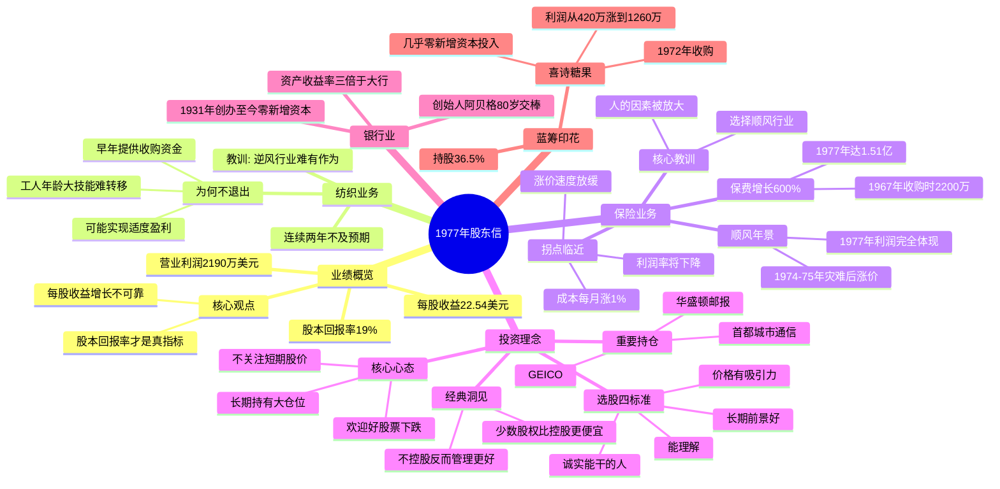

# 1977年巴菲特致股东信 · 思维导图

## 结构概要

| 章节 | 核心主题 | 关键词 |
|-----|---------|--------|
| 业绩概览 | 如何正确衡量业绩 | 股本回报率 > 每股收益 |
| 纺织业务 | 为何坚持亏损业务 | 责任感、历史恩情 |
| 保险业务 | 顺风行业的力量 | 周期性、人的因素 |
| 投资理念 | 股票就是企业 | 四标准、长期持有 |
| 银行业 | 优秀银行的典范 | 高收益、高流动性 |
| 蓝筹印花 | 喜诗糖果的成功 | 护城河、资本效率 |

## 关键人物

- [[沃伦·巴菲特]] - 董事长，作者
- [[菲尔·利切]] - 国家赔偿公司CEO，1977年表现非凡
- [[吉恩·阿贝格]] - 伊利诺伊国民银行创始人，80岁交棒
- [[查克·哈金斯]] - 喜诗糖果CEO

## 关键公司

- [[GEICO]] - 核心持仓，政府雇员保险公司
- [[华盛顿邮报]] - 重要持仓
- [[首都城市通信]] - 1977年新进
- [[喜诗糖果]] - 蓝筹印花旗下，经典收购案例
- [[伊利诺伊国民银行]] - 优秀银行典范

## 时代背景

- 1977年通胀高企，成本持续上升
- 保险行业经历1974-1975年危机后进入顺风周期
- 纺织行业持续衰退，新英格兰制造业外迁

---

> 链接：[[1977年巴菲特致股东的信-翻译]] | [[1977年巴菲特致股东的信-核心总结]]
