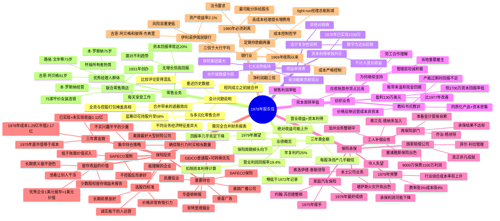

# 1978年巴菲特致股东信 · 思维导图

## 结构概要

| 章节 | 核心主题 | 关键词 |
|-----|---------|--------|
| 会计问题说明 | 合并带来的披露复杂性 | 完全合并、重述数据 |
| 业绩概览 | 三年黄金期的总结与展望 | 19.4%回报率、不可持续 |
| 收益来源表 | 各业务板块贡献一览 | 保险领先、喜诗突出 |
| 纺织业务 | 逆风行业的坚持与教训 | 同质化、产能过剩 |
| 保险承保 | 各板块表现与行业拐点 | 菲尔·利切、1979预警 |
| 保险投资 | 选股标准与重要持仓 | 四标准、SAFECO案例 |
| 银行业 | 优秀银行的典范与剥离 | 阿贝格、1980分拆 |
| 零售业务 | 老将的价值 | 罗斯纳、所有者热情 |

## 关键人物

- [[沃伦·巴菲特]] - 董事长，作者
- [[菲尔·利切]] - 国家赔偿公司CEO，1978年最大贡献者
- [[杰克·林格沃特]] - 国家赔偿创始人，经营哲学延续至今
- [[约翰·苏厄德]] - 家庭汽车保险，1975年接手整顿
- [[米尔特·桑顿]] - 塞浦路斯保险，工人补偿出色
- [[弗兰克·德纳多]] - 加州工人补偿整顿
- [[乔治·杨]] - 再保险部门
- [[弗洛伊德·泰勒]] - 堪萨斯火灾，开局出色
- [[吉恩·阿贝格]] - 伊利诺伊国民银行创始人，81岁
- [[彼得·杰弗里]] - 伊利诺伊国民银行联合领导
- [[本·罗斯纳]] - 联合零售，75岁
- [[路易·文辛蒂]] - 韦斯考金融，73岁

## 关键公司

- [[国家赔偿公司]] - 保险业务最大贡献者
- [[GEICO]] - 核心持仓，政府雇员保险公司
- [[SAFECO]] - 美国最好的大型财险公司
- [[华盛顿邮报]] - 重要持仓
- [[美国广播公司]] - 重要持仓
- [[喜诗糖果]] - 蓝筹印花旗下，利润贡献突出
- [[水牛城晚报]] - 1978年亏损
- [[伊利诺伊国民银行]] - 优秀银行典范，1980年剥离
- [[联合零售商店]] - 75家平价女装连锁
- [[蓝筹印花]] - 伯克希尔持股58%
- [[韦斯考金融]] - 蓝筹印花持股80%

## 时代背景

- 1978年与多元化零售合并，蓝筹印花持股升至58%
- 保险行业处于顺风周期尾声，1979年拐点将至
- 通胀高企：费率涨3%，成本涨9%
- 养老基金行为极端：1971年122%投股市，1978年仅9%
- 银行控股公司法要求1980年前剥离银行

---

> 链接：[[1978年巴菲特致股东的信-翻译]] | [[1978年巴菲特致股东的信-核心总结]]
