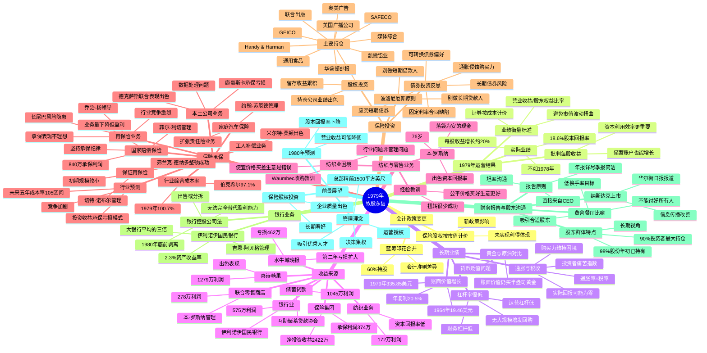

# 1979年巴菲特致股东信思维导图

---

## 结构概要表

| 章节 | 核心主题 | 关键数据/观点 |
|------|----------|---------------|
| 会计政策变更 | 保险股权市值计价 | 未实现利得体现、蓝筹印花合并 |
| 1979年运营结果 | 业绩衡量标准 | 18.6%股本回报率、批判每股收益 |
| 长期业绩 | 15年复利增长 | 20.5%年化、通胀与税收侵蚀 |
| 收益来源 | 各业务板块表现 | 保险承保与投资为主要利润来源 |
| 纺织与零售 | 行业困境与教训 | Waumbec收购错误、好生意优于便宜价格 |
| 保险承保 | 行业周期与纪律 | 综合成本率97.1%、承保纪律重要性 |
| 保险投资 | 股债配置策略 | 股权持仓出色、债券长期风险警示 |
| 银行业务 | 伊利诺伊国民银行 | 2.3%资产收益率、即将剥离 |
| 财务报告与股东沟通 | 沟通理念 | 股东群体稳定、餐厅比喻 |
| 前景展望 | 1980年预期 | 股本回报率下降、长期看好保险股权 |

---

## 关键人物链接

| 人物 | 职位/角色 | 相关公司 | 业绩亮点 |
|------|-----------|----------|----------|
| **沃伦·巴菲特** | 董事长 | 伯克希尔·哈撒韦 | 资本配置、投资决策 |
| **菲尔·利切** | 总裁 | 国家赔偿保险 | 840万承保利润、承保纪律 |
| **杰克·林格沃特** | 创始人 | 国家赔偿保险 | 确立承保纪律文化 |
| **吉恩·阿贝格** | CEO | 伊利诺伊国民银行 | 2.3%资产收益率、82岁高龄 |
| **本·罗斯纳** | CEO | 联合零售商店 | 76岁、出色资本回报率 |
| **路易·文辛蒂** | CEO | 韦斯考金融 | 74岁、持续出色业绩 |
| **约翰·苏厄德** | 管理者 | 家庭汽车保险 | 扩张责任险业务 |
| **乔治·杨** | 负责人 | 再保险部门 | 承保表现不理想 |
| **米尔特·桑顿** | 管理者 | 塞浦路斯保险 | 工人补偿业务出色 |
| **弗兰克·德纳多** | 管理者 | 国家赔偿加州工人补偿 | 整顿成功、节省七位数成本 |
| **切特·诺布尔** | 管理者 | 保证再保险 | 新业务负责人 |
| **乔治·比林斯** | 管理者 | 德克萨斯联合保险 | 最低损失率奖 |
| **彼得·杰弗里** | 管理者 | 伊利诺伊国民银行 | 与阿贝格共同管理 |
| **菲尔·费舍** | 投资作家 | - | 餐厅比喻理论 |

---

## 关键公司链接

| 公司 | 业务类型 | 持股比例 | 业绩/特点 |
|------|----------|----------|-----------|
| **伯克希尔·哈撒韦** | 控股公司 | - | 母公司，20.5%年复利 |
| **蓝筹印花** | 控股/邮票 | 60% | 合并报表，会计差异 |
| **韦斯考金融** | 金融服务 | 48% | 蓝筹印花持有80% |
| **国家赔偿保险** | 财产意外险 | 100% | 840万承保利润 |
| **GEICO** | 汽车保险 | 持股 | 主要股权投资 |
| **SAFECO** | 保险 | 持股 | 主要股权投资 |
| **喜诗糖果** | 糖果零售 | 100% | 1279万利润 |
| **水牛城晚报** | 报纸 | 100% | 亏损462万 |
| **伊利诺伊国民银行** | 银行 | 100% | 2.3%资产收益率，即将剥离 |
| **联合零售商店** | 零售 | 100% | 278万利润 |
| **伯克希尔-Waumbec纺织** | 纺织 | 100% | 172万利润，行业困境 |
| **互助储蓄贷款协会** | 储贷 | 48% | 1045万利润 |
| **华盛顿邮报** | 媒体 | 持股 | 主要股权投资 |
| **联合出版** | 出版 | 持股 | 主要股权投资 |
| **美国广播公司** | 媒体 | 持股 | 主要股权投资 |

---

## 时代背景

### 1979年美国经济环境

| 维度 | 背景 | 对巴菲特决策的影响 |
|------|------|-------------------|
| **通胀率** | 高通胀（约11-14%） | 实际回报被侵蚀，购买力下降 |
| **利率** | 美联储加息周期 | 长期债券风险加大 |
| **股市** | 70年代末熊市尾声 | 股权投资价值显现 |
| **税收** | 高税率环境 | 投资者痛苦指数高企 |
| **石油危机** | 伊朗革命，油价暴涨 | 交通事故频率下降，保险意外受益 |
| **监管** | 银行控股公司法 | 被迫剥离伊利诺伊国民银行 |

### 巴菲特投资哲学演变

- **1964-1979年**：从纺织业转型为保险+投资控股平台
- **通胀认知**：首次系统论述通胀对投资回报的侵蚀
- **债券反思**：批判长期固定利率债券在通胀环境下的缺陷
- **股东沟通**：确立年报详尽、季报简洁的沟通风格
- **管理哲学**：决策集权+运营授权，精简总部

---

## 核心投资原则提炼

1. **业绩衡量**：营业收益/股东权益比率，而非每股收益
2. **承保纪律**：业务量服从盈利能力，不亏本做生意
3. **投资理念**：股权优于债券，好生意优于便宜价格
4. **通胀应对**：避免长期固定利率合同，偏好股权和可转换债券
5. **股东关系**：吸引志同道合的长期投资者，低换手率

---

*思维导图生成日期：2026年4月9日*
*原始文档：1979年巴菲特致股东信*
