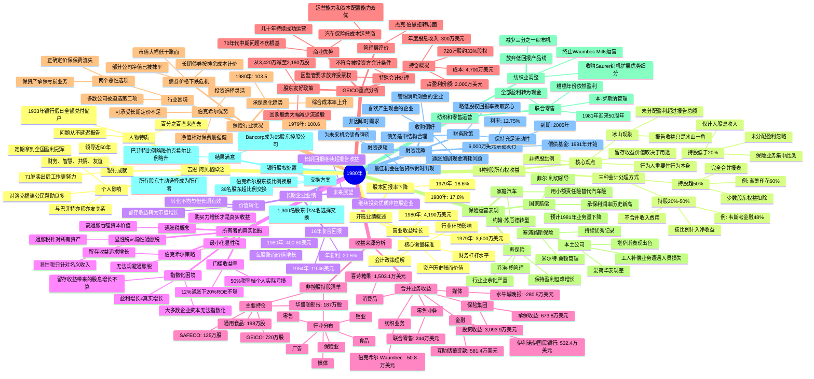

# 1980年巴菲特致股东信思维导图

---

## 📊 结构概要表

| 章节 | 核心主题 | 关键要点 |
|------|---------|---------|
| 开篇 | 1980年业绩概述 | 收益增长但回报率下降 |
| 非控股所有权收益 | 会计处理三种方式 | 留存收益价值取决于用途，非持股比例 |
| 长期企业业绩 | 16年复合回报 | 年复利20.5%，远超年度报告收益 |
| 所有者的真实回报 | 通胀税概念 | 高通胀吞噬资本，12%通胀下20%ROE不够 |
| 收益来源 | 财务分析 | 详细业务收益表+非控股持股清单 |
| GEICO | 重点持仓分析 | 33%股权，核心竞争优势完整保留 |
| 保险行业状况 | 行业危机 | 债券市值下跌+承保恶化双重困境 |
| 保险运营 | 各业务线表现 | 国家赔偿优秀，再保险谨慎 |
| 纺织和零售 | 业务调整 | 纺织收缩，联合零售表现稳健 |
| 银行股权处置 | 换股方案 | 顺利完成，股东主动选择 |
| 融资 | 债券发行 | 6000万美元储备资金，等待机会 |
| 悼念 | 吉恩·阿贝格 | 银行家典范，受托责任典范 |

---

## 👤 关键人物链接

| 人物 | 角色 | 相关公司 |
|------|------|---------|
| **沃伦·巴菲特** | 董事长 | 伯克希尔·哈撒韦 |
| **查理·芒格** | 副董事长 | 蓝筹印花、韦斯考金融 |
| **杰克·伯恩** | CEO | GEICO |
| **菲尔·利切** | 管理层 | 国家赔偿公司 |
| **约翰·苏厄德** | 管理层 | 家庭汽车保险公司 |
| **乔治·杨** | 管理层 | 再保险业务 |
| **弗洛伊德·泰勒** | 管理层 | 堪萨斯本土公司 |
| **米尔特·桑顿** | 管理层 | 塞浦路斯保险公司 |
| **本·罗斯纳** | 管理层 | 联合零售公司 |
| **路易·文辛蒂** | 管理层 | 互助储蓄贷款 |
| **吉恩·阿贝格** | 创始人（已故） | 伊利诺伊国民银行 |

---

## 🏢 关键公司链接

| 公司 | 业务类型 | 巴菲特评价 |
|------|---------|-----------|
| **GEICO** | 汽车保险 | 最好的投资：无法复制的商业优势+非凡管理层 |
| **伯克希尔·哈撒韦** | 综合集团 | 母公司，保险+纺织+零售+金融 |
| **蓝筹印花** | 多元控股 | 伯克希尔持股60%，完全合并报表 |
| **韦斯考金融** | 金融服务 | 伯克希尔持股48%，按比例计入收益 |
| **喜诗糖果** | 消费品 | 优质消费品牌，持续稳定盈利 |
| **华盛顿邮报** | 媒体 | 重要非控股持股，优质媒体资产 |
| **国家赔偿** | 保险 | 承保纪律典范，历史新高利润率 |
| **联合零售** | 零售 | 现金流典范，50年稳定运营 |
| **伊利诺伊国民银行** | 银行 | 盈利冠军，受托责任典范（已分拆） |

---

## 🕰️ 时代背景

### 1980年美国经济环境

**通胀高企**
- 年通胀率约12%，处于历史高位
- 通胀被视为"隐性资本税"，侵蚀投资回报
- 巴菲特首次系统阐述"通胀税"概念

**利率环境**
- 联邦基金利率一度升至20%以上
- 长期债券收益率高企（伯克希尔发行12.75%票据）
- 债券价格暴跌，保险公司账面受损

**保险业困境**
- 承保综合成本率恶化至103.5%
- 债券未实现损失威胁公司净值
- "保资产承保"现象普遍

**纺织业衰退**
- 传统制造业在通胀和竞争压力下艰难
- 巴菲特承认错误：应更早退出
- 典型的"烂行业好管理"案例

**投资哲学发展**
- 明确区分"报告收益"与"经济价值"
- 强调留存收益用途决定价值
- 提出"行为重要，行为人不重要"理念

---

## 💡 核心金句

> "留存收益对伯克希尔的价值，不取决于我们拥有企业100%、50%、20%还是1%，而是取决于留存收益怎么用，以及使用之后产生的盈利水平。"

> "当声名显赫的管理层接手基本面糟糕的企业，保持完好的是企业的名声。"

> "只有购买力增长才是投资真实收益。如果放弃十个汉堡买一个投资，拿到税后股息只能买两个汉堡，这个投资没有真实收入。"

> "通胀是对资本征收的税，让很多企业投资都不划算。"

> "他（吉恩·阿贝格）从来不会延迟一分钟报告问题，吉恩的问题本来就很少。"

---

*生成时间：2026-04-09*
