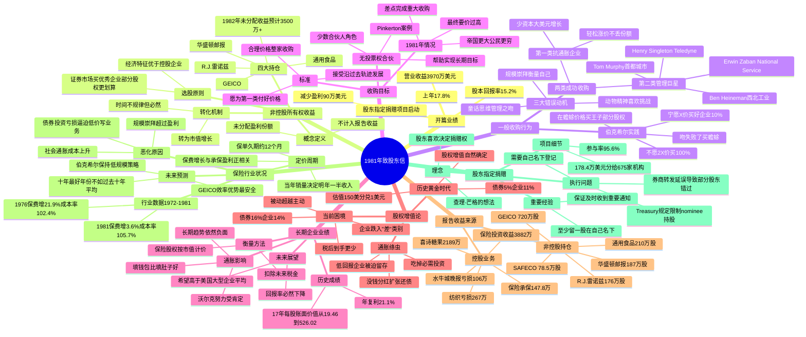

# 1981年巴菲特致股东信思维导图

---

## 结构概要表

| 章节 | 核心主题 | 关键数据/观点 | 字数占比 |
|------|---------|--------------|---------|
| 开篇业绩 | 1981年业绩 | ROE 15.2%，股东指定捐赠启动 | 5% |
| 非控股所有权收益 | 会计vs经济收益 | 四大持仓未分配收益3500万+ | 10% |
| 一般收购行为 | 收购动机批判 | 三大错误动机，两类成功案例 | 15% |
| 收购目标 | 伯克希尔标准 | 宁买10%不买100%，Pinkerton案例 | 8% |
| 长期企业业绩 | 17年业绩回顾 | 21.1%复利，通胀影响 | 10% |
| 股权增值论 | 利率vs企业回报 | 被动16% > 主动14%，通胀绦虫 | 20% |
| 报告收益来源 | 控股+非控股 | GEICO、喜诗、华盛顿邮报 | 12% |
| 保险行业状况 | 行业恶化预测 | 保费增3.6%，成本率105.7% | 12% |
| 股东指定捐赠 | 新项目描述 | 参与率95.6%，券商延误问题 | 8% |

---

## 关键人物链接

| 姓名 | 身份 | 公司 | 本章亮点 |
|------|------|------|---------|
| [沃伦·巴菲特](https://en.wikipedia.org/wiki/Warren_Buffett) | 董事长 | 伯克希尔·哈撒韦 | 21.1%年复利，股权增值论 |
| [查理·芒格](https://en.wikipedia.org/wiki/Charlie_Munger) | 副董事长 | 伯克希尔、蓝筹印花 | 股东指定捐赠创意来源 |
| [保罗·沃尔克](https://en.wikipedia.org/wiki/Paul_Volcker) | 美联储主席 | 美联储 | 抗通胀努力受肯定 |
| 菲尔·利切 | 总裁 | 国家赔偿公司 | 逆水行舟表现出色 |
| 比尔·莱昂斯 | 经理 | 保险公司 | 保持承保优势 |
| 罗兰·米勒 | 经理 | 保险公司 | 逆水行舟表现出色 |
| 弗洛伊德·泰勒 | 经理 | 保险公司 | 逆水行舟表现出色 |
| 米尔特·桑顿 | 经理 | 保险公司 | 逆水行舟表现出色 |
| [Ben Heineman](https://en.wikipedia.org/wiki/Ben_Heineman) | CEO | 西北工业 | 第二类管理巨星 |
| [Henry Singleton](https://en.wikipedia.org/wiki/Henry_Singleton) | CEO | Teledyne | 第二类管理巨星，回购自家股票 |
| [Tom Murphy](https://en.wikipedia.org/wiki/Thomas_S._Murphy) | CEO | 首都城市通信 | 两连击：收购+运营巨星 |

---

## 关键公司链接

| 公司 | 行业 | 本章要点 | 官网/链接 |
|------|------|---------|----------|
| [GEICO](https://en.wikipedia.org/wiki/GEICO) | 汽车-保险 | 最大持仓，720万股，效率优势最安全 | [geico.com](https://www.geico.com/) |
| [通用食品](https://en.wikipedia.org/wiki/General_Foods) | 食品 | 四大持仓之一 | 已并入卡夫 |
| [R.J.雷诺兹](https://en.wikipedia.org/wiki/R._J._Reynolds_Tobacco_Company) | 烟草 | 四大持仓之一，抗通胀属性 | [rjrt.com](https://www.rjrt.com/) |
| [华盛顿邮报](https://en.wikipedia.org/wiki/The_Washington_Post) | 媒体 | 四大持仓之一，1063万成本 | 已更名Graham Holdings |
| [喜诗糖果](https://en.wikipedia.org/wiki/See%27s_Candies) | 零售-糖果 | 2189万营业收益 | [sees.com](https://www.sees.com/) |
| [水牛城晚报](https://en.wikipedia.org/wiki/The_Buffalo_News) | 报纸 | 亏损106万，周日版竞争 | [buffalonews.com](https://buffalonews.com/) |
| [蓝筹印花](https://en.wikipedia.org/wiki/Blue_Chip_Stamps) | 零售-印花 | 伯克希尔持股60% | 已清算 |
| [韦斯考金融](https://en.wikipedia.org/wiki/Wesco_International) | 金融 | 蓝筹印花持股80% | [wescodist.com](https://www.wescodist.com/) |
| [Pinkerton](https://en.wikipedia.org/wiki/Pinkerton_(detective_agency)) | 保安服务 | 无投票权合伙案例 | 已并入Securitas |
| [SAFECO](https://en.wikipedia.org/wiki/Safeco) | 保险 | 非控股持仓，表现优异 | 已并入Liberty Mutual |
| [首都城市通信](https://en.wikipedia.org/wiki/Capital_Cities_Communications) | 媒体 | Murphy管理巨星案例 | 1985年收购ABC |
| 西北工业 | 工业 | Ben Heineman管理案例 | 已分拆 |
| Teledyne | 科技 | Henry Singleton管理案例 | 已并入TransDigm |

---

## 时代背景：1981年

### 经济环境
- **利率飙升**：长期应税债券收益率超过16%，免税债券超过14%
- **通胀高企**：年通胀率约10%，美联储主席沃尔克激进加息抗通胀
- **企业困境**：美国企业ROE约14%，低于被动投资回报

### 行业变革
- **保险业恶化**：保费增长率仅3.6%，成本率105.7%，行业面临大额亏损
- **并购浪潮**：规模崇拜驱动高溢价收购，收购方股东受损
- **媒体行业**：水牛城晚报与Courier-Express竞争，周日版亏损

### 投资理念形成
- **股权增值论**：首次系统阐述被动利率vs主动回报的关系
- **通胀绦虫**：经典比喻，低回报企业被迫留存盈利
- **收购批判**：三大错误动机、两类成功案例的框架
- **股东民主**：指定捐赠项目体现股东权利理念

### 历史地位
1981年是巴菲特投资思想成熟表达的关键年份，股权增值论框架成为后续几十年投资哲学的核心基础，对理解高利率环境下股权投资的困境具有长期指导意义。

---

## 核心金句摘录

1. **收购动机**："预测下雨不算，建方舟才算。"（诺亚原则）

2. **管理之吻**："我们看过很多吻，很少奇迹。"

3. **通胀绦虫**："通胀就像一个巨大的企业绦虫。这条绦虫预先就每天吃掉它必需的投资美元，不管宿主健康如何。"

4. **被动vs主动**："除非被动利率下降，否则对个人股东来说，不分红每年每股盈利增长14%的公司，经济上也是失败的。被动资本回报都超过主动资本了。"

5. **股东权利**："我们的公司所有者喜欢拥有并行使权利决定他们的钱捐给谁。"

---

*生成时间：2026-04-09*
