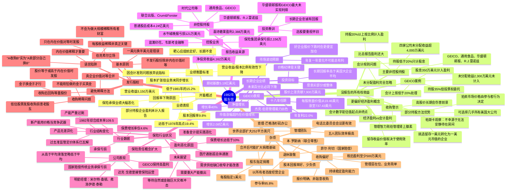

# 1982年巴菲特致股东信思维导图

---

## 结构概要表

| 章节 | 核心主题 | 关键观点 |
|------|----------|----------|
| 开篇概述 | 业绩下滑与衡量标准 | 股本回报率从15.2%降至9.8%，会计准则导致指标失真 |
| 没报告的所有权收益 | 会计vs经济盈利 | 持股低于20%企业未分配收益未计入，实际经济盈利被低估 |
| 长期企业业绩 | 净值增长与目标 | 18年每股账面价值年复利22%，长期目标跑赢大企业平均 |
| 报告收益来源 | 业务板块分析 | 控股业务详细披露，非控股持股清单及投资教训 |
| 保险行业状况 | 行业结构性变化 | 准监管定价体系瓦解，产能过剩导致盈利困难 |
| 发行股权 | 股份发行原则 | 只在内在价值对等时发股，反对稀释性收购 |
| 杂项 | 收购标准与团队 | 收购偏好、股东捐赠、团队介绍、退休致敬 |

---

## 关键人物链接

| 人物 | 身份 | 相关公司 | 本信提及要点 |
|------|------|----------|--------------|
| [沃伦·巴菲特](https://en.wikipedia.org/wiki/Warren_Buffett) | 董事长 | 伯克希尔·哈撒韦 | 署名作者，阐述经营理念 |
| [查理·芒格](https://en.wikipedia.org/wiki/Charlie_Munger) | 合伙人 | 伯克希尔·哈撒韦 | 洛杉矶办公，决策可互换 |
| [杰克·伯恩](https://en.wikipedia.org/wiki/John_J._Byrne_(executive)) | CEO | GEICO | 管理能力出色，"让杰克干"是完美信条 |
| 杰克·林格沃特 | 前任管理者 | 国家赔偿 | 与菲尔·利切共同推动成功 |
| 菲尔·利切 | 退休经理 | 国家赔偿 | 65岁退休，以所有者态度经营 |
| 本·罗斯纳 | 退休经理 | 联合零售 | 79岁退休，15年全垒打表现 |
| 米尔特·桑顿 | 经理 | 塞浦路斯保险 | 持续承保盈利明星 |
| 弗洛伊德·泰勒 | 经理 | 堪萨斯火灾意外伤害 | 持续承保盈利明星 |
| 迈克·戈德堡 | 保险运营主管 | 伯克希尔 | 1982年接管保险运营 |
| 卢·辛普森 | 投资经理 | GEICO | 财产意外险行业最佳 |
| 比尔·斯奈德 | 高管 | GEICO | 坚持简单，记住要做什么 |
| 亚瑟·奥肯 | 经济学家 | - | "抵消"圣徒理论 |

---

## 关键公司链接

| 公司 | 行业 | 伯克希尔持股 | 本信提及要点 |
|------|------|--------------|--------------|
| [伯克希尔·哈撒韦](https://en.wikipedia.org/wiki/Berkshire_Hathaway) | 综合企业 | 100% | 本信主体 |
| [GEICO](https://en.wikipedia.org/wiki/GEICO) | 汽车保险 | 35% | 最大未分配收益来源，成本优势突出 |
| [华盛顿邮报](https://en.wikipedia.org/wiki/The_Washington_Post) | 媒体 | 主要股东 | 最大未实现利得之一，巴菲特13岁首次商业接触 |
| [蓝筹印花](https://en.wikipedia.org/wiki/Blue_Chip_Stamps) | 商业印花 | 60% | 计划与伯克希尔合并 |
| [喜诗糖果](https://en.wikipedia.org/wiki/See%27s_Candies) | 糖果零售 | 控股 | 盈利2,388万美元 |
| [水牛城晚报](https://en.wikipedia.org/wiki/The_Buffalo_News) | 报纸 | 控股 | 周日版发行量增长35%至36.7万 |
| [韦斯考金融](https://en.wikipedia.org/wiki/Wesco_Financial) | 金融服务 | 通过蓝筹印花控股 | 储蓄贷款业务 |
| [通用食品](https://en.wikipedia.org/wiki/General_Foods) | 食品 | 主要股东 | 四大非控股持股之一 |
| [R.J.雷诺兹](https://en.wikipedia.org/wiki/R._J._Reynolds_Tobacco_Company) | 烟草 | 主要股东 | 1982年大幅增持 |
| 国家赔偿 | 财产意外险 | 100% | 传统业务承保亏损 |
| 联合零售 | 零售 | 控股 | 本·罗斯纳管理15年 |
| Crum & Forster | 保险 | 主要股东 | 非控股持股之一 |
| 时代公司 | 媒体 | 主要股东 | 非控股持股之一 |

---

## 时代背景

### 经济环境（1982年）

- **通胀与利率**：美国处于高通胀尾声，美联储主席保罗·沃尔克激进加息政策奏效，通胀从1980年14.8%降至1982年约6%
- **经济衰退**：1981-1982年美国经历严重衰退，失业率最高达10.8%
- **股市表现**：1982年8月美股开启大牛市，道琼斯指数从约770点起步

### 行业背景

- **保险业危机**：综合成本率109.5，行业承保严重亏损，准监管定价体系瓦解，价格战激烈
- **并购热潮**：80年代并购活跃，很多收购溢价过高，巴菲特警示"管理智力败给管理肾上腺素"

### 伯克希尔发展

- **规模扩张**：保险子公司股权投资占投资组合从1972年15%升至1982年80%
- **管理理念成熟**：形成"内在价值对等"发股原则，明确收购标准
- **股权结构变化**：计划与蓝筹印花合并，简化架构

### 核心思想演变

- 从"营业收益/股本"衡量转向关注"经济盈利"
- 部分持股方法与整体收购并重的投资策略
- 对大宗商品行业的深刻认识：产能过剩+无差异化=低盈利

---

*生成日期：2026年4月9日*
*基于1983年3月3日发布的1982年巴菲特致股东信原文翻译*
