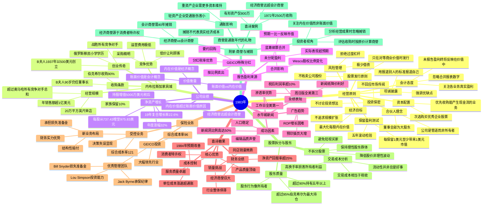

# 1983年巴菲特致股东信 思维导图

---

## 结构概要表

| 章节 | 核心主题 | 关键要点 |
|------|----------|----------|
| 经营原则 | 13条信条 | 合伙人理念、资本配置、坦诚披露、风险控制 |
| 内布拉斯加家具城 | 收购案例 | B夫人创业传奇、竞争优势、收购条款 |
| 公司业绩 | 财务表现 | 净资产增长32%、内在价值vs账面价值 |
| 报告盈利来源 | 盈利构成 | 合并影响、GEICO分红、未分配盈利 |
| 水牛城新闻 | 传媒业务 | 渗透率全美领先、新闻洞比例高、广告趋势变化 |
| 喜诗糖果 | 消费品业务 | 高ROE、消费者特许权、销量挑战 |
| 保险业务 | 承保与投资 | 受控业务表现不佳、GEICO优秀、新业务布局 |
| 股票拆分与股东 | 公司治理 | 不拆分股票、保持高质量股东群体 |
| 附录:商誉与摊销 | 会计专题 | 经济商誉价值、通胀影响、投资者视角 |

---

## 关键人物

| 人物 | 身份 | 链接/备注 |
|------|------|-----------|
| **沃伦·巴菲特** | 伯克希尔董事长、CEO | [维基百科](https://zh.wikipedia.org/wiki/%E6%B2%83%E4%BC%A6%C2%B7%E5%B7%B4%E8%8F%B2%E7%89%B9) |
| **查理·芒格** | 伯克希尔副董事长 | [维基百科](https://zh.wikipedia.org/wiki/%E6%9F%A5%E7%90%86%C2%B7%E8%8A%92%E6%A0%BC) |
| **Rose "B夫人" Blumkin** | 内布拉斯加家具城创始人 | 俄罗斯移民，90岁仍工作 |
| **Louie Blumkin** | 内布拉斯加家具城总裁 | B夫人之子，顶级采购员 |
| **Chuck Huggins** | 喜诗糖果CEO | 1972年起负责，管理卓越 |
| **Jack Byrne** | GEICO CEO | 承保纪律严格 |
| **Lou Simpson** | GEICO投资经理 | 顶尖保险投资经理 |
| **Stan Lipsey** | 水牛城新闻出版人 | 1969年加入伯克希尔 |
| **Mike Goldberg** | 保险业务负责人 | 接管运营责任 |

---

## 关键公司

| 公司 | 业务 | 链接/备注 |
|------|------|-----------|
| **伯克希尔·哈撒韦** | 投资控股公司 | [官网](https://www.berkshirehathaway.com) |
| **内布拉斯加家具城** | 家具零售 | [官网](https://www.nfm.com) |
| **喜诗糖果** | 高端巧克力 | [官网](https://www.sees.com) |
| **水牛城新闻** | 报纸媒体 | [官网](https://buffalonews.com) |
| **GEICO** | 汽车保险 | [官网](https://www.geico.com) |
| **蓝筹邮票** | 邮票/投资控股 | 1983年并入伯克希尔 |
| **Wesco Financial** | 金融控股 | [维基百科](https://en.wikipedia.org/wiki/Wesco_Financial) |

---

## 时代背景

### 1983年美国经济环境

- **通胀背景**：70年代高通胀的余波仍在，巴菲特在商誉附录中详细分析了通胀对不同企业的差异化影响
- **股市复苏**：1982年8月牛市开启，道琼斯指数从770点起步，1983年持续上涨
- **利率环境**：美联储主席沃尔克抗击通胀，利率仍处高位

### 并购浪潮

- **企业并购活跃**：巴菲特批评"肾上腺素上头的管理者瞎收购"
- **蓝筹邮票合并**：伯克希尔完成对蓝筹邮票剩余40%股份收购，整合喜诗糖果、水牛城新闻等资产

### 行业趋势

- **保险业困境**：行业综合成本率111，承保环境恶劣
- **传媒业转型**：报纸面临经济衰退挑战，广告从ROP转向预印插页
- **零售业集中**：区域性零售商面临大型连锁竞争压力

### 投资哲学形成

- **商誉理念成熟**：巴菲特从早期偏好有形资产转向重视经济商誉
- **股东理念确立**：明确不拆分股票，追求长期理性股东
- **通胀投资策略**：轻资产、高商誉企业在通胀环境中的优势

---

> **注**：本思维导图基于1983年巴菲特致股东信翻译文本生成，反映了巴菲特投资哲学从格雷厄姆式"烟蒂股"向"以合理价格买入优秀企业"转变的关键时期。
