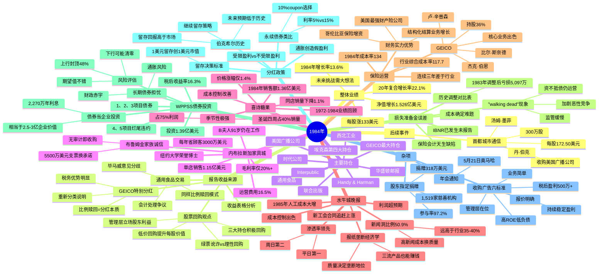

# 1984年巴菲特致股东信思维导图

---

## 结构概要表

| 章节 | 核心主题 | 关键数据/要点 |
|------|----------|---------------|
| 整体业绩 | 1984年经营成果 | 净值+1.526亿，每股+133美元，增长率13.6% |
| 报告收益来源 | 收益表格与会计处理 | 营业收益8,774万，GEICO/通用食品分红争议 |
| 主要持仓 | 股权投资组合 | 10大持仓，普通股总成本5.85亿美元 |
| 内布拉斯加家具城 | 收购后首年表现 | B夫人91岁，单店销售1.15亿，毛利率20%+ |
| 喜诗糖果 | 业绩回顾与挑战 | 销售额1.36亿，圣诞占利润75%，同店销量降1.1% |
| 水牛城晚报 | 报纸运营与经济 | 新闻洞50.9%，渗透率第一，垄断经济学 |
| 保险运营 | 承保困境与机会 | 综合成本率134，财务实力优势，GEICO持股36% |
| 损失准备金误差 | 保险会计问题 | 准备金估计误差，walking dead现象 |
| WPPSS债券投资 | 特殊投资案例 | 投资1.39亿，收益率16.3%，风险收益分析 |
| 分红政策 | 留存vs分红理论 | 受限/不受限盈利，留存标准，永续债类比 |
| 杂项 | 收购标准与股东项目 | 六大收购标准，捐赠参与率97.2% |
| 后续事件 | 首都城市通信投资 | 300万股，每股172.50美元，收购美国广播公司 |

---

## 关键人物链接

| 人物 | 身份 | 本章角色 |
|------|------|----------|
| **沃伦·巴菲特** | 董事长 | 信件作者，决策者 |
| **查理·芒格** | 合伙人 | 投资决策伙伴，持股47% |
| **B夫人（罗斯·布鲁姆金）** | 内布拉斯加家具城董事长 | 91岁仍在工作，NYU荣誉博士 |
| **Louie Blumkin** | B夫人儿子 | NFM管理层 |
| **Ron/Irv/Steve Blumkin** | B夫人孙子 | NFM年轻一代管理层 |
| **查克·哈金斯** | 喜诗糖果CEO | exceptional经理 |
| **Stan Lipsey** | 水牛城新闻管理者 | 行业最好performance |
| **Murray Light** | 水牛城新闻编辑 | 高标准新闻质量 |
| **Mike Goldberg** | 保险运营负责人 | 修正前任错误 |
| **杰克·伯恩** | GEICO CEO | 核心业务出色发挥 |
| **比尔·斯奈德** | GEICO高管 | 核心业务出色发挥 |
| **卢·辛普森** | GEICO投资经理 | 保险行业最好投资经理 |
| **汤姆·墨菲** | 首都城市通信CEO | 能力诚信顶级 |
| **丹·伯克** | 首都城市通信高管 | 能力诚信顶级 |
| **菲尔·格雷厄姆** | 华盛顿邮报发行人 | 引用其观点"日报是历史第一份草稿" |

---

## 关键公司链接

| 公司 | 行业 | 本章要点 |
|------|------|----------|
| **伯克希尔·哈撒韦** | 投资控股 | 净值增长1.526亿，20年复合增长22.1% |
| **GEICO** | 汽车保险 | 持股36%，核心业务低成本优势，比例赎回分红 |
| **通用食品** | 食品 | 持股8.75%，比例赎回分红，会计处理争议 |
| **华盛顿邮报** | 报业 | 大股东，低价回购支持股东利益 |
| **埃克森** | 石油 | 第四大持仓，积极回购 |
| **内布拉斯加家具城** | 家居零售 | 90%股权，单店销售1.15亿，B夫人家族管理 |
| **喜诗糖果** | 高端糖果 | 销售额1.36亿，季节性强，查克·哈金斯管理 |
| **水牛城晚报** | 报业 | 渗透率领先，新闻洞50.9%，垄断优势 |
| **哥伦比亚保险** | 再保险 | 专门做结构化结算，大幅增资 |
| **WPPSS** | 公用事业 | 1、2、3项目债券，投资1.39亿，收益率16.3% |
| **首都城市通信** | 媒体 | 后续事件，300万股投资，收购美国广播公司 |
| **美国广播公司** | 媒体 | 首都城市通信收购标的 |
| **蓝筹印花** | 零售 | 1983年合并，喜诗糖果原母公司 |
| **Levitz家具** | 家居零售 | 行业对比，毛利率44.4%，NFM仅20%+ |
| **联合出版** | 出版 | 持股69万股，成本352万 |
| **时代公司** | 出版 | 持股255万股，成本8,933万 |
| **Handy & Harman** | 工业品 | 持股238万股，成本2,732万 |
| **西北工业** | 工业 | 持股56万股，成本2,658万 |
| **Interpublic** | 广告 | 持股82万股，成本257万 |
| **联合零售** | 零售 | 亏损107万美元 |
| **互助储蓄贷款** | 金融 | 盈利146万美元 |
| **精密钢铁** | 制造 | 盈利409万美元 |
| **韦斯考金融** | 金融 | 盈利978万美元 |

---

## 时代背景

### 经济环境（1984年）

1. **通胀压力持续**
   - 1980年代初美国高通胀逐步缓解
   - 但巴菲特仍担忧未来通胀回归
   - 财政赤字巨大，长期通胀风险

2. **利率环境**
   - 长期无风险利率约5%（巴菲特永续债例子）
   - 1984年债券收益率较高
   - WPPSS债券税后收益率达16.3%

3. **保险行业困境**
   - 行业综合成本率高达117.7
   - 1979-1984年保费总增长仅30%（应有61%）
   - 承保亏损普遍，准备金不足问题严重

4. **企业并购与回购**
   - 公司回购股票成为热点
   - 绿票讹诈（greenmail）现象出现
   - 巴菲特区分理性回购与绿票讹诈

5. **媒体行业演变**
   - 报业仍具有垄断优势
   - 电视媒体崛起（首都城市/ABC交易）
   - 新闻洞比例成为质量指标

6. **投资环境变化**
   - 符合标准的股权投资难找
   - "明智无为"成为策略
   - 债券作为特殊business投资视角

### 会计与监管环境

1. **会计处理争议**
   - 比例赎回按分红vs出售处理
   - 毕马威奥马哈/芝加哥vs纽约所意见分歧
   - 经济实质vs会计形式

2. **保险监管不足**
   - "Walking dead"公司现象
   - 资不抵债仍能运营
   - 州保障基金机制

3. **分红政策讨论**
   - 受限盈利概念提出
   - 通胀对真实盈利的影响
   - 留存与分红决策标准

### 市场特征

1. **股市估值**
   - 优秀企业可按账面价值购买
   - 部分公司股价低于内在价值
   - 回购窗口期

2. **债券市场**
   - 长期债券收益率较高
   - 垃圾债与困境债券机会
   - WPPSS困境债券案例

3. **企业行为**
   - 大公司积极回购
   - 并购活动增加
   - 首都城市收购ABC

### 历史意义

这封信标志着巴菲特投资思想的成熟表达：
- 明确提出"债券当business投资"视角
- 系统阐述分红政策理论框架
- 深入分析保险会计缺陷
- 首次披露首都城市通信重大投资

同时，这封信也展现了伯克希尔从纺织、印花等传统业务向保险、媒体、零售多元化转型的成果。
