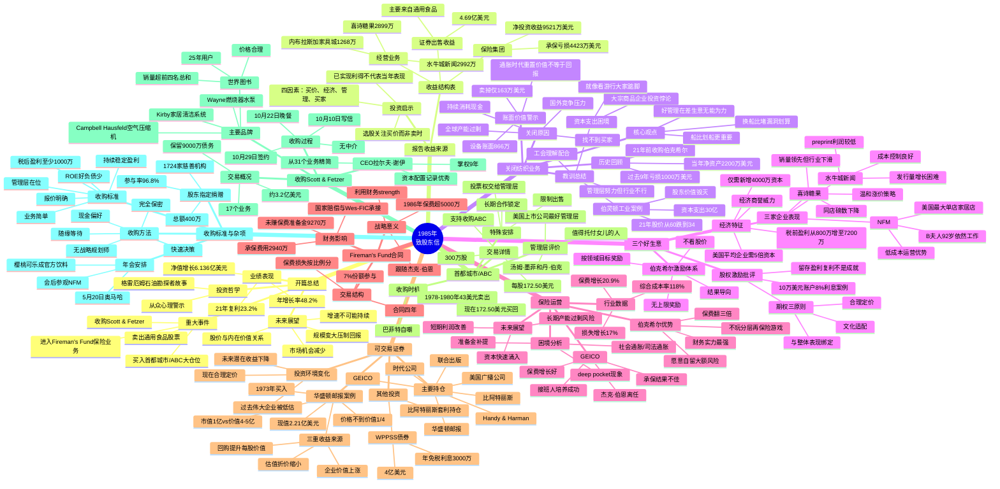

# 1985年巴菲特致股东信思维导图

---

## 结构概要表

| 章节 | 核心主题 | 关键要点数 | 字数占比 |
|------|----------|------------|----------|
| 开篇总结 | 年度业绩与重大事件 | 4大事件、业绩数据、未来展望 | 约15% |
| 报告收益来源 | 收益结构与投资启示 | 收益表解读、四因素分析 | 约8% |
| 关闭纺织业务 | 失败案例深度剖析 | 历史回顾、教训总结、核心观点 | 约18% |
| 三个好生意 | 经济商誉与激励机制 | 盈利分析、期权批评、企业表现 | 约12% |
| 保险运营 | 行业困境与竞争优势 | 行业数据、困境分析、伯克希尔优势 | 约12% |
| Fireman's Fund合同 | 新业务布局 | 交易结构、战略意义 | 约5% |
| 可交易证券 | 投资组合与经典案例 | 主要持仓、华盛顿邮报案例 | 约10% |
| 首都城市/ABC | 重大投资与管理信任 | 交易详情、管理层评价、特殊安排 | 约7% |
| 收购Scott & Fetzer | 企业收购与整合 | 交易概况、主要品牌、收购过程 | 约8% |
| 收购标准与杂项 | 投资方法论与股东事务 | 收购标准、捐赠项目、年会 | 约5% |

---

## 关键人物链接

| 人物 | 身份 | 相关公司 | 核心贡献/特点 |
|------|------|----------|---------------|
| **沃伦·巴菲特** | 董事长 | 伯克希尔·哈撒韦 | 致股东信作者，投资决策者 |
| **查理·芒格** | 副董事长 | 伯克希尔·哈撒韦 | 合伙人，研究错误的哲学 |
| **汤姆·墨菲** | CEO | 首都城市/ABC | 美国上市公司最好管理者 |
| **丹·伯克** | CEO | 首都城市/ABC | 与墨菲并肩的卓越管理者 |
| **杰克·伯恩** | 前CEO | GEICO→Fireman's Fund | 从破产边缘拯救GEICO |
| **拉尔夫·谢伊** | CEO | Scott & Fetzer | 资本配置记录优秀 |
| **B夫人（罗斯·布鲁姆金）** | 董事长 | 内布拉斯加家具城 | 92岁仍在工作，速度惊人 |
| **凯瑟琳·格雷厄姆** | CEO | 华盛顿邮报 | 回购股票、提升企业价值 |
| **肯·蔡斯** | 前总裁 | 伯克希尔纺织业务 | 优秀的纺织业务管理者 |
| **吉姆·弗格森** | 管理层 | 通用食品 | 增加企业价值 |
| **菲尔·史密斯** | 管理层 | 通用食品 | 聚焦股东利益 |
| **比尔·斯奈德** | 董事长 | GEICO | 杰克·伯恩接班人 |
| **卢·辛普森** | 副董事长 | GEICO | 投资管理出色 |
| **迈克·戈德堡** | 管理者 | 国家赔偿公司 | 保险运营改进 |
| **查克·哈金斯** | 管理者 | 喜诗糖果 | 优秀管理 |
| **斯坦·利普西** | 管理者 | 水牛城新闻 | 优秀管理 |

---

## 关键公司链接

| 公司 | 行业 | 业务特点 | 投资逻辑 |
|------|------|----------|----------|
| **伯克希尔·哈撒韦** | 多元化控股 | 保险为核心的投资平台 | 长期复利、财务实力 |
| **首都城市/ABC** | 媒体 | 电视台、广播、出版 | 最好管理层、好生意 |
| **Scott & Fetzer** | 多元制造 | 17个业务，世界图书领先 | 行业领先、优秀CEO |
| **Fireman's Fund** | 保险 | 财产险、意外险 | 份额参与、跟随杰克·伯恩 |
| **华盛顿邮报** | 媒体 | 报纸、杂志 | 价值低估、管理层优秀 |
| **GEICO** | 保险 | 汽车保险直销 | 成本优势、从破产边缘拯救 |
| **内布拉斯加家具城** | 零售 | 家居家具 | 低成本运营、B夫人领导 |
| **喜诗糖果** | 食品 | 高端糖果 | 经济商誉、品牌价值 |
| **水牛城新闻** | 媒体 | 报纸发行 | 地区垄断、成本控制 |
| **通用食品** | 食品 | 消费品 | 价值增长、被菲利普·莫里斯收购 |
| **伯灵顿工业** | 纺织 | 美国最大纺织公司 | 股东价值毁灭案例 |
| **时代公司** | 媒体 | 杂志出版 | 投资组合持仓 |
| **比阿特丽斯** | 消费品 | 食品加工 | 套利持仓 |

---

## 时代背景

### 经济环境

| 维度 | 背景 | 对投资的影响 |
|------|------|--------------|
| **通胀时代** | 1970-80年代高通胀 | 经济商誉价值凸显 |
| **股市周期** | 1973-74年熊市后复苏 | 早期买入机会 |
| **利率环境** | 高利率 | 资本成本上升 |
| **税制变化** | 众议院税法案 | 公司资本利得税率可能上升 |

### 行业变革

| 行业 | 变化 | 巴菲特应对 |
|------|------|------------|
| **纺织业** | 全球产能过剩、国外竞争 | 关闭业务、止损退出 |
| **保险业** | 社会通胀、司法通胀、准备金问题 | 利用财务实力承接大单 |
| **媒体业** | 估值从低估到合理 | 继续持有优质资产 |
| **并购市场** | 活跃 | 积极参与套利 |

### 投资理念演变

| 阶段 | 特点 | 代表案例 |
|------|------|----------|
| **早期（1960-70s）** | 烟蒂股、深度价值 | 伯克希尔纺织业务 |
| **中期（1970-80s）** | 优质企业、合理价格 | 华盛顿邮报、GEICO |
| **成熟期（1980s）** | 伟大管理层+好生意 | 首都城市、Scott & Fetzer |

### 市场有效性

- **1970年代**：机构投资者被有效市场理论洗脑，价值股被严重低估
- **1980年代**：市场逐渐认识到优质企业的价值，估值回归合理
- **启示**：市场从无效到有效的过程创造了超额收益机会

---

## 核心金句

1. **关于管理**："当名声卓越的管理层接手名声差的business，名声坏的还是business保持完好。"

2. **关于选择**："好管理记录，很大程度你拿到什么business船，比你划船多有效影响更大。"

3. **关于困境**："史上任何时候，人类现在都走到十字路口，一条路通向绝对绝望，另一条通向完全灭绝，让我们祈祷我们有智慧选对。"

4. **关于投资**："我们选普通股，关注买吸引人的，不关注什么时候吸引人卖出去。"

5. **关于人性**：石油勘探者故事——"我觉得我还是跟着大家走吧，毕竟传言可能真的。"

---

*生成时间：2026年4月9日*
*文档版本：v1.0*
