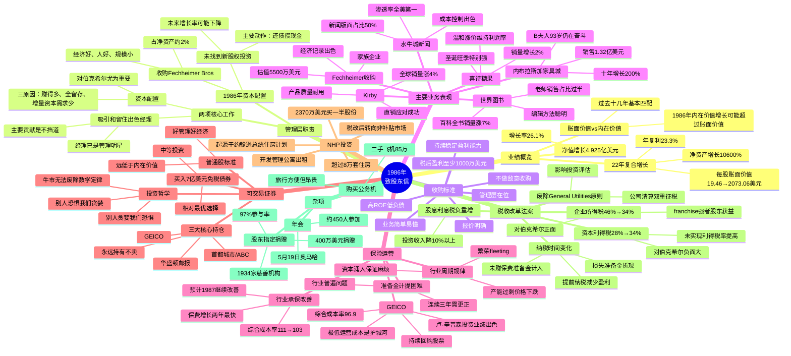

# 1986年巴菲特致股东信思维导图

---

## 结构概要表

| 章节 | 主要内容 | 关键数据/要点 |
|------|----------|---------------|
| 业绩概览 | 年度业绩与管理层职责 | 净值增长26.1%，22年复利23.3% |
| 报告收益来源 | 各业务板块收益明细 | 营业收益1.96亿美元，总收益4.12亿美元 |
| 主要业务表现 | 水牛城、NFM、喜诗、世界图书、Kirby详情 | 渗透率第一、销售增长、利润率维持 |
| Fechheimer收购 | 收购案例与标准更新 | 5500万估值，收购标准提至1000万 |
| 保险运营 | 行业分析与GEICO表现 | 综合成本率改善，GEICO成本率96.9 |
| 可交易证券 | 投资策略与核心持仓 | 7亿债券，三大持仓永远持有 |
| NHP投资 | 公寓住房投资 | 2370万美元，8万套住房 |
| 税收改革法案 | 税改对各业务影响 | 企业税降、资本利得税升、股息税负重 |
| 杂项 | 公务机、捐赠、年会 | 400万捐赠，450人参会 |

---

## 关键人物链接

| 人物 | 身份 | 相关企业 | 本章提及要点 |
|------|------|----------|--------------|
| 沃伦·巴菲特 | 董事长 | 伯克希尔·哈撒韦 | 资本配置困难，承认配不上经理们表现 |
| 查理·芒格 | 副董事长 | 伯克希尔·哈撒韦 | 两项工作：留住经理、配置资本 |
| B夫人（Rose Blumkin） | 创始人 | 内布拉斯加家具城 | 93岁仍是最强销售，NFM十年增长200% |
| 斯坦·利普西 | 出版人 | 水牛城新闻 | 管理superb，渗透率全美第一 |
| 查克·哈金斯 | CEO | 喜诗糖果 | 保持客户导向企业文化 |
| 拉尔夫·谢伊 | CEO | Scott Fetzer/世界图书 | 超级棒商人，精力全能 |
| Bob Heldman | 董事长 | Fechheimer Bros | 家族企业，主动写信寻求收购 |
| 迈克·戈德堡 | 保险经理 | 伯克希尔保险集团 | 保险运营出色表现 |
| 比尔·斯奈德 | 董事长 | GEICO | 极低运营成本，持续压降费用 |
| 卢·辛普森 | 投资副总裁 | GEICO | 投资业绩远超标普500 |
| 穆雷·莱特 | 主编 | 水牛城新闻 | 困难时期坚持，繁荣后不变 |

---

## 关键公司链接

| 公司 | 业务性质 | 本章要点 |
|------|----------|----------|
| 伯克希尔·哈撒韦 | 投资控股公司 | 净值2073美元/股，22年复利23.3% |
| 水牛城新闻 | 报纸出版 | 工作日+周日渗透率双第一，新闻版面50% |
| 内布拉斯加家具城 | 家具零售 | 销售1.32亿，十年增长200%，B夫人传奇 |
| 喜诗糖果 | 糖果零售 | 销量增2%，温和涨价维持利润率 |
| 世界图书 | 百科全书出版 | 销量增7%，美国直销第一 |
| Kirby | 吸尘器制造 | 全球销量增4%，产品耐用三十四年 |
| Fechheimer Bros | 制服生产分销 | 1842年创立，5500万估值收购 |
| GEICO | 汽车保险 | 成本率96.9，极低成本护城河 |
| 首都城市/ABC | 媒体集团 | 三大核心持仓之一，永远持有 |
| 华盛顿邮报 | 报业集团 | 三大核心持仓之一，永远持有 |
| NHP | 公寓开发管理 | 8万套住房，税改后转向非补贴市场 |
| Scott Fetzer | 多元化制造 | 世界图书+Kirby母公司，收购后表现出色 |

---

## 时代背景

### 1986年美国经济与市场环境

| 维度 | 背景 | 对巴菲特的影响 |
|------|------|----------------|
| **股市环境** | 牛市欣快症，华尔街缺乏恐惧 | 找不到低估普通股，买入债券替代 |
| **保险行业** | 保费增长22.6%，综合成本率改善 | 承保亏损大幅下降，但预计繁荣短暂 |
| **税收改革** | 1986年税改法案通过 | 企业税降但资本利得税升，整体负面影响 |
| **并购市场** | 企业重组活跃 | 收购Fechheimer，提高收购标准至1000万 |
| **利率环境** | 中期利率相对较高 | 8-12年免税债券成为相对优选择 |

### 关键历史节点

- **税改里程碑**：1986年税收改革法案是美国二战后最重要税制改革，简化税制、降低税率、扩大税基
- **保险周期**：保费增长从27.1%降至18.7%，行业产能扩张预示未来价格下跌
- **企业重组浪潮**：LBO（杠杆收购）盛行，Fechheimer前身为风投LBO标的
- **媒体行业变革**：首都城市收购ABC，形成媒体巨头

### 巴菲特投资哲学的体现

1. **长期主义**：三大核心持仓"永远持有"，不受市场估值波动影响
2. **逆向思维**："别人贪婪我恐惧，别人恐惧我贪婪"
3. **质量优先**：只与喜欢欣赏的人合作，宁缺毋滥
4. **能力圈**：业务简单易懂，太多技术不碰
5. **护城河意识**：GEICO极低成本、水牛城新闻高渗透率
