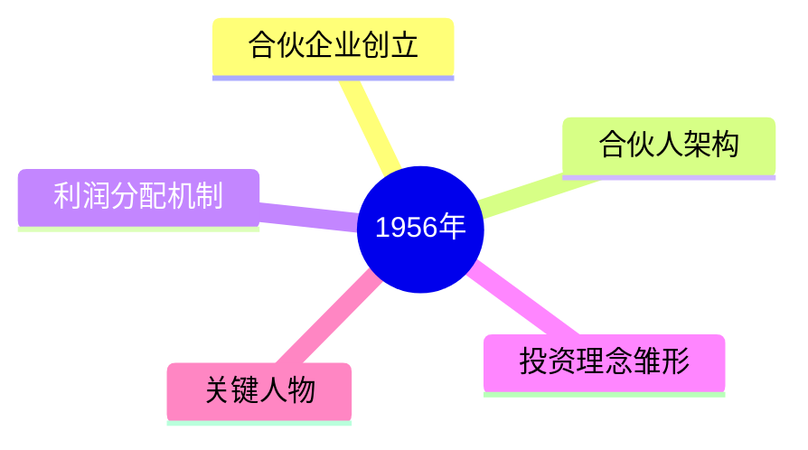
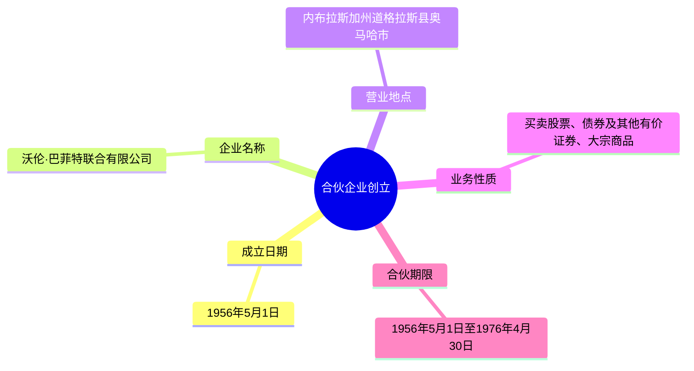
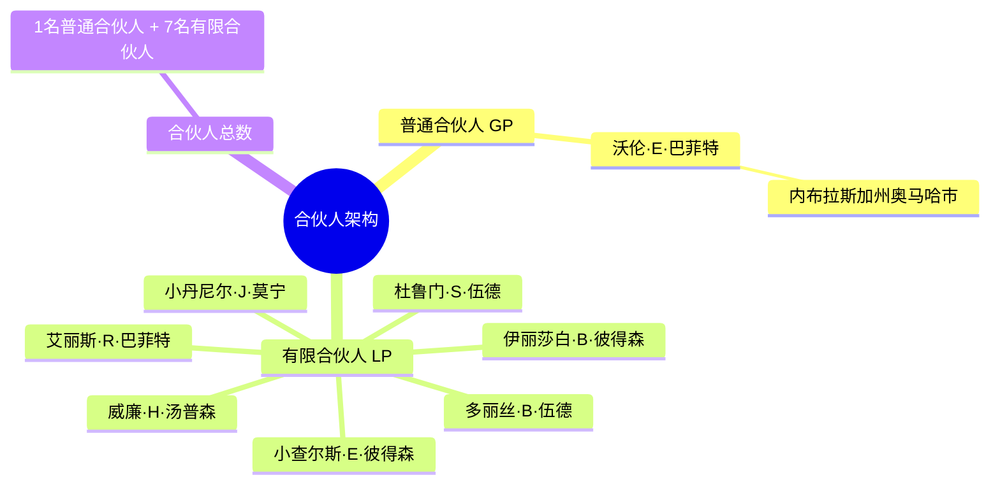
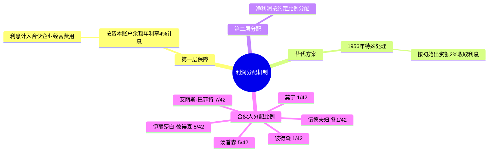
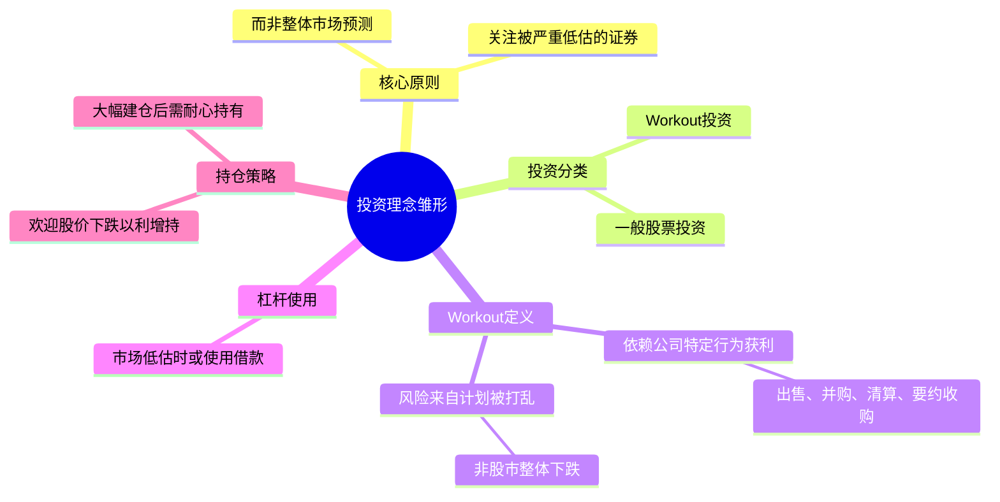
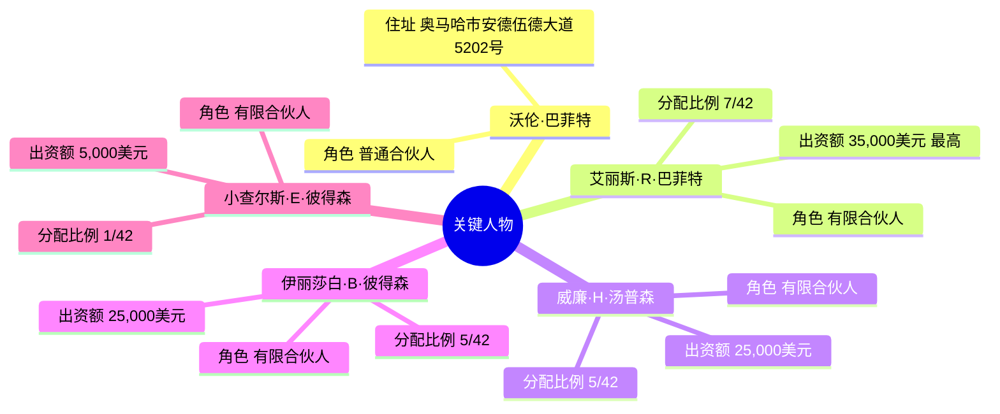

# 1956年 思维导图

```mermaid
mindmap
  root((1956年))
    合伙企业创立
    合伙人架构
    利润分配机制
    投资理念雏形
    关键人物
```

---

## 合伙企业创立

合伙企业创立

```mermaid
mindmap
  root((合伙企业创立))
    成立日期
      1956年5月1日
    企业名称
      沃伦·巴菲特联合有限公司
    营业地点
      内布拉斯加州道格拉斯县奥马哈市
    业务性质
      买卖股票、债券及其他有价证券、大宗商品
    合伙期限
      1956年5月1日至1976年4月30日
```

---

## 合伙人架构

合伙人架构

```mermaid
mindmap
  root((合伙人架构))
    普通合伙人 GP
      沃伦·E·巴菲特
        内布拉斯加州奥马哈市
    有限合伙人 LP
      小查尔斯·E·彼得森
      伊丽莎白·B·彼得森
      多丽丝·B·伍德
      杜鲁门·S·伍德
      小丹尼尔·J·莫宁
      威廉·H·汤普森
      艾丽斯·R·巴菲特
    合伙人总数
      1名普通合伙人 + 7名有限合伙人
```

---

## 利润分配机制

利润分配机制

```mermaid
mindmap
  root((利润分配机制))
    第一层保障
      按资本账户余额年利率4%计息
        利息计入合伙企业经营费用
    替代方案
      1956年特殊处理
        按初始出资额2%收取利息
    第二层分配
      净利润按约定比例分配
    合伙人分配比例
      彼得森 1/42
      伊丽莎白·彼得森 5/42
      伍德夫妇 各1/42
      莫宁 1/42
      汤普森 5/42
      艾丽斯·巴菲特 7/42
```

---

## 投资理念雏形

投资理念雏形

```mermaid
mindmap
  root((投资理念雏形))
    核心原则
      关注被严重低估的证券
      而非整体市场预测
    投资分类
      一般股票投资
      Workout投资
    Workout定义
      依赖公司特定行为获利
        出售、并购、清算、要约收购
      风险来自计划被打乱
        非股市整体下跌
    杠杆使用
      市场低估时或使用借款
    持仓策略
      大幅建仓后需耐心持有
      欢迎股价下跌以利增持
```

---

## 关键人物

关键人物

```mermaid
mindmap
  root((关键人物))
    沃伦·巴菲特
      角色 普通合伙人
      住址 奥马哈市安德伍德大道5202号
    艾丽斯·R·巴菲特
      角色 有限合伙人
      出资额 35,000美元 最高
      分配比例 7/42
    威廉·H·汤普森
      角色 有限合伙人
      出资额 25,000美元
      分配比例 5/42
    伊丽莎白·B·彼得森
      角色 有限合伙人
      出资额 25,000美元
      分配比例 5/42
    小查尔斯·E·彼得森
      角色 有限合伙人
      出资额 5,000美元
      分配比例 1/42
```

