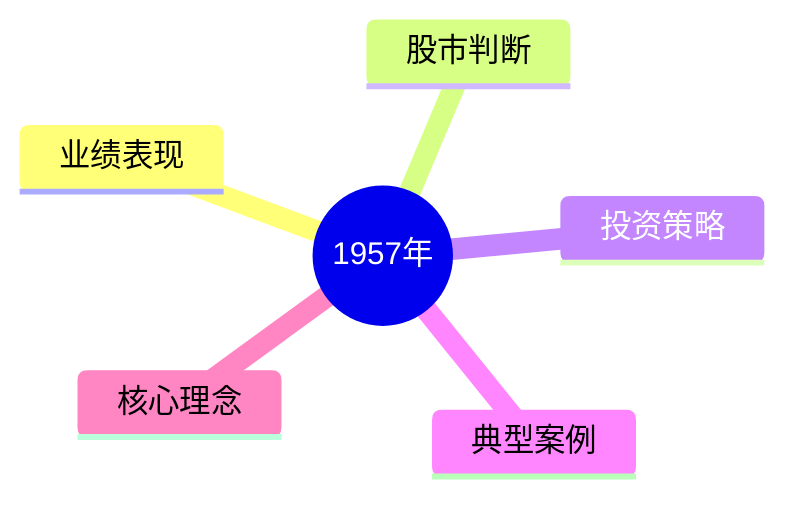
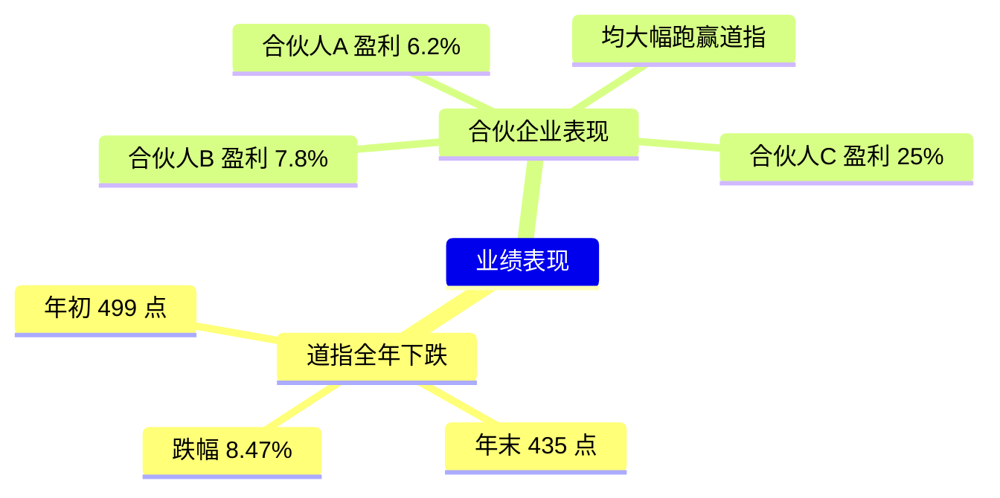
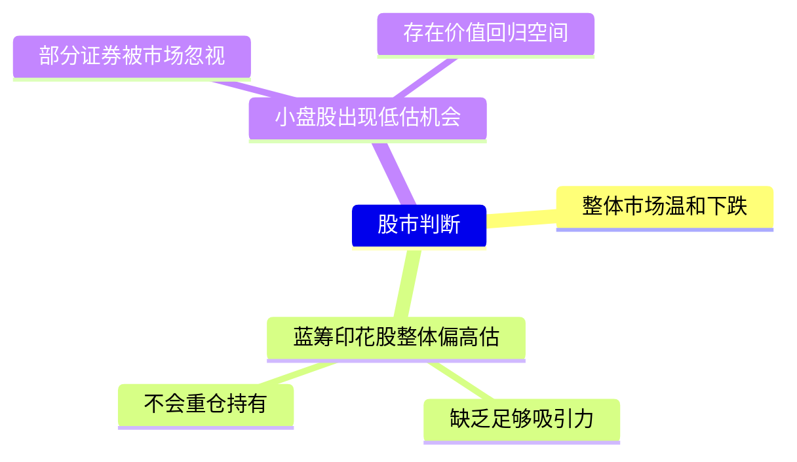
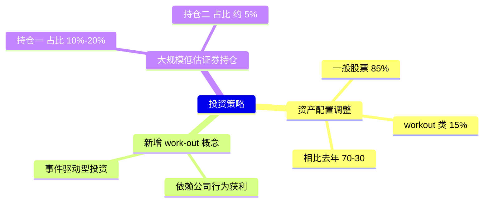
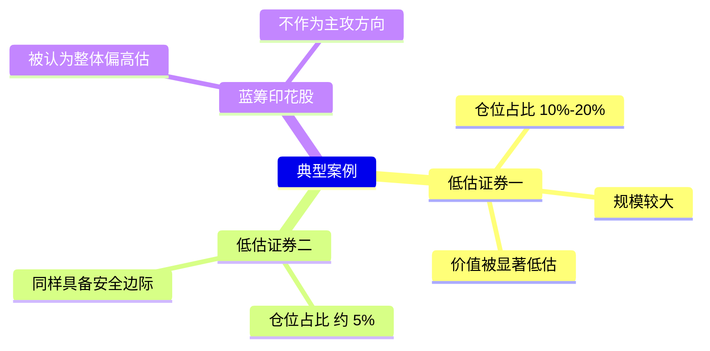
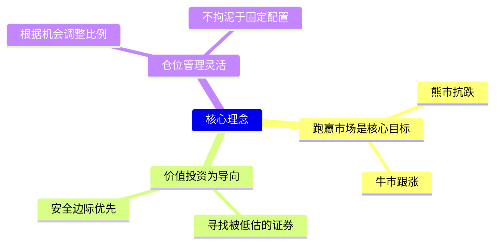

# 1957 年巴菲特致股东信 — 思维导图

---

```mermaid
mindmap
  root((1957年))
    业绩表现
    股市判断
    投资策略
    典型案例
    核心理念
```

---

业绩表现

```mermaid
mindmap
  业绩表现
    道指全年下跌
      年初 499 点
      年末 435 点
      跌幅 8.47%
    合伙企业表现
      合伙人A 盈利 6.2%
      合伙人B 盈利 7.8%
      合伙人C 盈利 25%
      均大幅跑赢道指
```

---

股市判断

```mermaid
mindmap
  股市判断
    整体市场温和下跌
    蓝筹印花股整体偏高估
      缺乏足够吸引力
      不会重仓持有
    小盘股出现低估机会
      部分证券被市场忽视
      存在价值回归空间
```

---

投资策略

```mermaid
mindmap
  投资策略
    资产配置调整
      一般股票 85%
      workout 类 15%
      相比去年 70-30
    新增 work-out 概念
      依赖公司行为获利
      事件驱动型投资
    大规模低估证券持仓
      持仓一 占比 10%-20%
      持仓二 占比 约 5%
```

---

典型案例

```mermaid
mindmap
  典型案例
    低估证券一
      仓位占比 10%-20%
      规模较大
      价值被显著低估
    低估证券二
      仓位占比 约 5%
      同样具备安全边际
    蓝筹印花股
      被认为整体偏高估
      不作为主攻方向
```

---

核心理念

```mermaid
mindmap
  核心理念
    跑赢市场是核心目标
      熊市抗跌
      牛市跟涨
    价值投资为导向
      寻找被低估的证券
      安全边际优先
    仓位管理灵活
      根据机会调整比例
      不拘泥于固定配置
```

