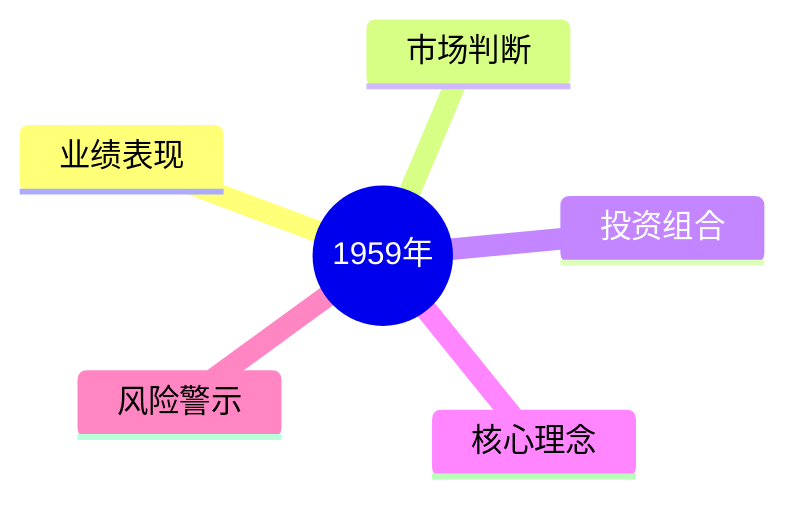
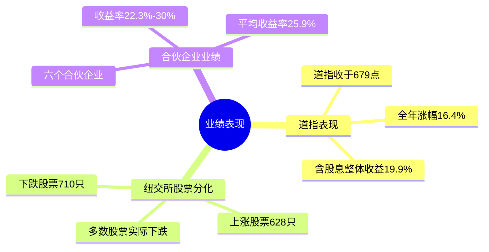
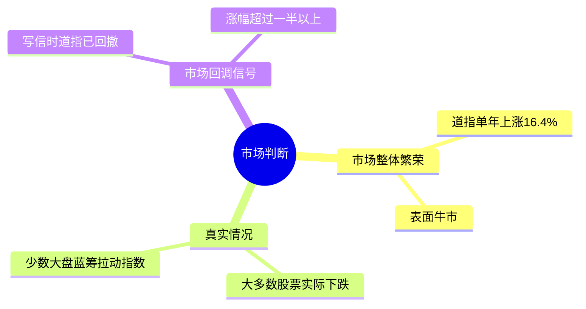
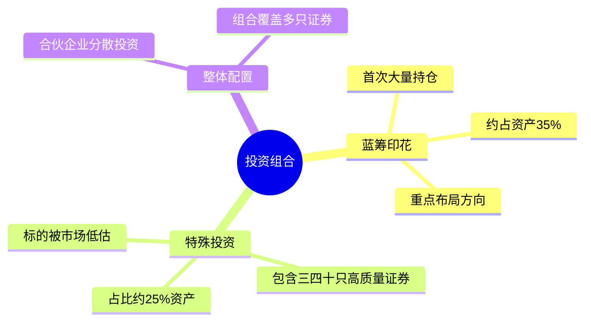
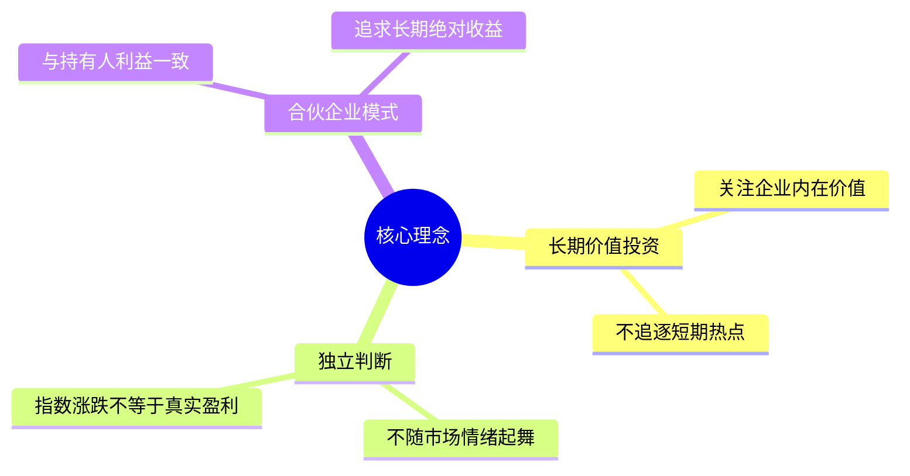
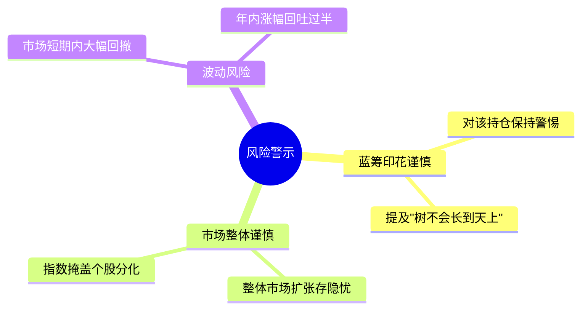

# 1959年 巴菲特致股东信 思维导图

```mermaid
mindmap
  root((1959年))
    业绩表现
    市场判断
    投资组合
    核心理念
    风险警示
```

---

业绩表现

```mermaid
mindmap
  root((业绩表现))
    道指表现
      道指收于679点
      全年涨幅16.4%
      含股息整体收益19.9%
    纽交所股票分化
      下跌股票710只
      上涨股票628只
      多数股票实际下跌
    合伙企业业绩
      六个合伙企业
      收益率22.3%-30%
      平均收益率25.9%
```

---

市场判断

```mermaid
mindmap
  root((市场判断))
    市场整体繁荣
      道指单年上涨16.4%
      表面牛市
    真实情况
      大多数股票实际下跌
      少数大盘蓝筹拉动指数
    市场回调信号
      写信时道指已回撤
      涨幅超过一半以上
```

---

投资组合

```mermaid
mindmap
  root((投资组合))
    蓝筹印花
      首次大量持仓
      约占资产35%
      重点布局方向
    特殊投资
      占比约25%资产
      包含三四十只高质量证券
      标的被市场低估
    整体配置
      合伙企业分散投资
      组合覆盖多只证券
```

---

核心理念

```mermaid
mindmap
  root((核心理念))
    长期价值投资
      关注企业内在价值
      不追逐短期热点
    独立判断
      不随市场情绪起舞
      指数涨跌不等于真实盈利
    合伙企业模式
      与持有人利益一致
      追求长期绝对收益
```

---

风险警示

```mermaid
mindmap
  root((风险警示))
    蓝筹印花谨慎
      对该持仓保持警惕
      提及"树不会长到天上"
    市场整体谨慎
      整体市场扩张存隐忧
      指数掩盖个股分化
    波动风险
      市场短期内大幅回撤
      年内涨幅回吐过半
```

