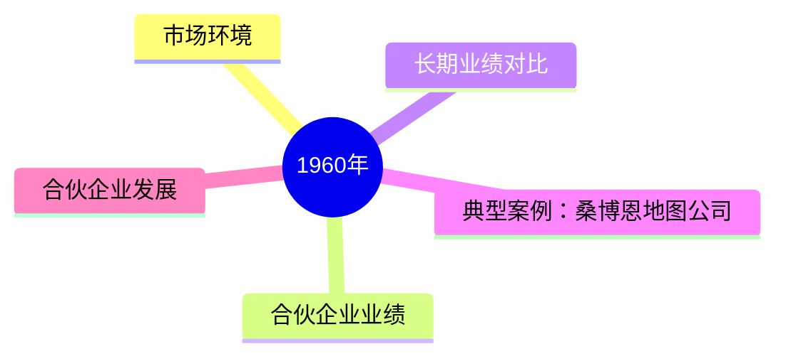
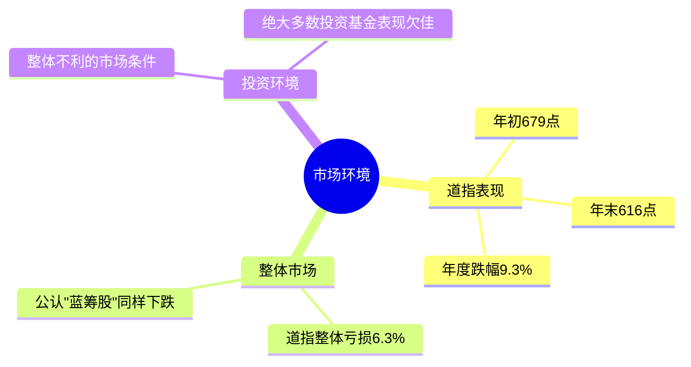
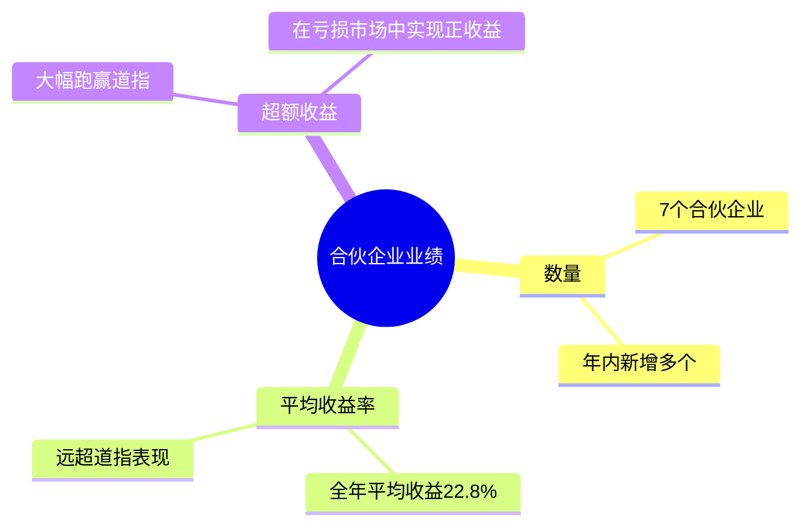
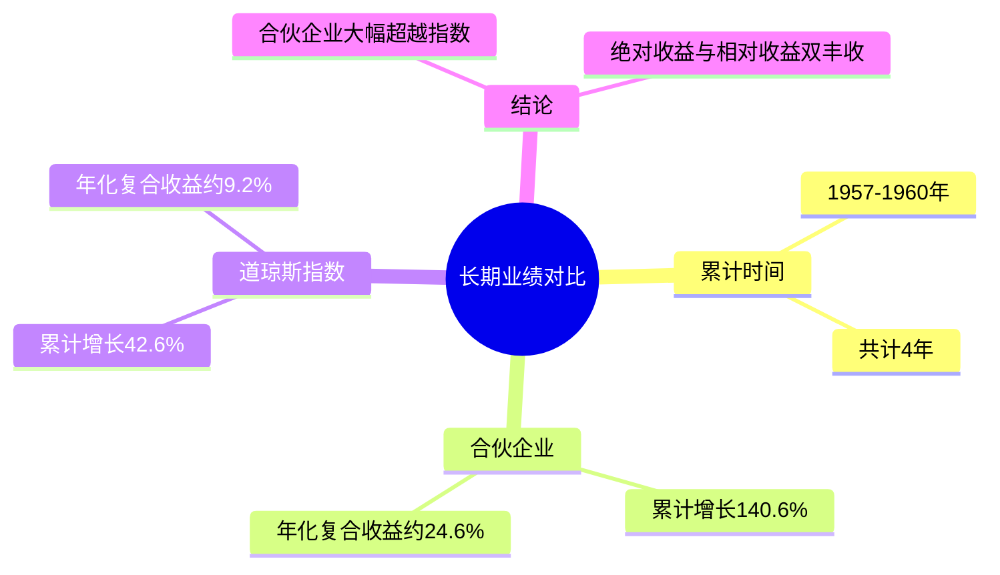
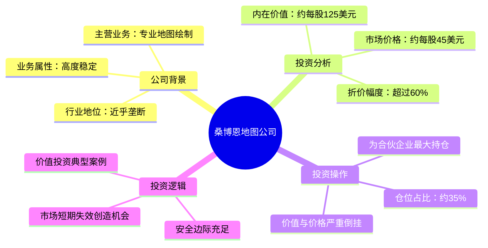
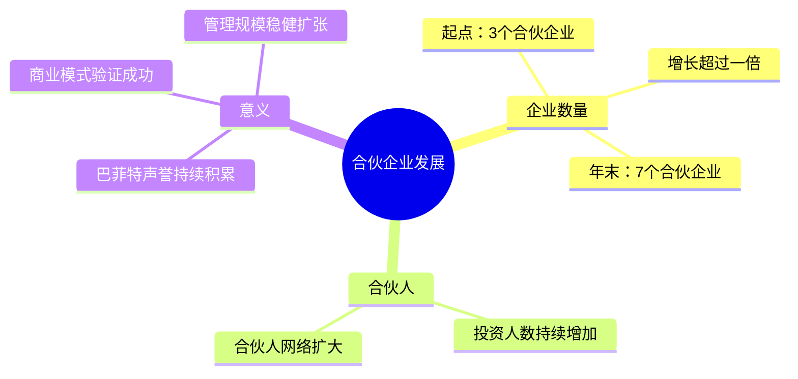

# 1960年巴菲特致股东信 思维导图

---

## 市场环境

市场环境

---

## 合伙企业业绩

合伙企业业绩

---

## 长期业绩对比

长期业绩对比

---

## 典型案例：桑博恩地图公司

典型案例：桑博恩地图公司

---

## 合伙企业发展

合伙企业发展

---

> 📌 **数据来源**：1960年巴菲特致股东信原文。所有数据均来自信中实际披露内容。
