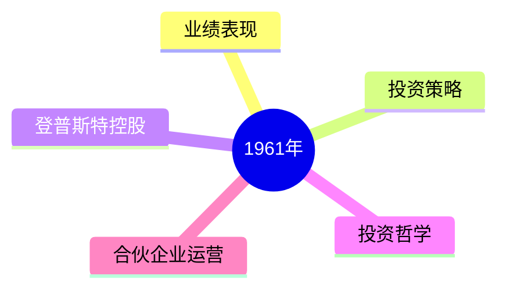
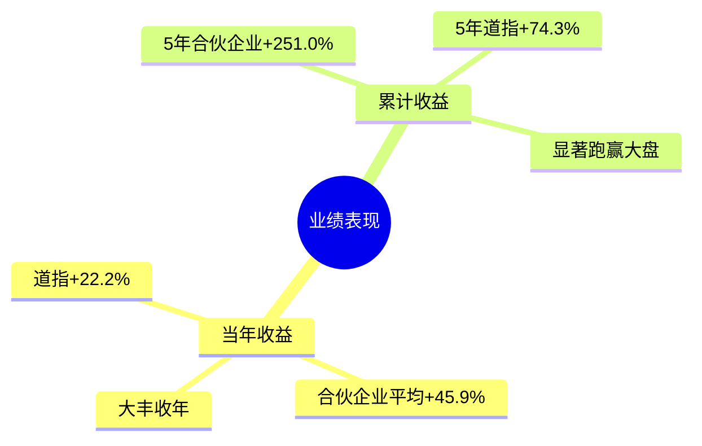
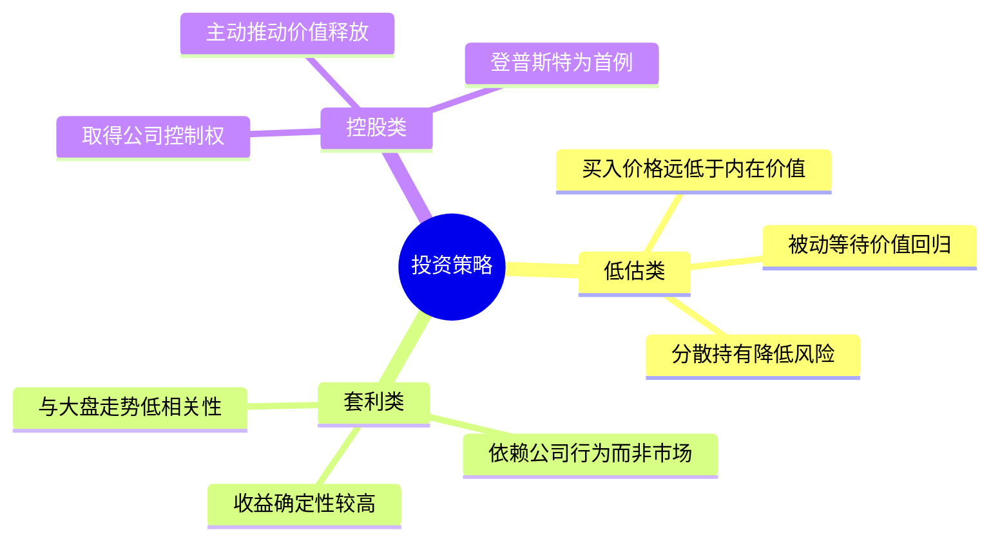
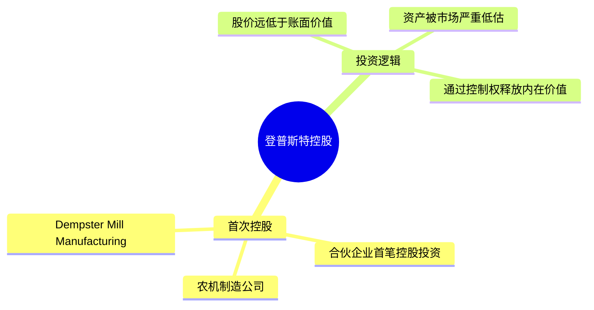
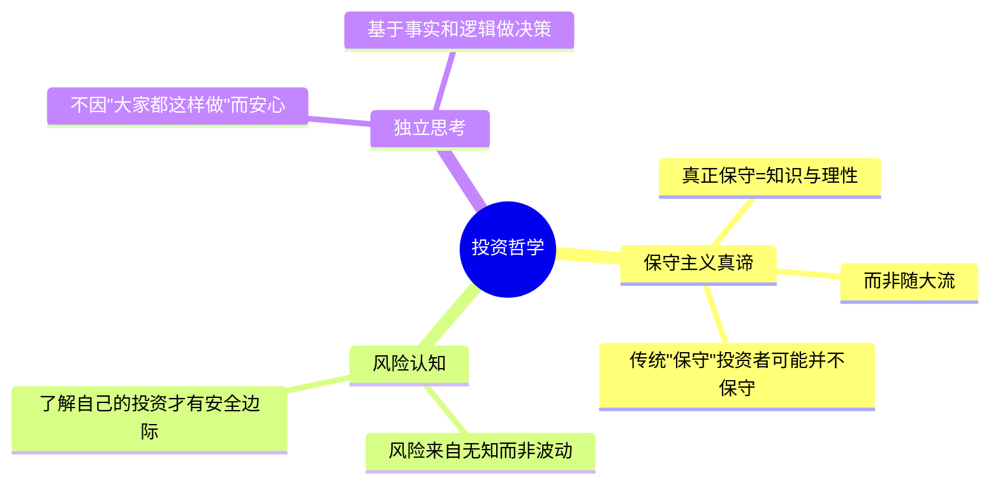
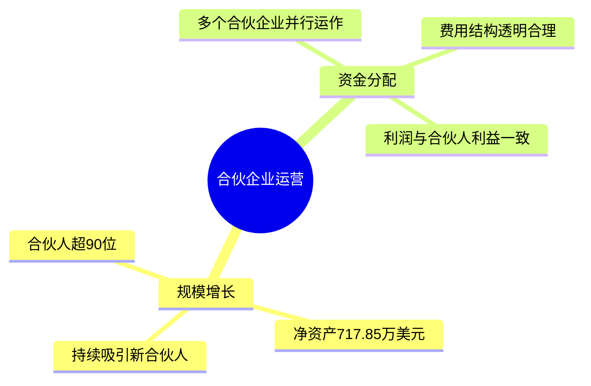

# 1961年巴菲特致股东信 · 思维导图

## 总览

```mermaid
mindmap
  root((1961年))
    业绩表现
    投资策略
    登普斯特控股
    投资哲学
    合伙企业运营
```

---

## 业绩表现

📊 业绩表现

```mermaid
mindmap
  root((业绩表现))
    当年收益
      道指+22.2%
      合伙企业平均+45.9%
      大丰收年
    累计收益
      5年合伙企业+251.0%
      5年道指+74.3%
      显著跑赢大盘
```

---

## 投资策略

🎯 投资策略

```mermaid
mindmap
  root((投资策略))
    低估类
      买入价格远低于内在价值
      分散持有降低风险
      被动等待价值回归
    套利类
      依赖公司行为而非市场
      收益确定性较高
      与大盘走势低相关性
    控股类
      取得公司控制权
      主动推动价值释放
      登普斯特为首例
```

---

## 登普斯特控股

🏭 登普斯特控股

```mermaid
mindmap
  root((登普斯特控股))
    首次控股
      Dempster Mill Manufacturing
      农机制造公司
      合伙企业首笔控股投资
    投资逻辑
      股价远低于账面价值
      资产被市场严重低估
      通过控制权释放内在价值
```

---

## 投资哲学

💡 投资哲学

```mermaid
mindmap
  root((投资哲学))
    保守主义真谛
      真正保守=知识与理性
      而非随大流
      传统"保守"投资者可能并不保守
    风险认知
      风险来自无知而非波动
      了解自己的投资才有安全边际
    独立思考
      不因"大家都这样做"而安心
      基于事实和逻辑做决策
```

---

## 合伙企业运营

🏢 合伙企业运营

```mermaid
mindmap
  root((合伙企业运营))
    规模增长
      合伙人超90位
      净资产717.85万美元
      持续吸引新合伙人
    资金分配
      多个合伙企业并行运作
      费用结构透明合理
      利润与合伙人利益一致
```

