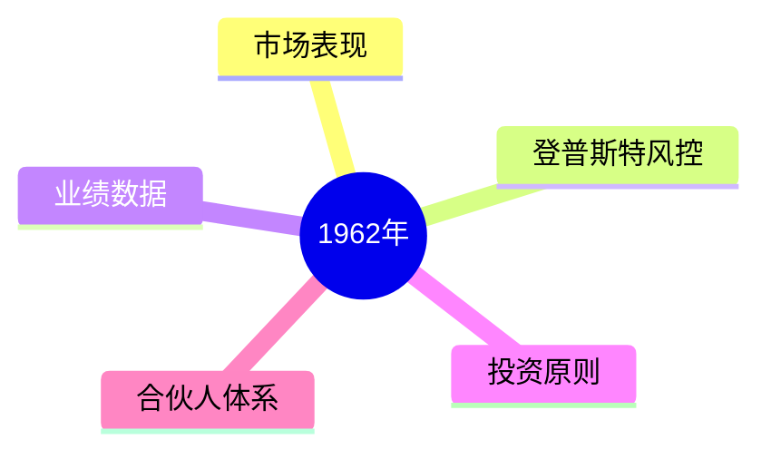
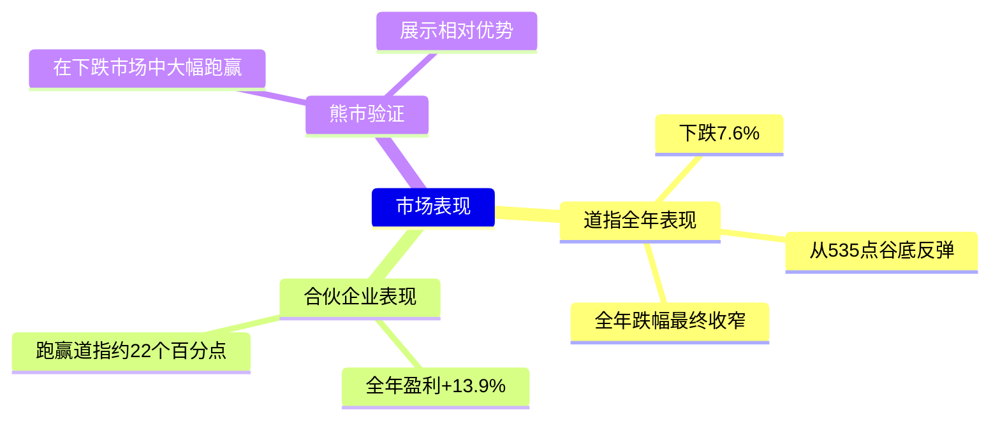
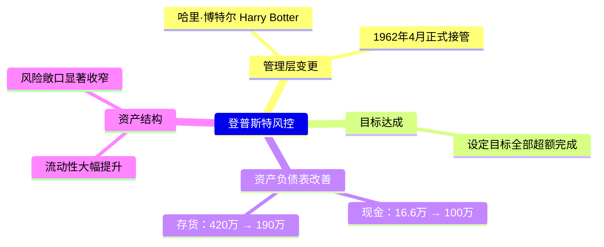
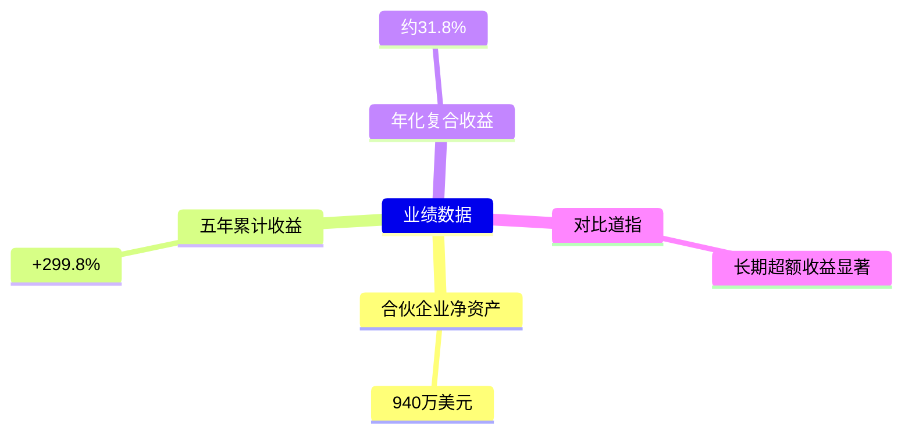
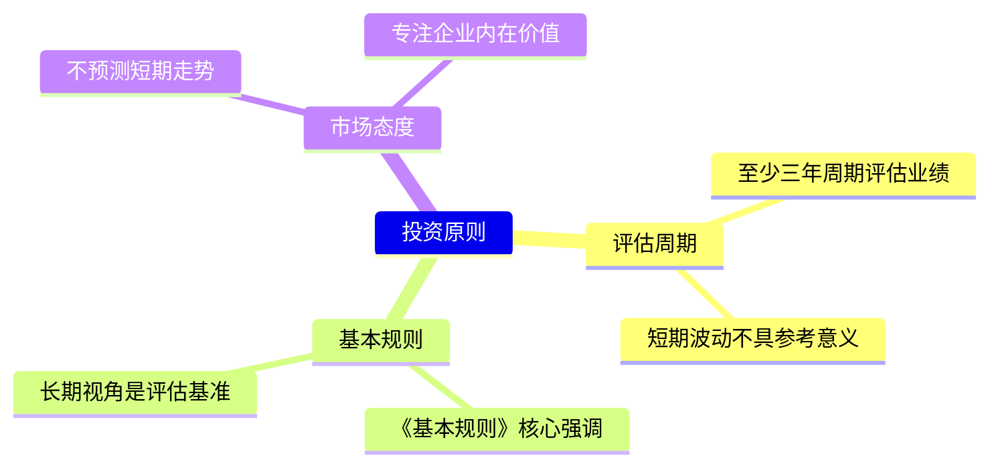
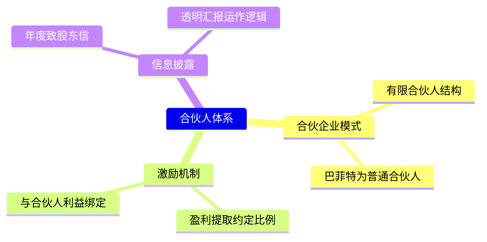

# 1962年巴菲特致股东信 · 思维导图

## 总览

```mermaid
mindmap
  root((1962年))
    市场表现
    登普斯特风控
    业绩数据
    投资原则
    合伙人体系
```

---

## 市场表现

市场表现

```mermaid
mindmap
  市场表现
    道指全年表现
      下跌7.6%
      从535点谷底反弹
      全年跌幅最终收窄
    合伙企业表现
      全年盈利+13.9%
      跑赢道指约22个百分点
    熊市验证
      在下跌市场中大幅跑赢
      展示相对优势
```

---

## 登普斯特风控

登普斯特风控

```mermaid
mindmap
  登普斯特风控
    管理层变更
      哈里·博特尔 Harry Botter
      1962年4月正式接管
    目标达成
      设定目标全部超额完成
    资产负债表改善
      现金：16.6万 → 100万
      存货：420万 → 190万
    资产结构
      流动性大幅提升
      风险敞口显著收窄
```

---

## 业绩数据

业绩数据

```mermaid
mindmap
  业绩数据
    合伙企业净资产
      940万美元
    五年累计收益
      +299.8%
    年化复合收益
      约31.8%
    对比道指
      长期超额收益显著
```

---

## 投资原则

投资原则

```mermaid
mindmap
  投资原则
    评估周期
      至少三年周期评估业绩
      短期波动不具参考意义
    基本规则
      《基本规则》核心强调
      长期视角是评估基准
    市场态度
      不预测短期走势
      专注企业内在价值
```

---

## 合伙人体系

合伙人体系

```mermaid
mindmap
  合伙人体系
    合伙企业模式
      有限合伙人结构
      巴菲特为普通合伙人
    激励机制
      盈利提取约定比例
      与合伙人利益绑定
    信息披露
      年度致股东信
      透明汇报运作逻辑
```

