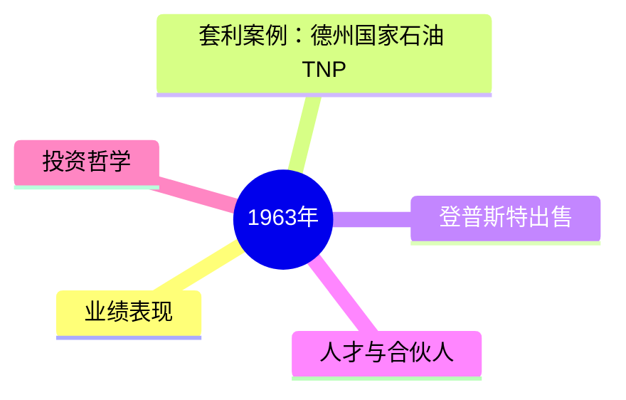
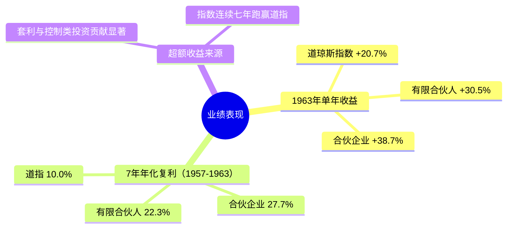
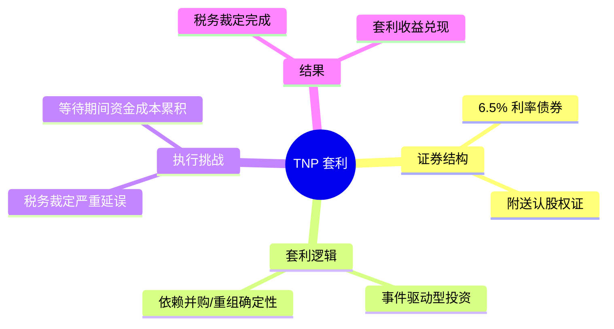
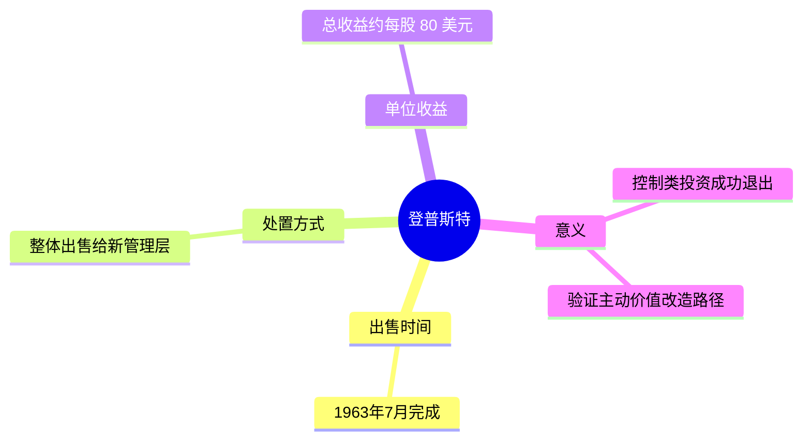
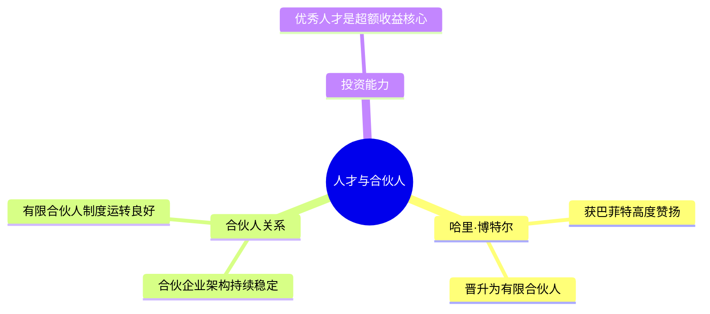
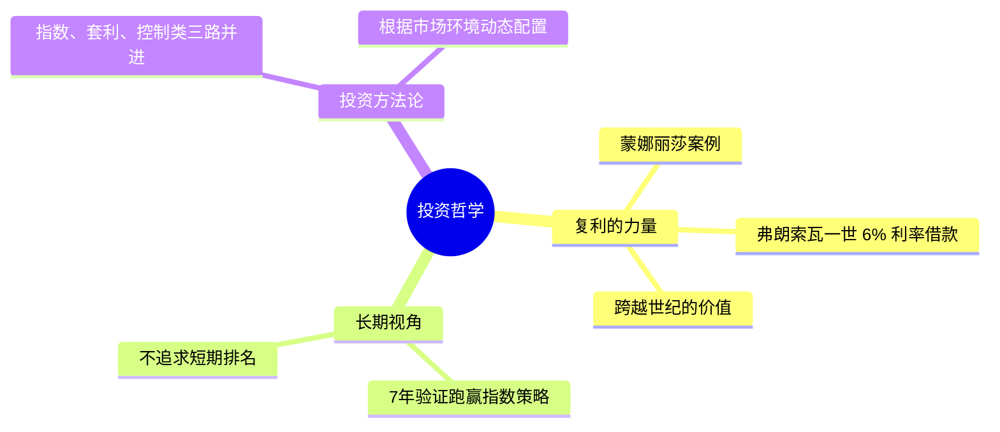

# 1963年巴菲特致股东信 · 思维导图

> 渲染提示：在支持 Mermaid 的编辑器（如 Typora、VS Code+Mermaid 插件、GitLab、GitHub）中打开即可查看。

---

## 总览

---

## 详细展开

📈 业绩表现

🔗 套利案例：德州国家石油 TNP

🏭 登普斯特出售（Dempster）

👤 人才与合伙人

💡 投资哲学

---

*数据来源：1963年巴菲特致股东信原文，未经虚构。*
