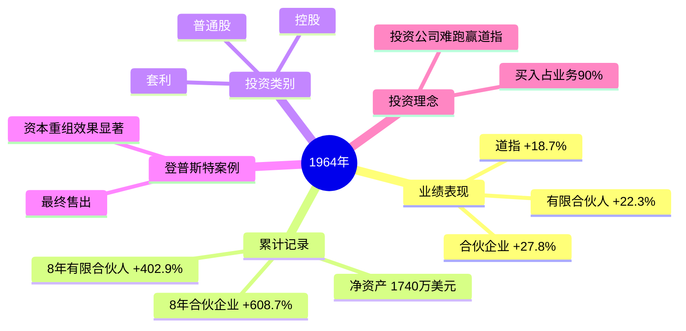
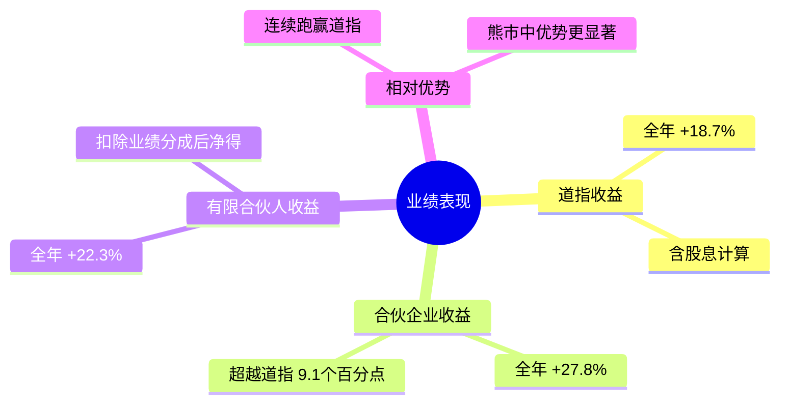
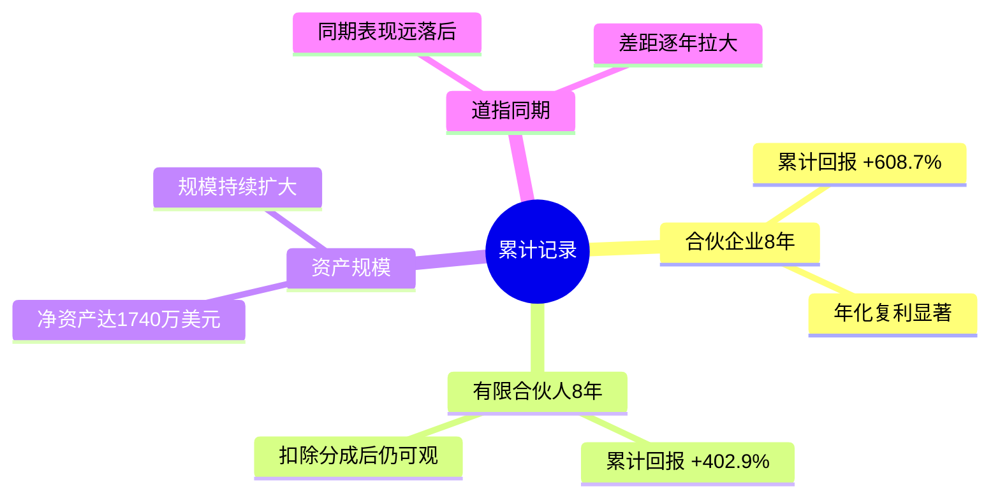
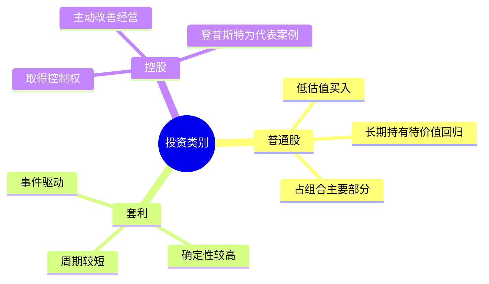
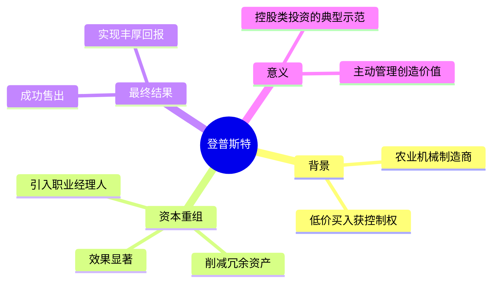
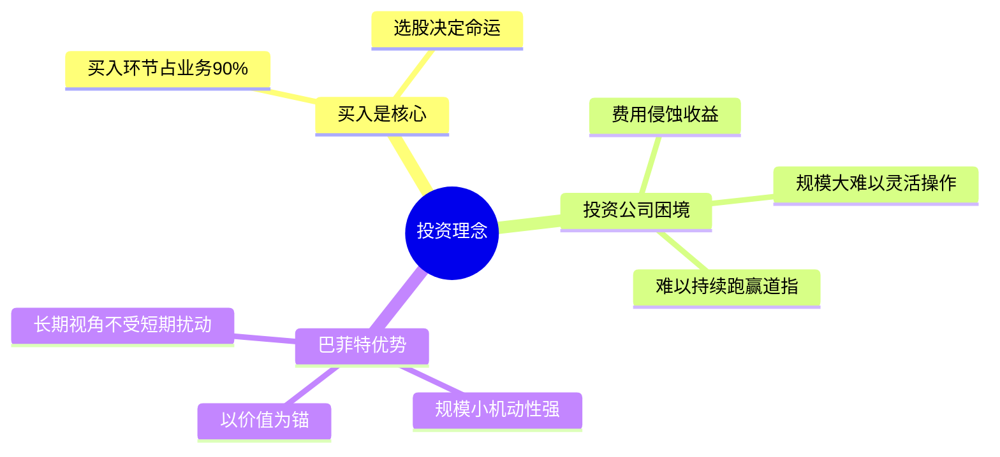

# 1964年巴菲特致股东信 · 思维导图

## 总览

```mermaid
mindmap
  root((1964年))
    业绩表现
      道指 +18.7%
      合伙企业 +27.8%
      有限合伙人 +22.3%
    累计记录
      8年合伙企业 +608.7%
      8年有限合伙人 +402.9%
      净资产 1740万美元
    投资类别
      普通股
      套利
      控股
    登普斯特案例
      最终售出
      资本重组效果显著
    投资理念
      买入占业务90%
      投资公司难跑赢道指
```

---

业绩表现

```mermaid
mindmap
  root((业绩表现))
    道指收益
      全年 +18.7%
      含股息计算
    合伙企业收益
      全年 +27.8%
      超越道指 9.1个百分点
    有限合伙人收益
      全年 +22.3%
      扣除业绩分成后净得
    相对优势
      连续跑赢道指
      熊市中优势更显著
```

累计记录

```mermaid
mindmap
  root((累计记录))
    合伙企业8年
      累计回报 +608.7%
      年化复利显著
    有限合伙人8年
      累计回报 +402.9%
      扣除分成后仍可观
    资产规模
      净资产达1740万美元
      规模持续扩大
    道指同期
      同期表现远落后
      差距逐年拉大
```

投资类别

```mermaid
mindmap
  root((投资类别))
    普通股
      低估值买入
      长期持有待价值回归
      占组合主要部分
    套利
      事件驱动
      确定性较高
      周期较短
    控股
      取得控制权
      主动改善经营
      登普斯特为代表案例
```

登普斯特案例

```mermaid
mindmap
  root((登普斯特))
    背景
      农业机械制造商
      低价买入获控制权
    资本重组
      引入职业经理人
      削减冗余资产
      效果显著
    最终结果
      成功售出
      实现丰厚回报
    意义
      控股类投资的典型示范
      主动管理创造价值
```

投资理念

```mermaid
mindmap
  root((投资理念))
    买入是核心
      买入环节占业务90%
      选股决定命运
    投资公司困境
      规模大难以灵活操作
      费用侵蚀收益
      难以持续跑赢道指
    巴菲特优势
      规模小机动性强
      以价值为锚
      长期视角不受短期扰动
```

