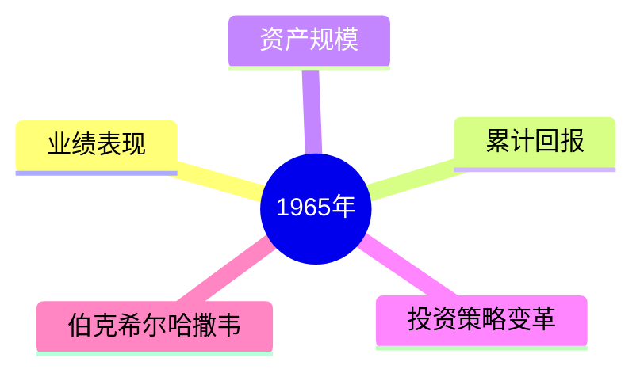
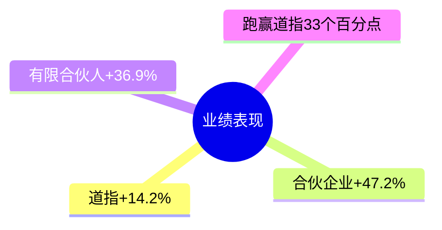
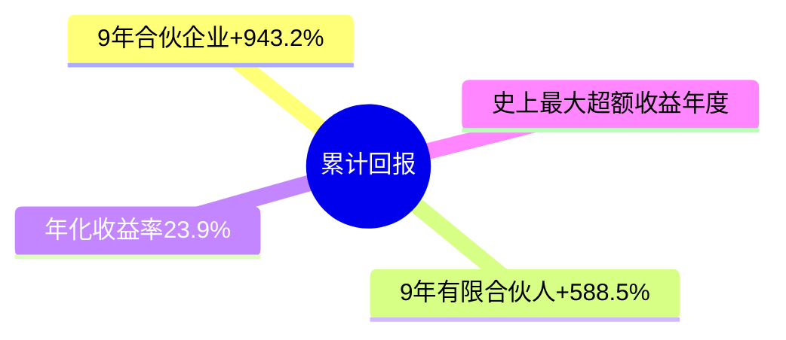
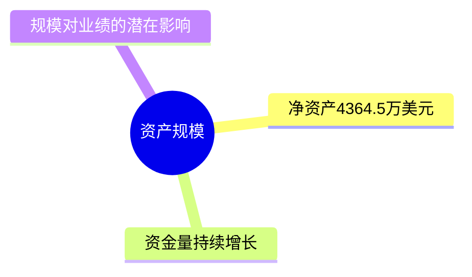
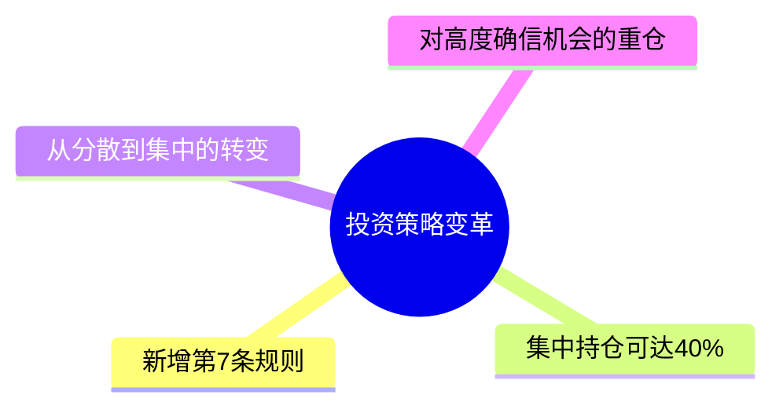
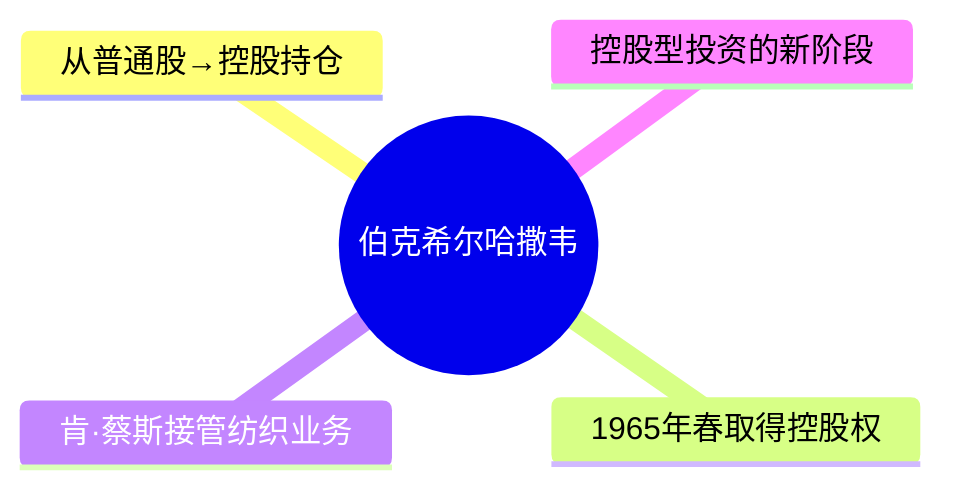

# 1965年巴菲特致股东信 · 思维导图

## 总览

```mermaid
mindmap
  root((1965年))
    业绩表现
    累计回报
    资产规模
    投资策略变革
    伯克希尔哈撒韦
```

---

业绩表现

```mermaid
mindmap
  root((业绩表现))
    道指+14.2%
    合伙企业+47.2%
    有限合伙人+36.9%
    跑赢道指33个百分点
```

累计回报

```mermaid
mindmap
  root((累计回报))
    9年合伙企业+943.2%
    9年有限合伙人+588.5%
    年化收益率23.9%
    史上最大超额收益年度
```

资产规模

```mermaid
mindmap
  root((资产规模))
    净资产4364.5万美元
    资金量持续增长
    规模对业绩的潜在影响
```

投资策略变革

```mermaid
mindmap
  root((投资策略变革))
    新增第7条规则
    集中持仓可达40%
    从分散到集中的转变
    对高度确信机会的重仓
```

伯克希尔哈撒韦

```mermaid
mindmap
  root((伯克希尔哈撒韦))
    从普通股→控股持仓
    1965年春取得控股权
    肯·蔡斯接管纺织业务
    控股型投资的新阶段
```

