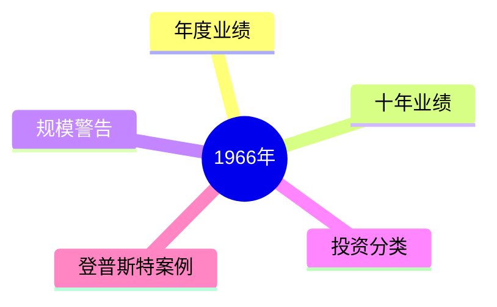
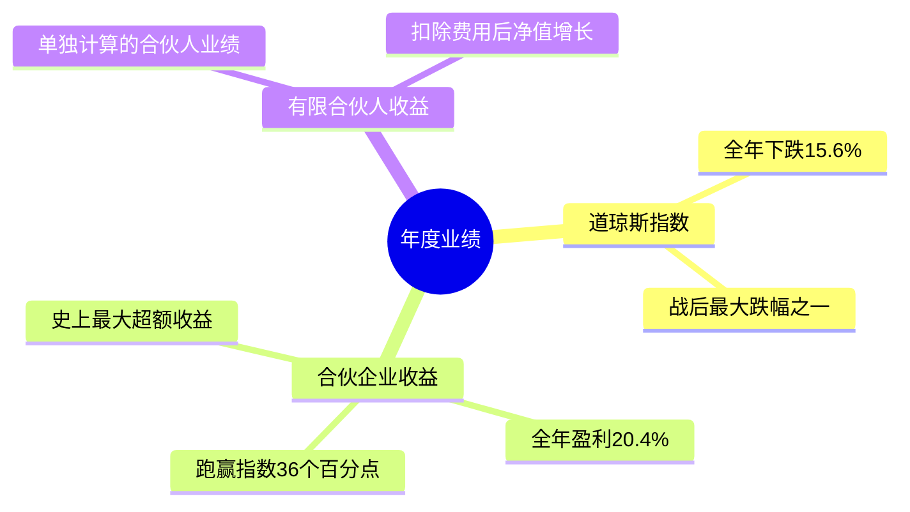
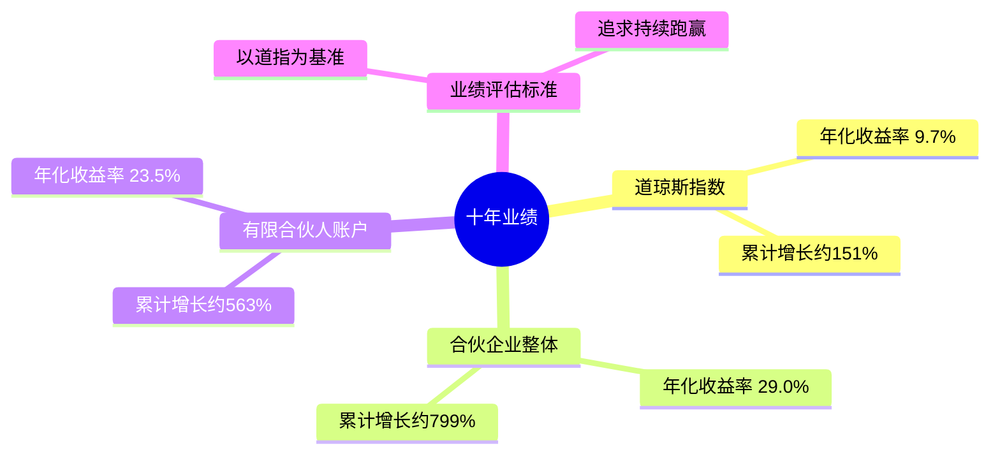
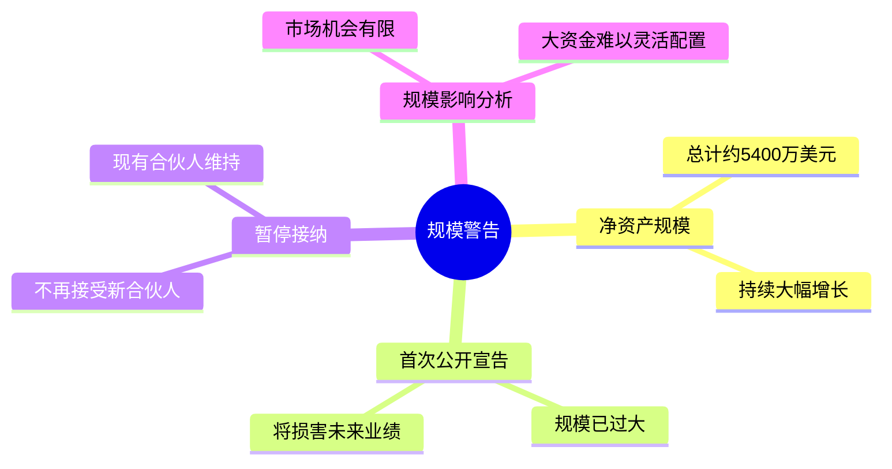
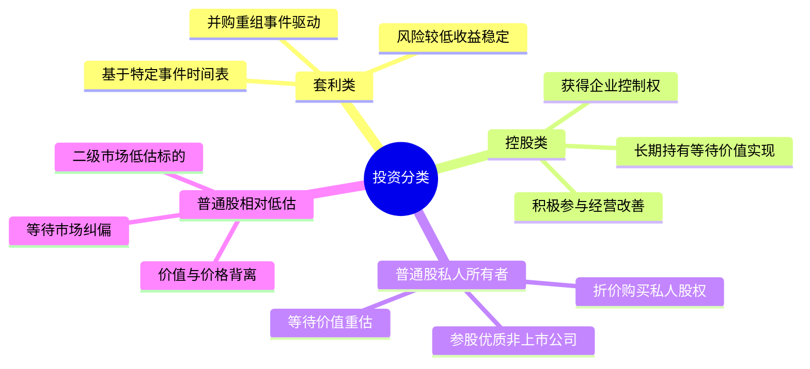
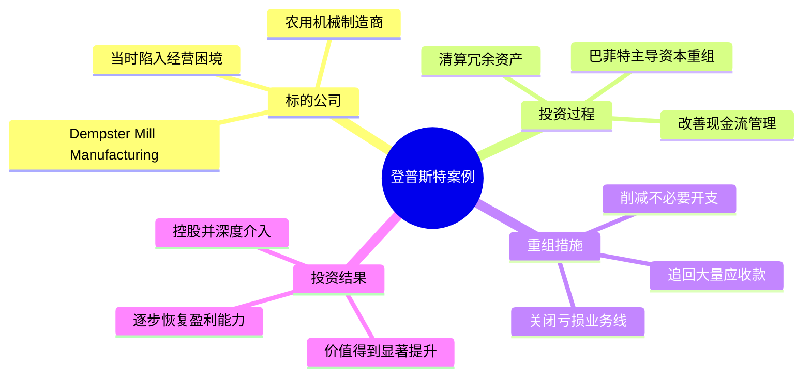

# 1966年巴菲特致股东信 — 思维导图

```mermaid
mindmap
  root((1966年))
    年度业绩
    十年业绩
    规模警告
    投资分类
    登普斯特案例
```

---

## 一、年度业绩

年度业绩

```mermaid
mindmap
  root((年度业绩))
    道琼斯指数
      全年下跌15.6%
      战后最大跌幅之一
    合伙企业收益
      全年盈利20.4%
      跑赢指数36个百分点
      史上最大超额收益
    有限合伙人收益
      单独计算的合伙人业绩
      扣除费用后净值增长
```

---

## 二、十年业绩

十年业绩

```mermaid
mindmap
  root((十年业绩))
    道琼斯指数
      年化收益率 9.7%
      累计增长约151%
    合伙企业整体
      年化收益率 29.0%
      累计增长约799%
    有限合伙人账户
      年化收益率 23.5%
      累计增长约563%
    业绩评估标准
      以道指为基准
      追求持续跑赢
```

---

## 三、规模警告

规模警告

```mermaid
mindmap
  root((规模警告))
    净资产规模
      总计约5400万美元
      持续大幅增长
    首次公开宣告
      规模已过大
      将损害未来业绩
    暂停接纳
      不再接受新合伙人
      现有合伙人维持
    规模影响分析
      市场机会有限
      大资金难以灵活配置
```

---

## 四、投资分类

投资分类

```mermaid
mindmap
  root((投资分类))
    套利类
      并购重组事件驱动
      风险较低收益稳定
      基于特定事件时间表
    控股类
      获得企业控制权
      积极参与经营改善
      长期持有等待价值实现
    普通股私人所有者
      参股优质非上市公司
      折价购买私人股权
      等待价值重估
    普通股相对低估
      二级市场低估标的
      价值与价格背离
      等待市场纠偏
```

---

## 五、登普斯特案例

登普斯特案例

```mermaid
mindmap
  root((登普斯特案例))
    标的公司
      Dempster Mill Manufacturing
      农用机械制造商
      当时陷入经营困境
    投资过程
      巴菲特主导资本重组
      清算冗余资产
      改善现金流管理
    重组措施
      削减不必要开支
      追回大量应收款
      关闭亏损业务线
    投资结果
      控股并深度介入
      逐步恢复盈利能力
      价值得到显著提升
```

