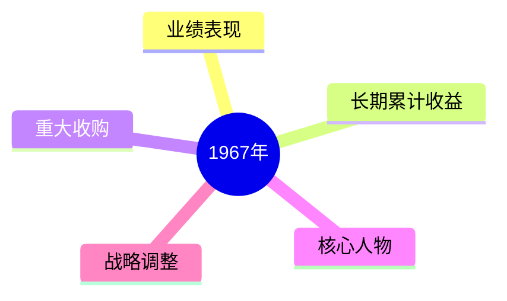
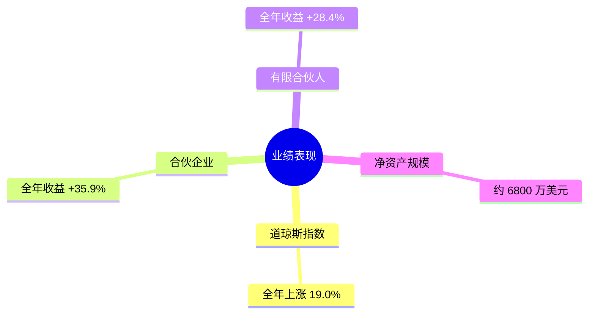
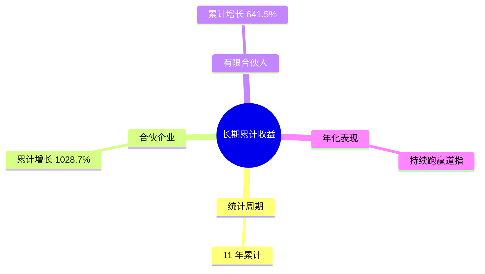
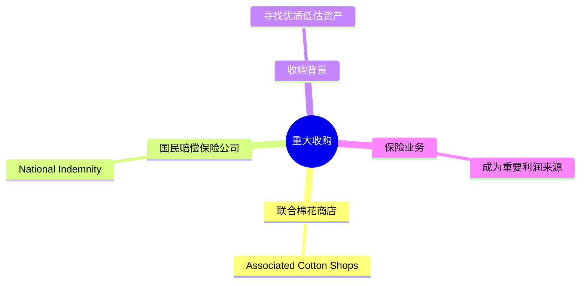
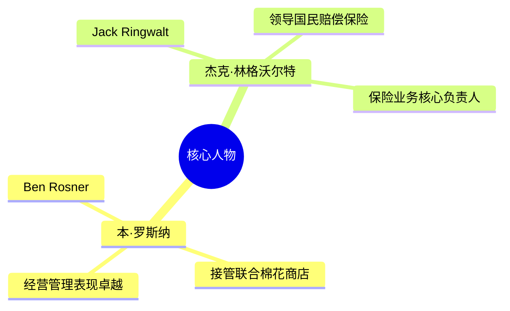
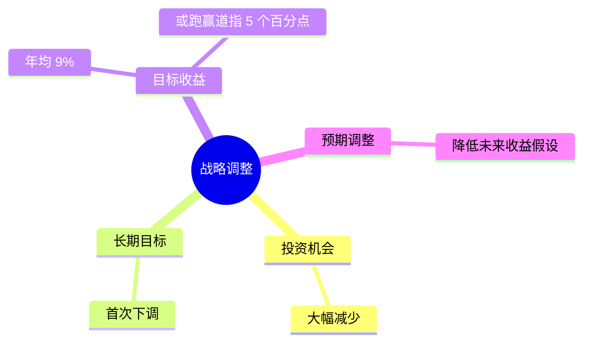

# 1967 年巴菲特致股东信——思维导图

---

## 总览

```mermaid
mindmap
  root((1967年))
    业绩表现
    长期累计收益
    重大收购
    核心人物
    战略调整
```

---

业绩表现

```mermaid
mindmap
  root((业绩表现))
    道琼斯指数
      全年上涨 19.0%
    合伙企业
      全年收益 +35.9%
    有限合伙人
      全年收益 +28.4%
    净资产规模
      约 6800 万美元
```

长期累计收益

```mermaid
mindmap
  root((长期累计收益))
    统计周期
      11 年累计
    合伙企业
      累计增长 1028.7%
    有限合伙人
      累计增长 641.5%
    年化表现
      持续跑赢道指
```

重大收购

```mermaid
mindmap
  root((重大收购))
    联合棉花商店
      Associated Cotton Shops
    国民赔偿保险公司
      National Indemnity
    收购背景
      寻找优质低估资产
    保险业务
      成为重要利润来源
```

核心人物

```mermaid
mindmap
  root((核心人物))
    本·罗斯纳
      Ben Rosner
      接管联合棉花商店
      经营管理表现卓越
    杰克·林格沃尔特
      Jack Ringwalt
      领导国民赔偿保险
      保险业务核心负责人
```

战略调整

```mermaid
mindmap
  root((战略调整))
    投资机会
      大幅减少
    长期目标
      首次下调
    目标收益
      年均 9%
      或跑赢道指 5 个百分点
    预期调整
      降低未来收益假设
```

---

> 本思维导图基于 1967 年巴菲特致股东信原文内容整理，所有数据均来自信件原文。
