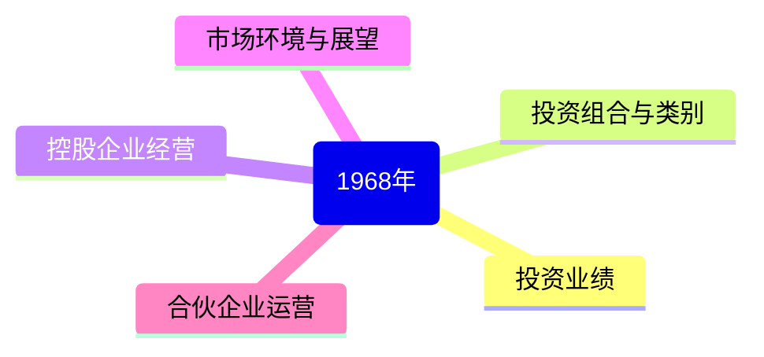
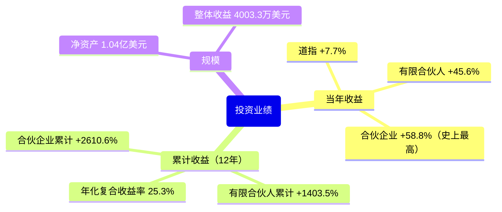
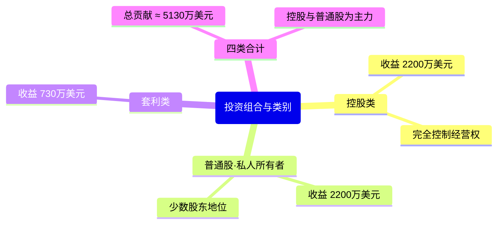
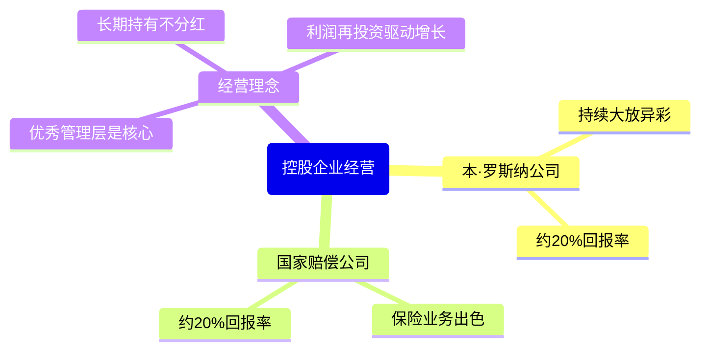
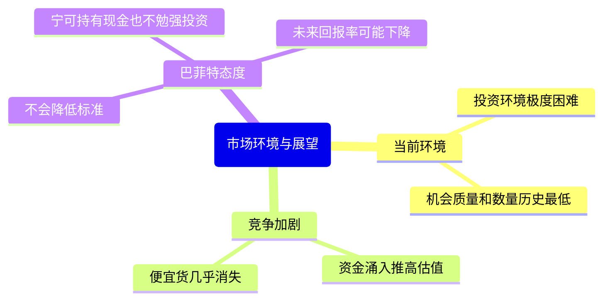
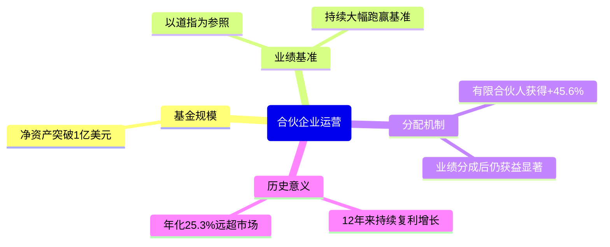

# 1968年巴菲特致股东信 · 思维导图

## 总览

```mermaid
mindmap
  root(1968年)
    投资业绩
    投资组合与类别
    控股企业经营
    市场环境与展望
    合伙企业运营
```

---

## 分类详解

📊 投资业绩

```mermaid
mindmap
  root(投资业绩)
    当年收益
      道指 +7.7%
      合伙企业 +58.8%（史上最高）
      有限合伙人 +45.6%
    累计收益（12年）
      合伙企业累计 +2610.6%
      有限合伙人累计 +1403.5%
      年化复合收益率 25.3%
    规模
      净资产 1.04亿美元
      整体收益 4003.3万美元
```

💼 投资组合与类别

```mermaid
mindmap
  root(投资组合与类别)
    控股类
      收益 2200万美元
      完全控制经营权
    普通股·私人所有者
      收益 2200万美元
      少数股东地位
    套利类
      收益 730万美元
    四类合计
      总贡献 ≈ 5130万美元
      控股与普通股为主力
```

🏭 控股企业经营

```mermaid
mindmap
  root(控股企业经营)
    本·罗斯纳公司
      持续大放异彩
      约20%回报率
    国家赔偿公司
      保险业务出色
      约20%回报率
    经营理念
      优秀管理层是核心
      长期持有不分红
      利润再投资驱动增长
```

⚠️ 市场环境与展望

```mermaid
mindmap
  root(市场环境与展望)
    当前环境
      投资环境极度困难
      机会质量和数量历史最低
    竞争加剧
      资金涌入推高估值
      便宜货几乎消失
    巴菲特态度
      不会降低标准
      宁可持有现金也不勉强投资
      未来回报率可能下降
```

🏛️ 合伙企业运营

```mermaid
mindmap
  root(合伙企业运营)
    基金规模
      净资产突破1亿美元
    业绩基准
      以道指为参照
      持续大幅跑赢基准
    分配机制
      有限合伙人获得+45.6%
      业绩分成后仍获益显著
    历史意义
      12年来持续复利增长
      年化25.3%远超市场
```

