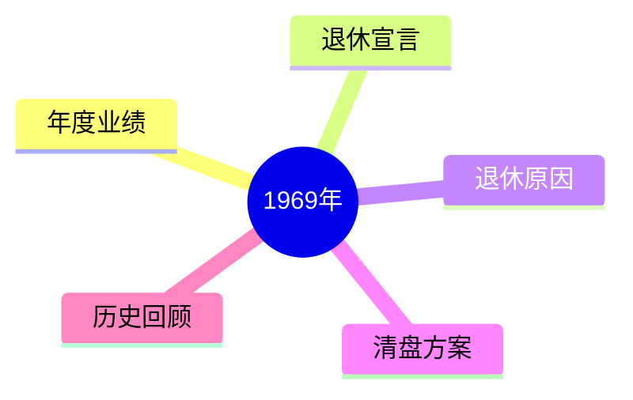
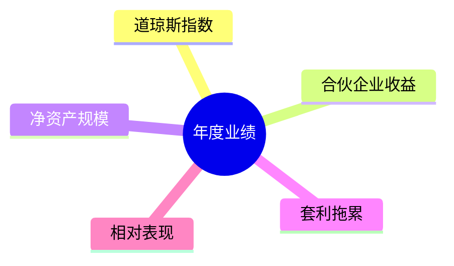
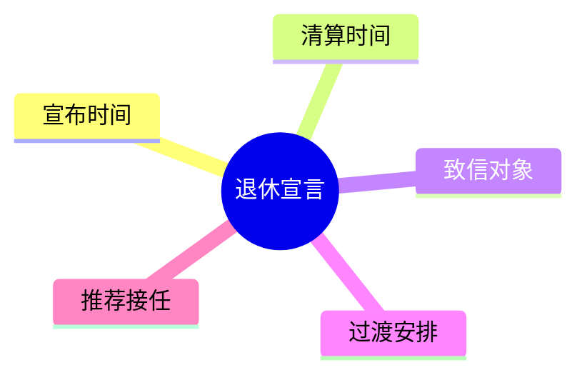
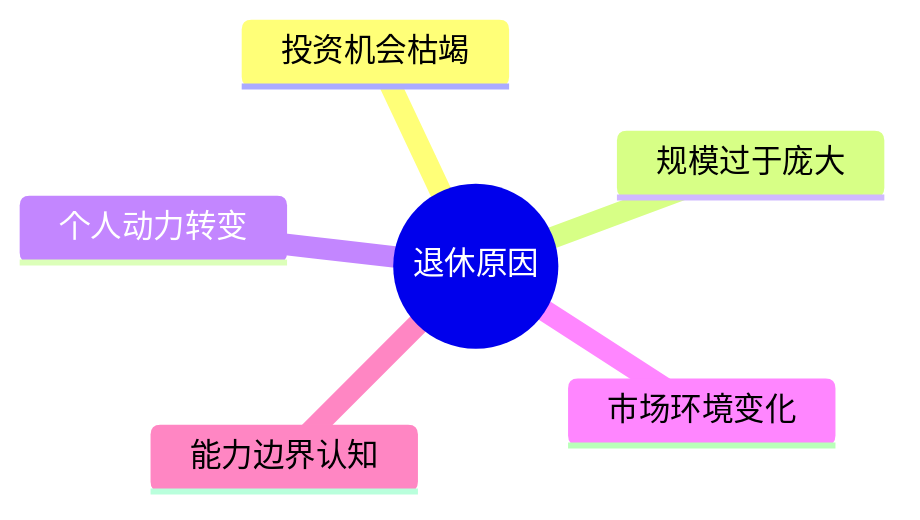
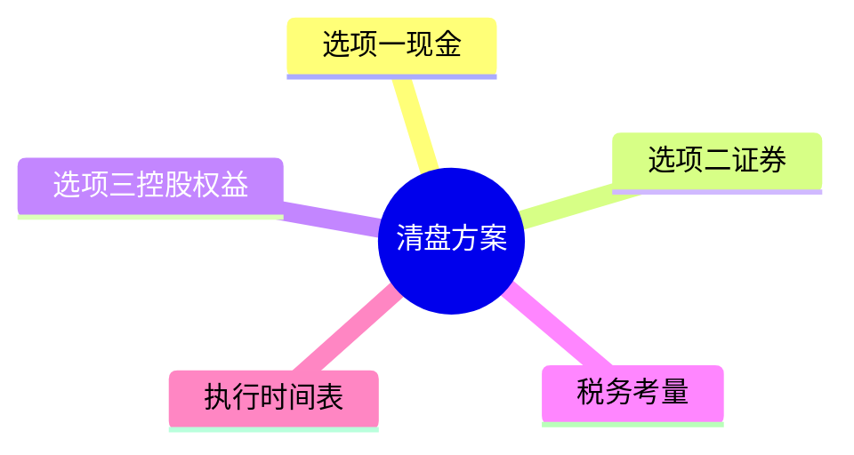
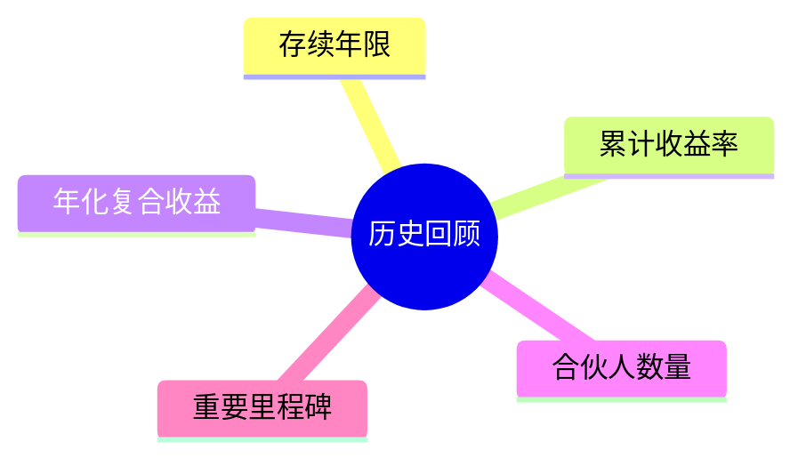

# 1969年巴菲特致股东信 · 思维导图

---

## 总览

```mermaid
mindmap
  root((1969年))
    年度业绩
    退休宣言
    退休原因
    清盘方案
    历史回顾
```

---

📊 年度业绩

```mermaid
mindmap
  root((年度业绩))
    道琼斯指数
    合伙企业收益
    净资产规模
    套利拖累
    相对表现
```

🏁 退休宣言

```mermaid
mindmap
  root((退休宣言))
    宣布时间
    清算时间
    致信对象
    过渡安排
    推荐接任
```

🔍 退休原因

```mermaid
mindmap
  root((退休原因))
    投资机会枯竭
    规模过于庞大
    个人动力转变
    市场环境变化
    能力边界认知
```

📋 清盘方案

```mermaid
mindmap
  root((清盘方案))
    选项一现金
    选项二证券
    选项三控股权益
    税务考量
    执行时间表
```

📈 历史回顾

```mermaid
mindmap
  root((历史回顾))
    存续年限
    累计收益率
    年化复合收益
    合伙人数量
    重要里程碑
```

---

> **说明**：以上内容基于1969年巴菲特致合伙人信函原文整理，思维导图采用两级结构。一级分类为总览节点，二级分类为各主题子节点。数据来源为巴菲特合伙企业历年实际业绩披露。
