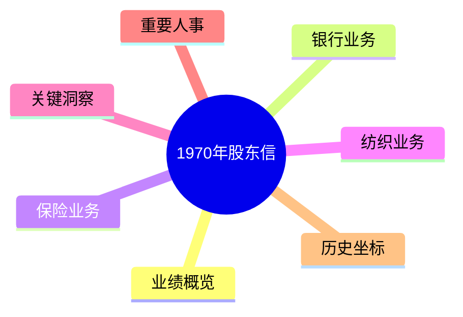
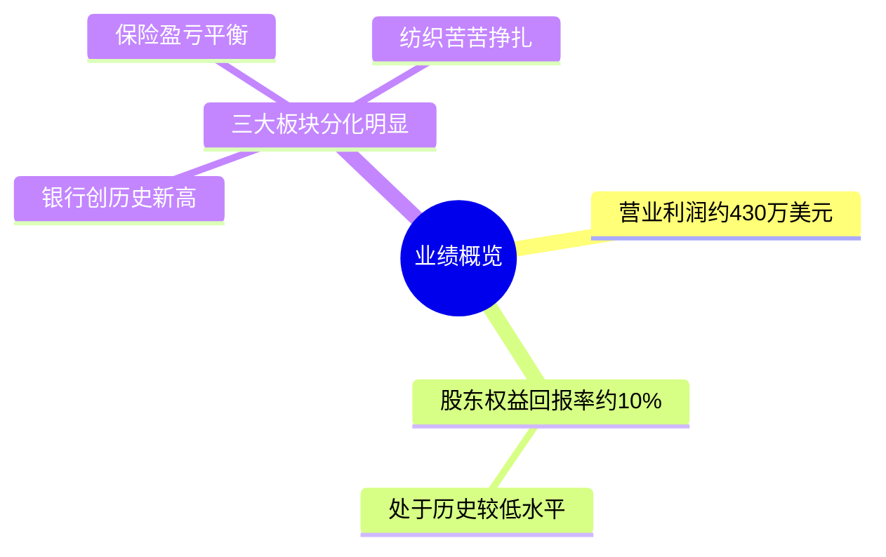
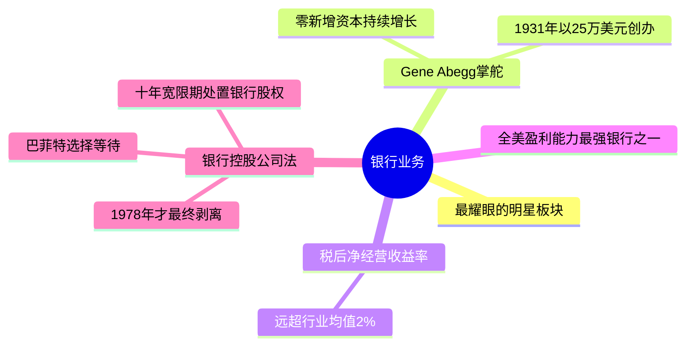
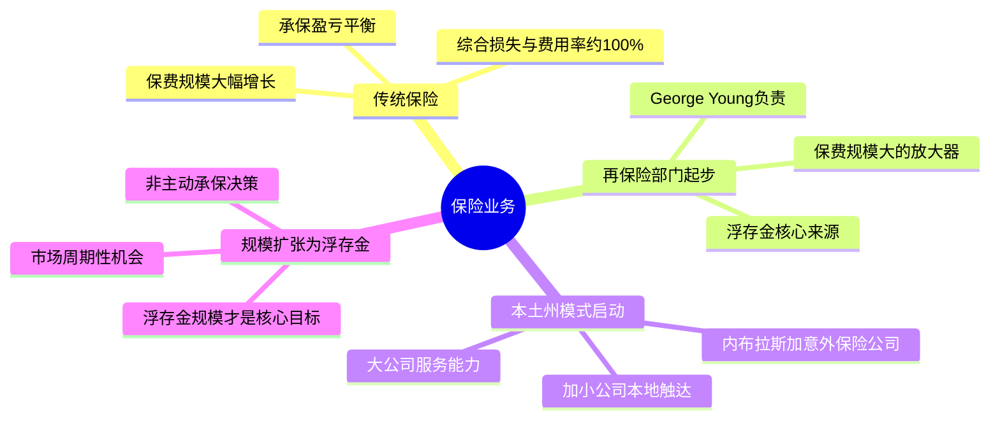
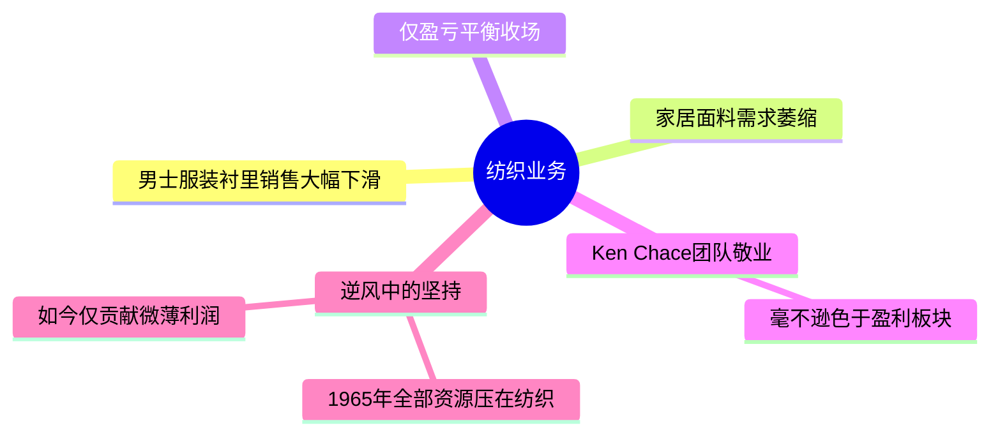
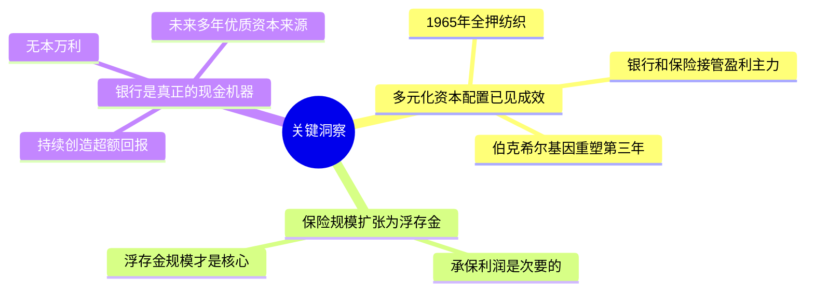
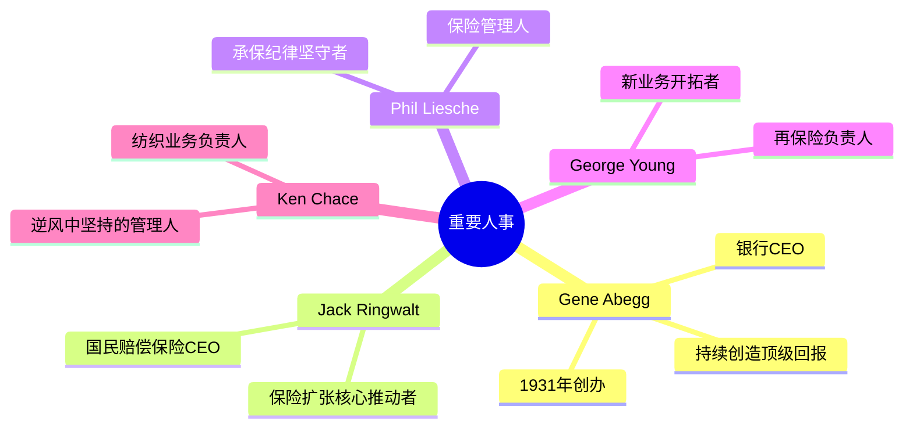
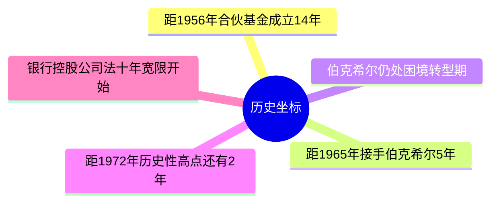

# 1970年巴菲特致股东信 · 思维导图

业绩概览

银行业务

保险业务

纺织业务

关键洞察

重要人事

历史坐标

## 结构概要

| 章节 | 核心主题 | 关键词 |
|-----|---------|--------|
| 业绩概览 | 三大板块分化 | 低ROE、盈利主力转移 |
| 银行业务 | 最耀眼的明星 | 零新增资本、顶级ROA |
| 保险业务 | 规模扩张、利润下滑 | 浮存金、再保险、本土州 |
| 纺织业务 | 逆风中的坚持 | 盈亏平衡、敬业精神 |
| 关键洞察 | 多元化资本配置已见成效 | 基因重塑、现金机器 |
| 重要人事 | 五位核心管理人 | Abegg、Ringwalt、Chace |
| 历史坐标 | 困境转型期的关键节点 | 十年宽限期、转型中 |

## 关键人物

- [[Gene Abegg]] - 伊利诺伊国民银行创始人，持续创造顶级回报
- [[Jack Ringwalt]] - 国民赔偿保险CEO，保险业务扩张核心推动者
- [[Phil Liesche]] - 保险管理人，承保纪律坚守者
- [[George Young]] - 再保险负责人，新业务开拓者
- [[Ken Chace]] - 纺织业务负责人，逆风中坚持

## 关键公司

- [[伊利诺伊国民银行]] - 全美盈利能力最强银行之一
- [[国民赔偿保险]] - 传统保险业务主体
- [[内布拉斯加意外保险公司]] - 本土州模式首站
- [[伯克希尔哈撒韦]] - 从纺织厂转型为多元控股平台

## 时代背景

- 1970年银行控股公司法出台，给予十年宽限期处置银行股权
- 纺织行业持续衰退，新英格兰制造业面临结构性困境
- 保险市场承保能力收紧，带来周期性保费增长机会

---

> 链接：[[1970年巴菲特致股东的信-翻译]] | [[1970年巴菲特致股东的信-核心总结]]
