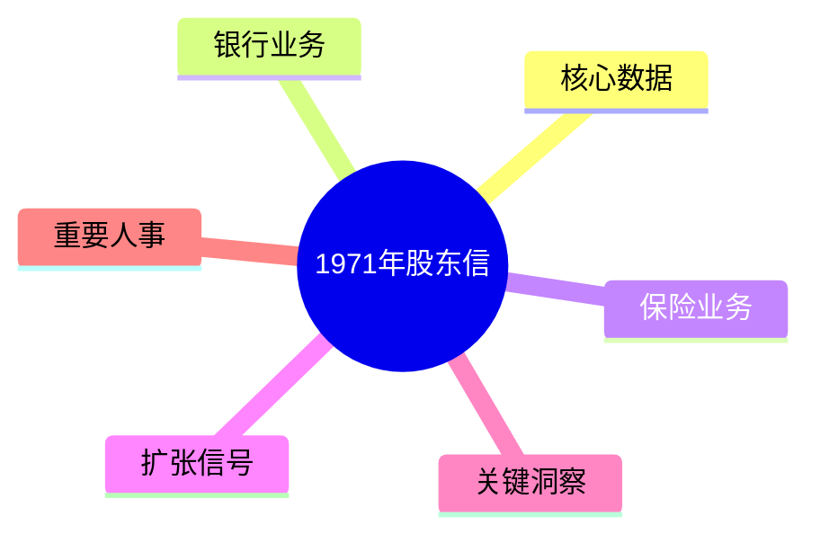
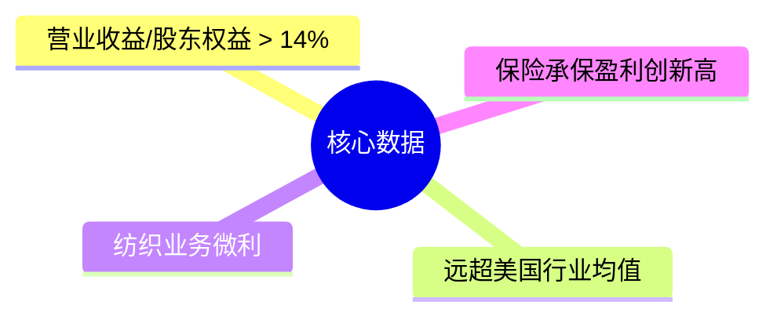
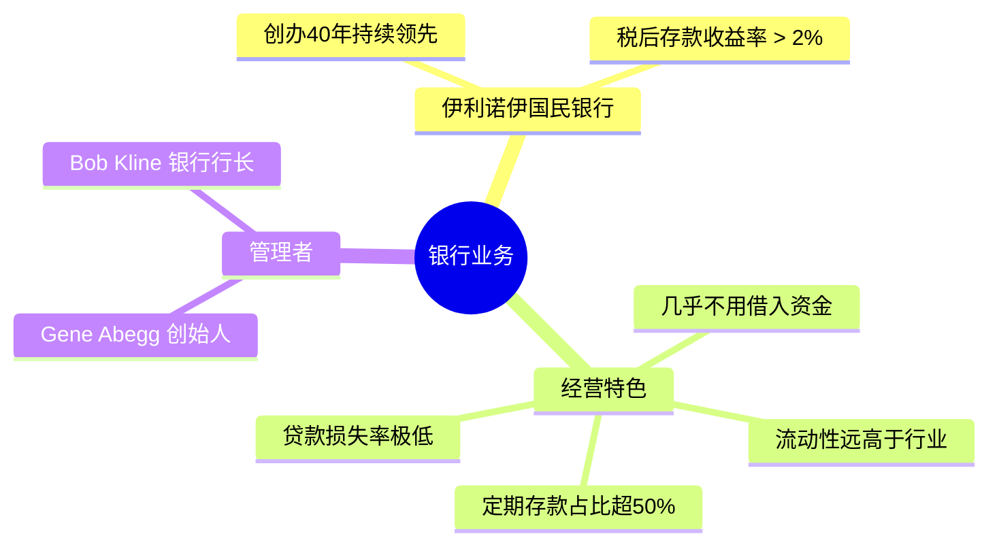
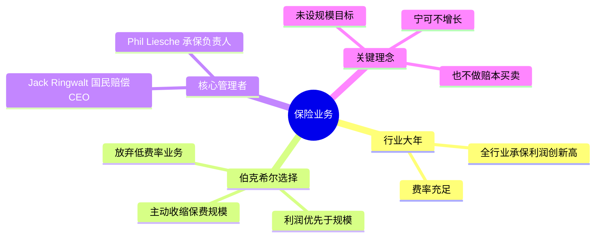
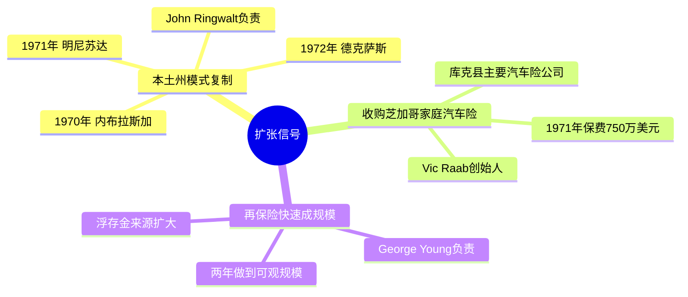
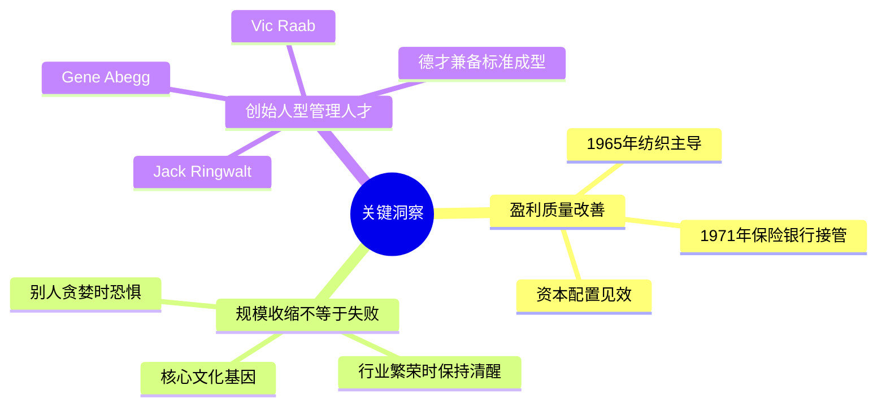
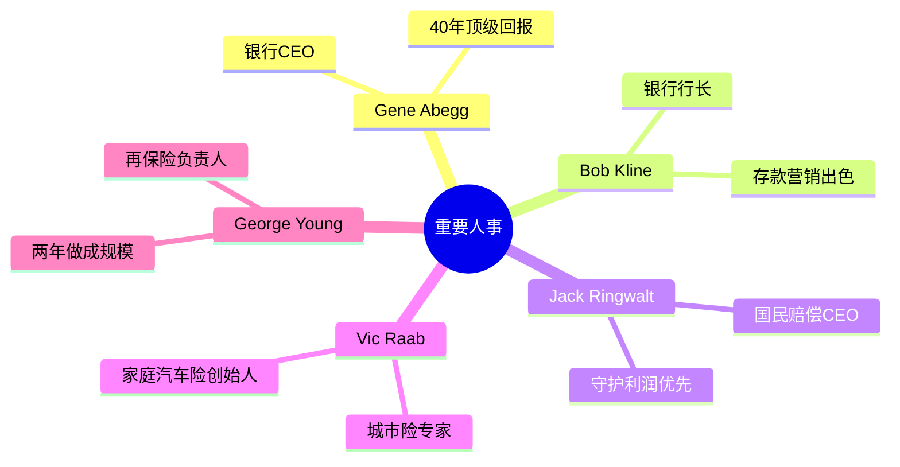

# 1971年巴菲特致股东信 · 思维导图

核心数据

银行业务

保险业务

扩张信号

关键洞察

重要人事

## 结构概要

| 章节 | 核心主题 | 关键词 |
|-----|---------|--------|
| 核心数据 | 营业收益超14% | 跑赢行业、低基数效应 |
| 银行业务 | 伊利诺伊国民银行典范 | 高收益、高流动性、40年领先 |
| 保险业务 | 规模收缩与利润优先 | 行业景气、主动收缩、盈利原则 |
| 扩张信号 | 三条增长线 | 本土州复制、城市险收购、再保险 |
| 关键洞察 | 伯克希尔文化基因 | 盈利质量、逆向思维、选人标准 |
| 重要人事 | 创始人型企业家 | Ringwalt、Abegg、Raab、Young |

## 关键人物

- [[沃伦·巴菲特]] - 董事长，作者
- [[Gene Abegg]] - 伊利诺伊国民银行创始人，40年持续领先
- [[Jack Ringwalt]] - 国民赔偿保险公司CEO，利润优先原则践行者
- [[Vic Raab]] - 家庭与汽车保险公司创始人，城市险专家
- [[George Young]] - 再保险业务负责人

## 关键公司

- [[伯克希尔·哈撒韦]] - 母公司
- [[伊利诺伊国民银行]] - 银行业务典范
- [[国民赔偿保险公司]] - 保险业务核心
- [[家庭与汽车保险公司]] - 芝加哥城市险布局
- [[内布拉斯加意外保险公司（HomeState）]] - 本土州模式起点

## 时代背景

- 1971年保险行业承保利润创历史新高
- 全行业费率充足，但巴菲特预感繁荣不可持续
- 纺织业务艰难求生，已从主导业务变为边缘角色
- 距离1972年历史最高ROE（19.8%）仅一年之遥

## 历史坐标

- 距离1956年巴菲特合伙基金：**15年**
- 距离1965年接手伯克希尔：**6年**
- 距离1972年历史最高ROE（19.8%）：**1年**

---

> 名言："当整个行业在'分享'繁荣的时候，我们也分到了一杯羹。但我们意识到，这背后也存在隐忧。"
> 
> 解读：行业景气时所有人都在赚钱，但巴菲特已经预感到繁荣不可持续，所以主动收缩保费规模。这种"别人贪婪时恐惧"的本能，在1970年代初就已清晰可见。

> 链接：[[1971年巴菲特致股东的信-翻译]] | [[1971年巴菲特致股东的信-核心总结]]
