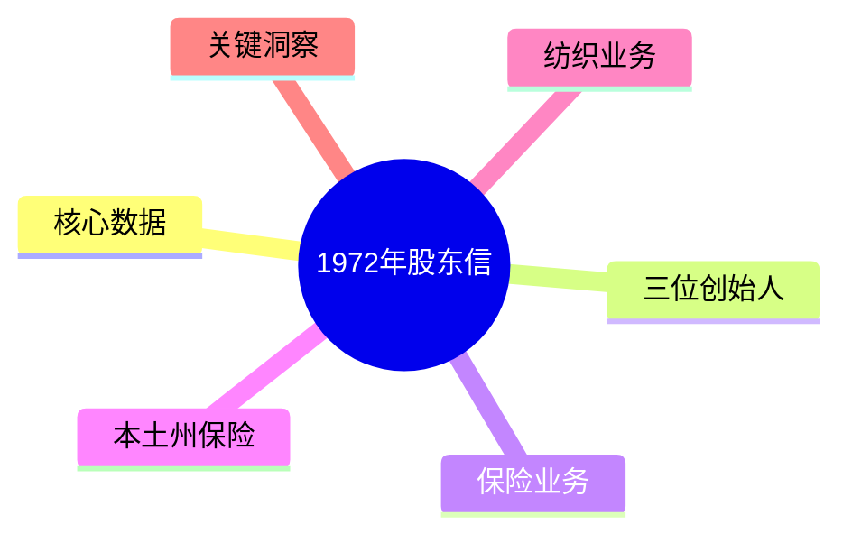
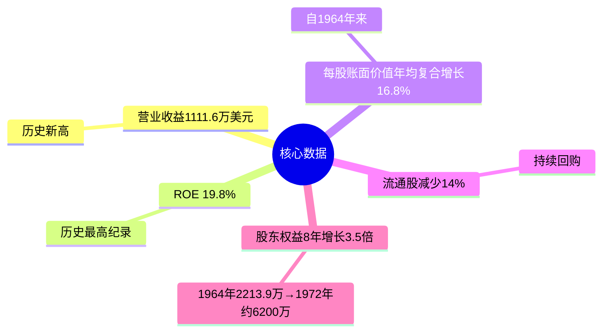
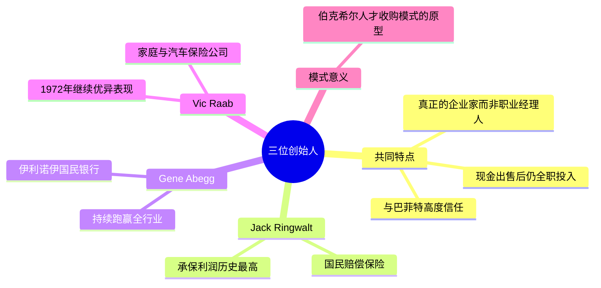
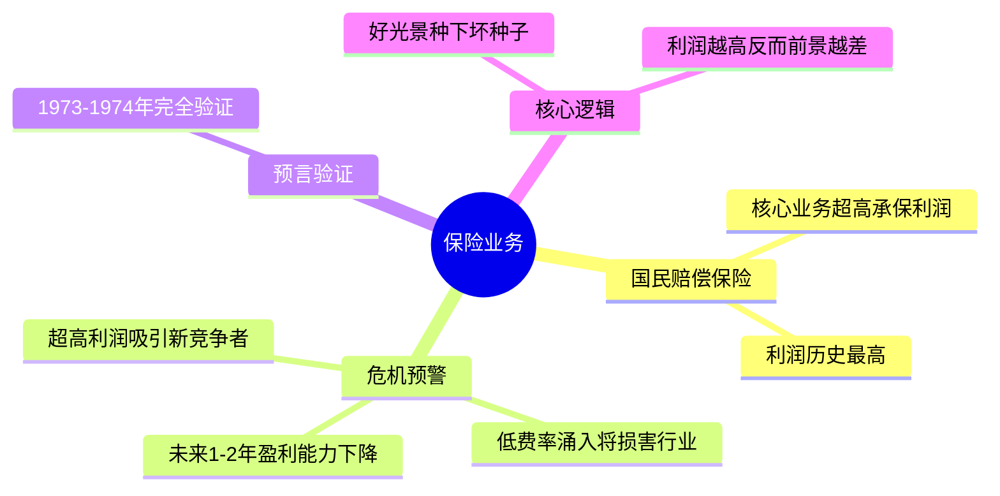
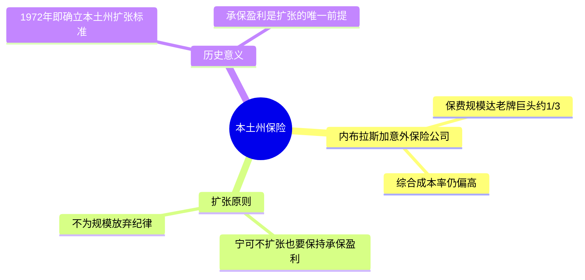
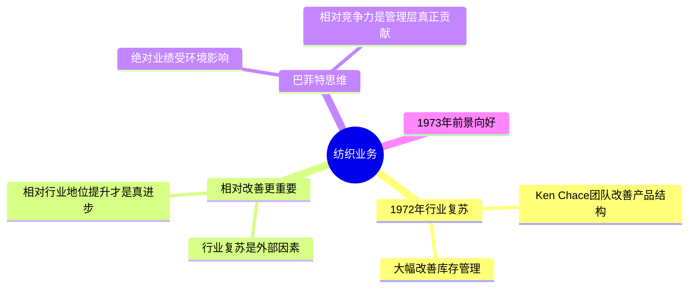
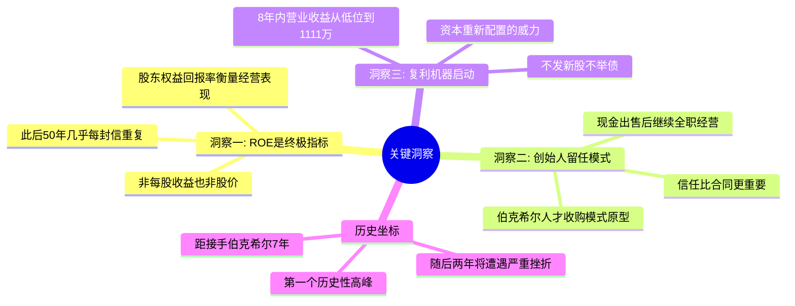

# 1972年巴菲特致股东信 · 思维导图

核心数据

三位创始人

保险业务

本土州保险

纺织业务

关键洞察

## 结构概要

| 章节 | 核心主题 | 关键词 |
|-----|---------|--------|
| 核心数据 | 历史新高，复利启动 | ROE 19.8%、回购14%、3.5倍增长 |
| 三位创始人 | 人才收购模式原型 | Ringwalt、Abegg、Raab、留任 |
| 保险业务 | 超高利润与危机预警 | 承保利润、竞争涌入、周期反转 |
| 本土州保险 | 扩张纪律 | 承保盈利优先、不为规模放弃纪律 |
| 纺织业务 | 相对改善比绝对业绩重要 | 行业复苏、相对地位、资本重配 |
| 关键洞察 | 三大投资原则确立 | ROE终极指标、创始人模式、复利 |

## 关键人物

- [[沃伦·巴菲特]] - 董事长，作者
- [[Jack Ringwalt]] - 国民赔偿保险创始人，承保利润历史最高
- [[Gene Abegg]] - 伊利诺伊国民银行创始人，持续跑赢全行业
- [[Vic Raab]] - 家庭与汽车保险公司创始人，1972年继续优异
- [[Ken Chace]] - 纺织业务负责人，改善产品结构与库存管理

## 关键公司

- [[国民赔偿保险]] - 核心保险子公司，承保利润历史最高
- [[伊利诺伊国民银行]] - 银行业典范，持续跑赢全行业
- [[家庭与汽车保险公司]] - Vic Raab 经营，优异表现
- [[内布拉斯加意外保险公司]] - 本土州保险，确立扩张纪律

## 时代背景

- 1972年保险行业处于超高利润周期顶部
- 大量竞争者以低费率涌入，为1973-1974年危机埋下伏笔
- 纺织行业短暂复苏，但长期衰退趋势未变
- 伯克希尔转型7年，迎来第一个历史性高峰

---

> 链接：[[1972年巴菲特致股东的信-翻译]] | [[1972年巴菲特致股东的信-核心总结]]
