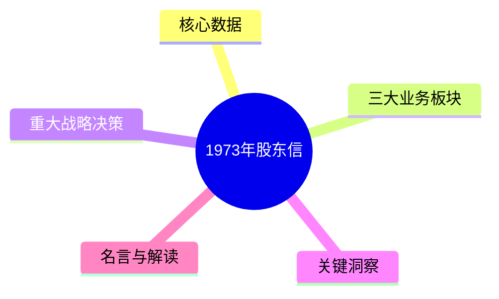
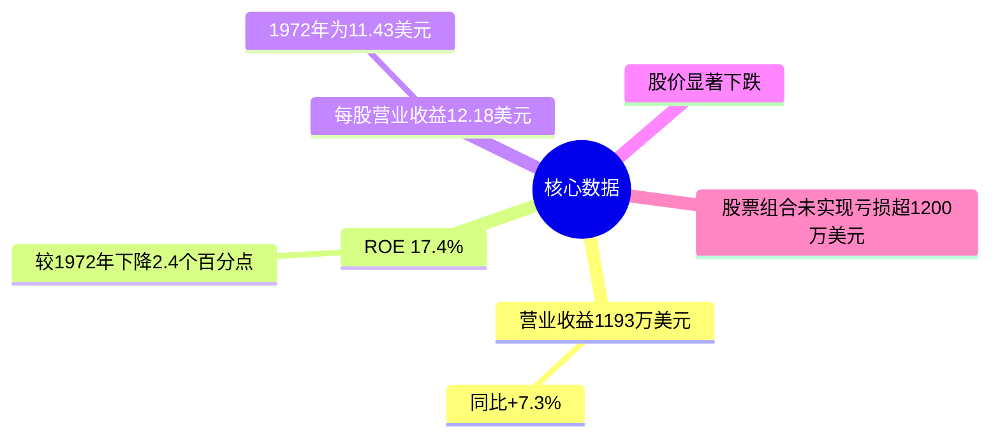
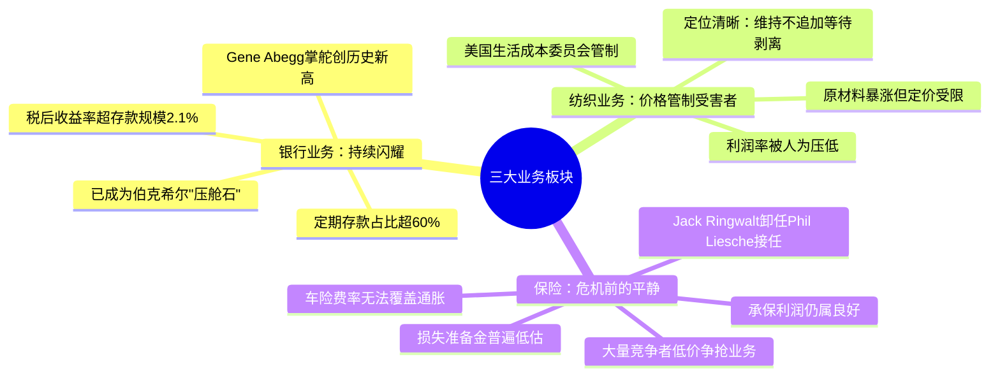
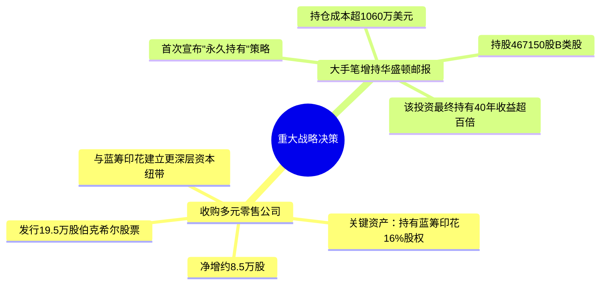
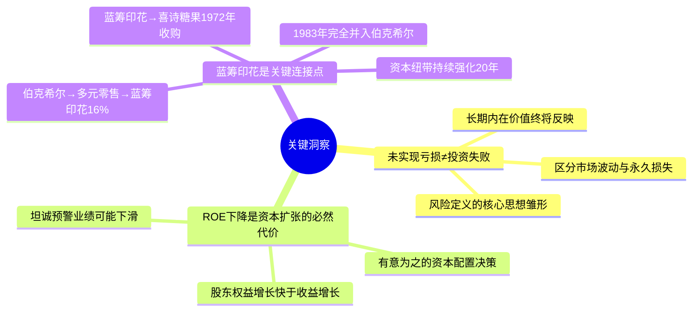
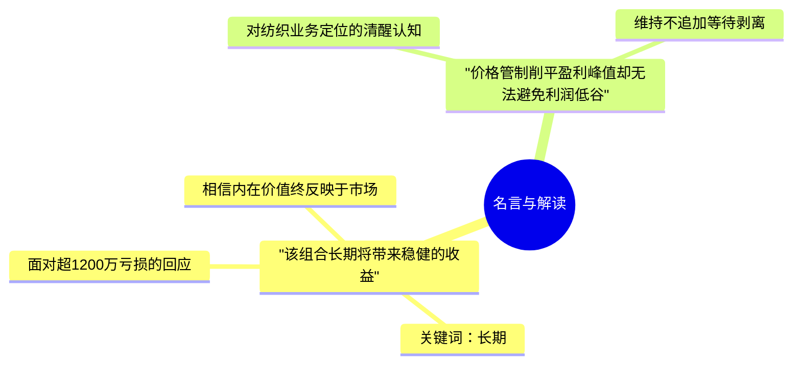

# 1973年巴菲特致股东信 · 思维导图

核心数据

三大业务板块

重大战略决策

关键洞察

名言与解读

## 结构概要

| 章节 | 核心主题 | 关键词 |
|-----|---------|--------|
| 核心数据 | ROE回落，股价下跌 | 17.4% ROE、1200万未实现亏损 |
| 三大业务板块 | 两好一坏 | 银行压舱石、纺织受害者、保险预警 |
| 重大战略决策 | 并购与永久持有 | 多元零售、华盛顿邮报、蓝筹印花 |
| 关键洞察 | 风险定义、资本配置 | 市场波动≠损失、资本扩张代价 |
| 名言与解读 | 长期主义 | 永久持有、内在价值 |

## 关键人物

- [[沃伦·巴菲特]] - 董事长，作者
- [[Gene Abegg]] - 伊利诺伊国民银行掌舵人
- [[Jack Ringwalt]] - 国家赔偿公司CEO，1973年卸任
- [[Phil Liesche]] - 接任Jack Ringwalt

## 关键公司

- [[伯克希尔·哈撒韦]] - 从困境转型公司蜕变为长期投资平台
- [[华盛顿邮报]] - 1973年大手笔增持，首次"永久持有"
- [[多元零售公司]] - 并购对象，持有蓝筹印花16%
- [[蓝筹印花公司]] - 伯克希尔体系核心节点
- [[喜诗糖果]] - 蓝筹印花旗下，1972年收购
- [[伊利诺伊国民银行]] - 伯克希尔"压舱石"

## 时代背景

- 1973年原材料价格暴涨，通胀压力加剧
- 美国生活成本委员会实施价格管制
- 保险行业竞争加剧，危机信号初现
- 股市低迷，伯克希尔股价显著下跌
- 距离1974年灾难性保险亏损仅1年

---

> 链接：[[1973年巴菲特致股东的信-翻译]] | [[1973年巴菲特致股东的信-核心总结]]
