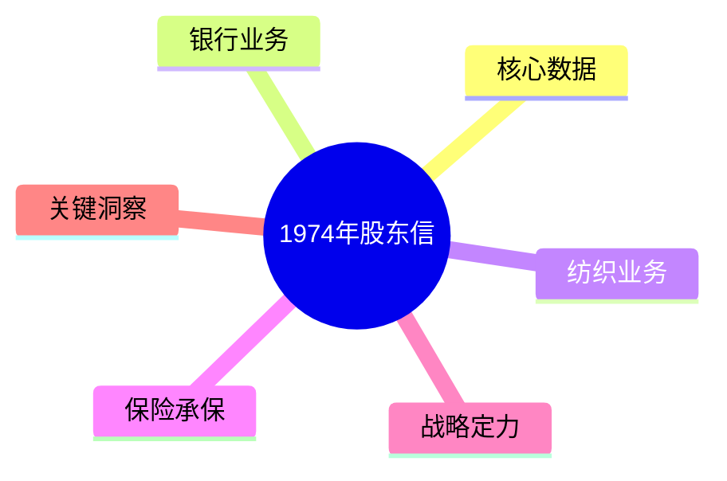
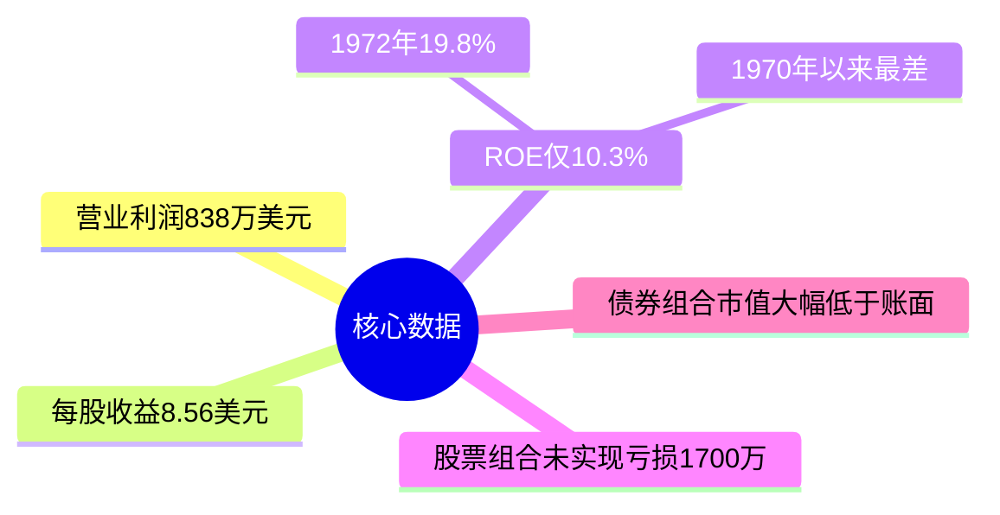
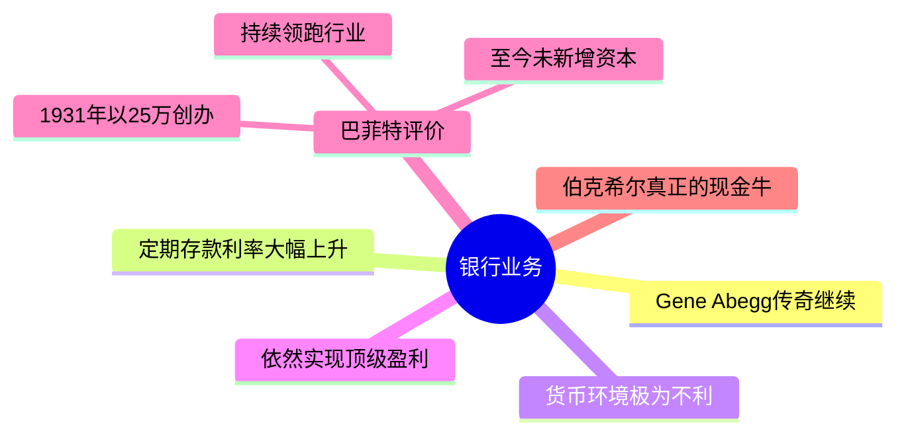
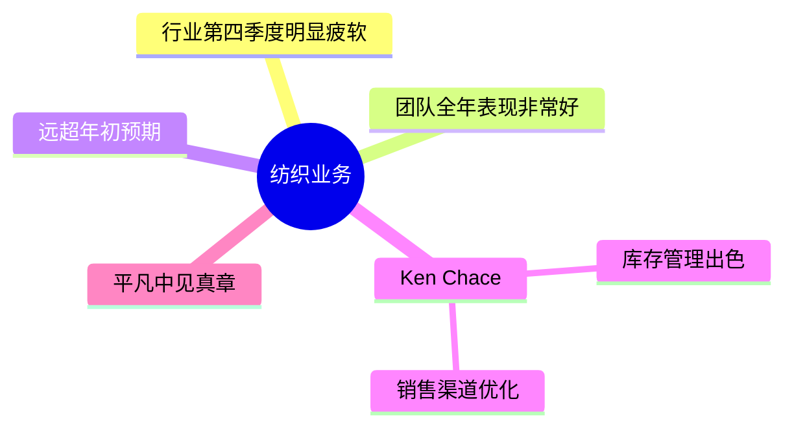
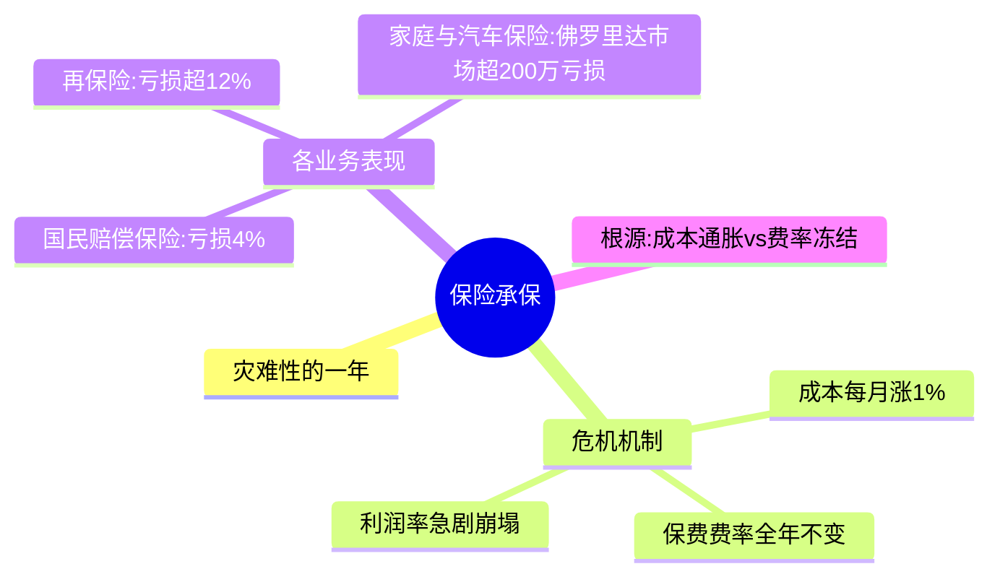
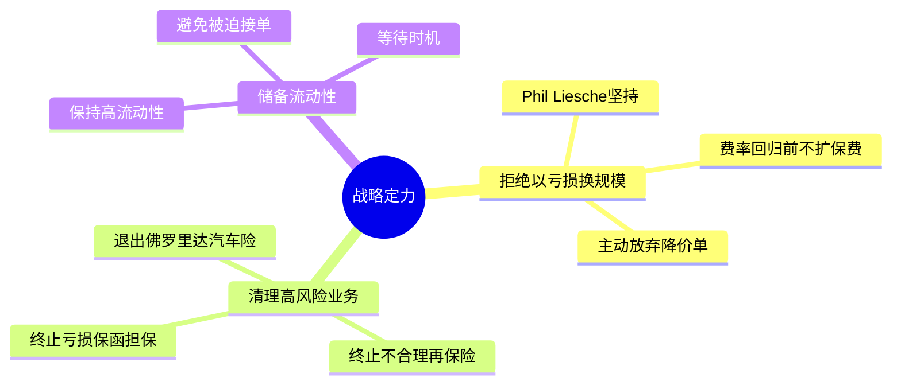
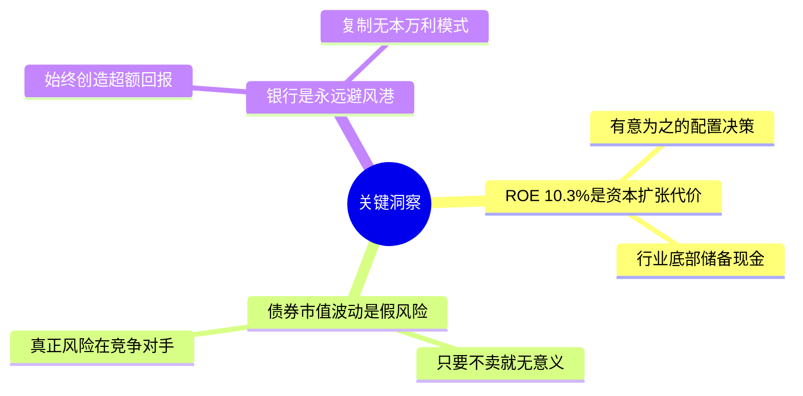

# 1974年巴菲特致股东信 · 思维导图

核心数据

银行业务

纺织业务

保险承保

战略定力

关键洞察

## 结构概要

| 章节 | 核心主题 | 关键词 |
|-----|---------|--------|
| 核心数据 | 1970年来最差ROE | 10.3%、838万利润 |
| 银行业务 | Abegg传奇持续 | 25万创办、零新增资本 |
| 纺织业务 | 超预期表现 | Ken Chace、平凡传奇 |
| 保险承保 | 灾难性亏损 | 成本通胀、费率冻结 |
| 战略定力 | 拒绝亏损换规模 | 清理业务、储备流动性 |
| 关键洞察 | 危机中的机会 | 资本布局、银行避风港 |

## 关键人物

- [[沃伦·巴菲特]] - 董事长，作者
- [[Gene Abegg]] - 伊利诺伊国民银行创始人
- [[Ken Chace]] - 纺织业务负责人
- [[Phil Liesche]] - 国家赔偿公司CEO

## 关键公司

- [[伊利诺伊国民银行]] - 现金牛业务
- [[国民赔偿保险公司]] - 保险业务主体
- [[伯克希尔·哈撒韦]] - 纺织+保险帝国

## 时代背景

- 1973-1974年熊市
- 保险行业承保危机
- 利率飙升冲击债券组合
- 通胀高企、成本上涨

---

> 链接：[[1974年巴菲特致股东的信-翻译]] | [[1974年巴菲特致股东的信-核心总结]]