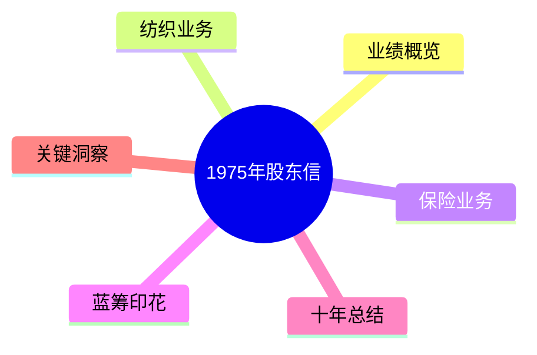
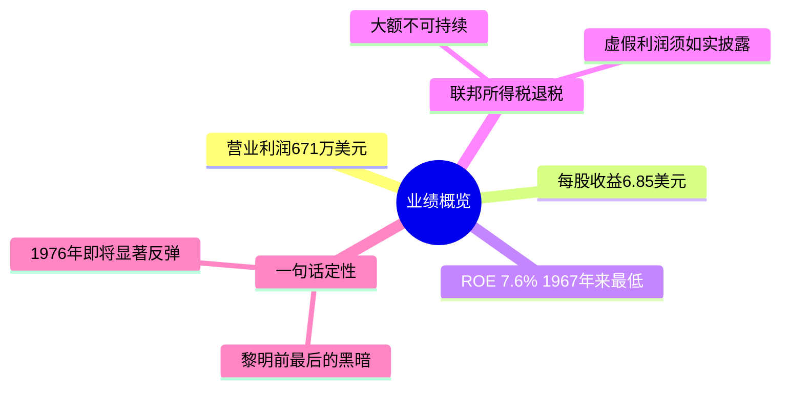
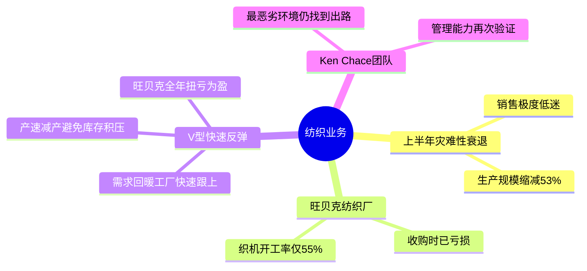
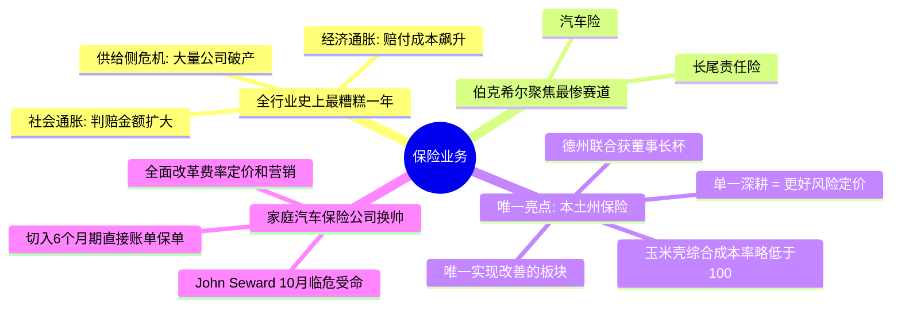
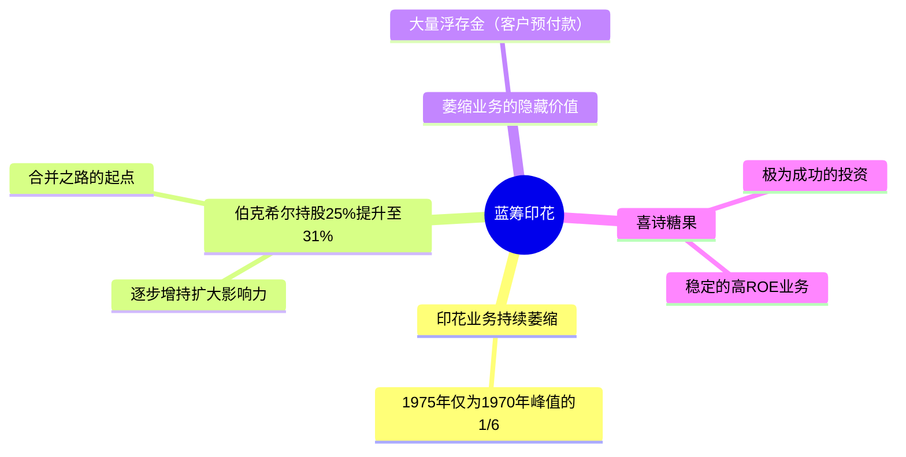
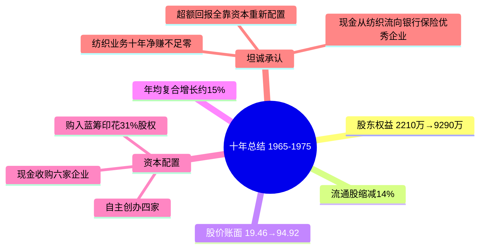
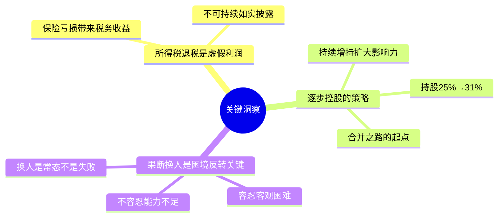

# 1975年巴菲特致股东信 · 思维导图

业绩概览

纺织业务

保险业务

蓝筹印花

十年总结

关键洞察

## 结构概要

| 章节 | 核心主题 | 关键词 |
|-----|---------|--------|
| 业绩概览 | 黎明前最后的黑暗 | ROE 7.6%、所得税退税、虚假利润 |
| 纺织业务 | V型衰退与快速反弹 | 产量缩减53%、旺贝克扭亏、Ken Chace |
| 保险业务 | 史上最差年份中的亮点 | 三重打击、本土州模式、换帅Seward |
| 蓝筹印花 | 萎缩业务的隐藏价值 | 持股31%、喜诗糖果、浮存金 |
| 十年总结 | 资本重新配置的力量 | 年均15%、纺织归零、现金再配置 |
| 关键洞察 | 坦诚与果断 | 虚假利润、逐步控股、换人文化 |

## 关键人物

- [[沃伦·巴菲特]] - 董事长，作者
- [[Ken Chace]] - 纺织业务负责人，逆境管理典范
- [[John Seward]] - 家庭汽车保险公司新任总裁，临危受命

## 关键公司

- [[伯克希尔·哈撒韦]] - 主体公司，十年年均复合增长约15%
- [[本土州保险]] - 唯一改善的保险板块
- [[德克萨斯联合保险公司]] - 获"董事长杯"
- [[家庭汽车保险公司]] - 换帅改革
- [[蓝筹印花]] - 持股31%，合并之路起点
- [[喜诗糖果]] - 极为成功的投资
- [[旺贝克纺织厂]] - 收购后扭亏为盈
- [[玉米壳意外伤害保险公司]] - 综合成本率略低于100

## 时代背景

- 1975年经济衰退底部，上半年生产极度低迷
- 通胀高企：赔付成本涨幅远超一般通胀
- 社会通胀：陪审团判赔扩大，诉讼频率上升
- 财产意外伤害险行业"史上最糟糕的一年"

---

> 链接：[[1975年巴菲特致股东的信-翻译]] | [[1975年巴菲特致股东的信-核心总结]]
