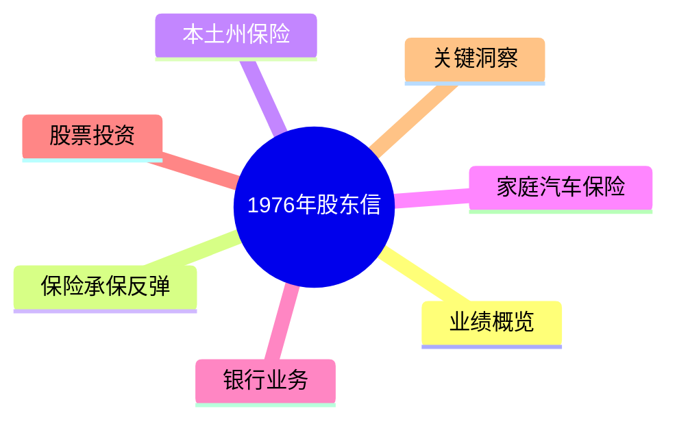
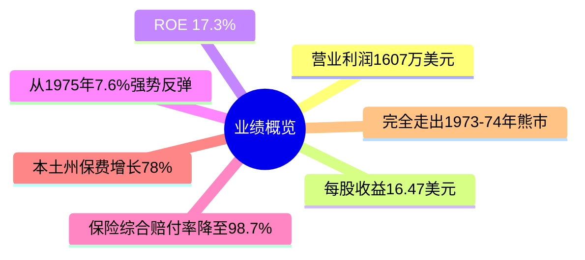
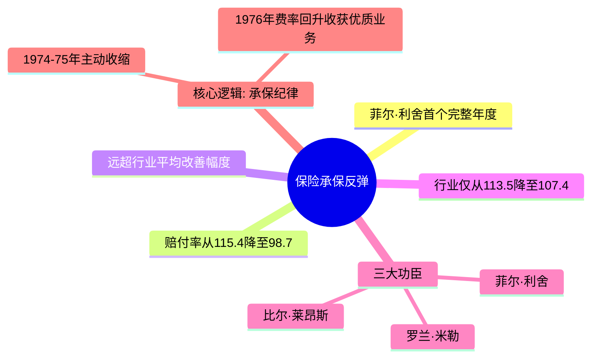
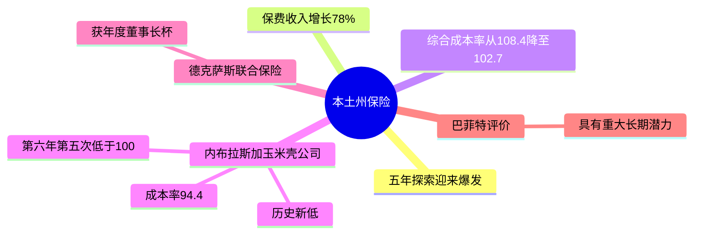
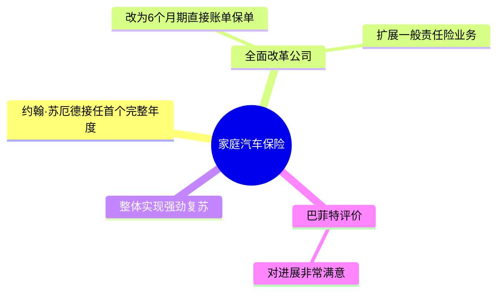
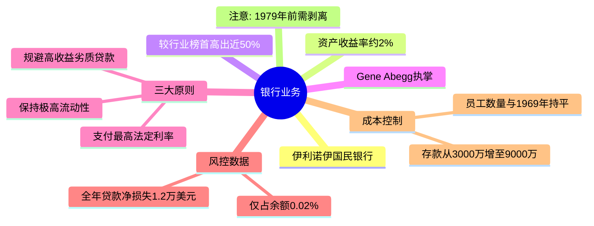
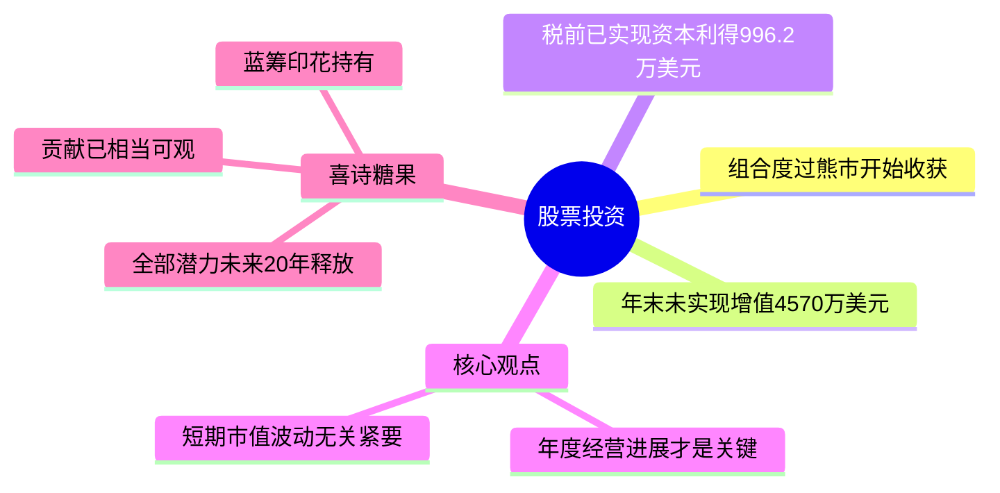
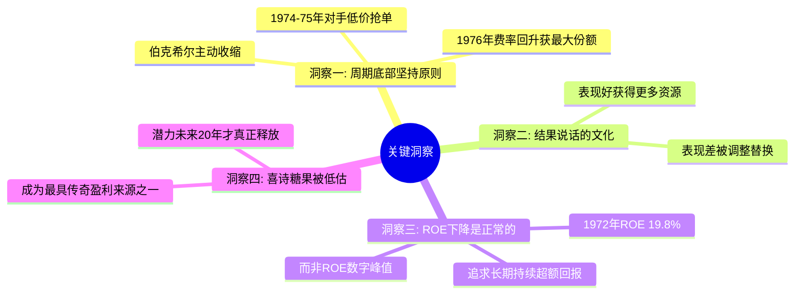

# 1976年巴菲特致股东信 · 思维导图

业绩概览

保险承保反弹

本土州保险

家庭汽车保险

银行业务

股票投资

关键洞察

## 结构概要

| 章节 | 核心主题 | 关键词 |
|-----|---------|--------|
| 业绩概览 | 从谷底强势反弹 | ROE 17.3%、历史新高 |
| 保险承保反弹 | 菲尔·利舍的首个完整年 | 承保纪律、赔付率98.7% |
| 本土州保险 | 五年探索迎来爆发 | 保费+78%、长期潜力 |
| 家庭汽车保险 | 约翰·苏厄德全面改革 | 6个月期账单、强劲复苏 |
| 银行业 | 持续书写传奇 | 资产收益率2%、零新增资本 |
| 股票投资 | 度过熊市开始收获 | 已实现利得996万、经营进展为重 |
| 关键洞察 | 四大洞见 | 周期纪律、结果文化、长期ROE、喜诗价值 |

## 关键人物

- [[沃伦·巴菲特]] - 董事长，作者
- [[菲尔·利舍]] - 国民赔偿保险CEO，接替杰克·林沃尔特后首个完整年度大逆转
- [[罗兰·米勒]] - 承保部门负责人
- [[比尔·莱昂斯]] - 理赔部门负责人
- [[约翰·苏厄德]] - 家庭汽车保险公司CEO，全面改革
- [[Gene Abegg]] - 伊利诺伊国民银行创始人兼CEO

## 关键公司

- [[国民赔偿保险]] - 核心保险业务，赔付率从115.4降至98.7
- [[本土州保险]] - 五年探索后迎来爆发，保费增长78%
- [[家庭汽车保险公司]] - 约翰·苏厄德全面改革后强劲复苏
- [[伊利诺伊国民银行]] - 资产收益率行业最高，1979年前需剥离
- [[喜诗糖果]] - 蓝筹印花持有，潜力被低估

## 时代背景

- 1976年美国经济从衰退中复苏
- 保险行业经历1974-1975年危机后费率回升
- 伯克希尔完全走出1973-1974年熊市影响
- 距离1979年银行资产剥离截止日还有3年

---

> 链接：[[1976年巴菲特致股东的信-翻译]] | [[1976年巴菲特致股东的信-核心总结]]
