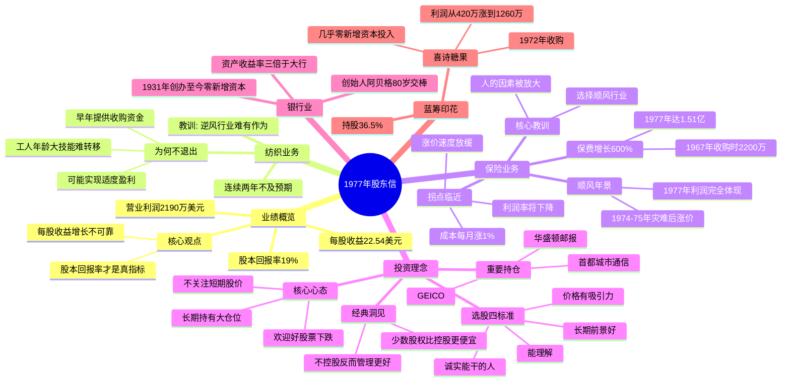

# 1977年巴菲特致股东信 · 思维导图

## 二、文本大纲（点击展开）

1977年股东信

业绩概览

营业利润2190万美元

每股收益22.54美元

股本回报率19%

核心观点

每股收益增长不可靠

股本回报率才是真指标

纺织业务

连续两年不及预期

为何不退出

工人年龄大技能难转移

早年提供收购资金

可能实现适度盈利

教训: 逆风行业难有作为

保险业务

保费增长600%

1967年收购时2200万

1977年达1.51亿

顺风年景

1974-75年灾难后涨价

1977年利润完全体现

拐点临近

成本每月涨1%

涨价速度放缓

利润率将下降

核心教训

选择顺风行业

人的因素被放大

投资理念

选股四标准

能理解

长期前景好

诚实能干的人

价格有吸引力

核心心态

不关注短期股价

欢迎好股票下跌

长期持有大仓位

经典洞见

少数股权比控股更便宜

不控股反而管理更好

重要持仓

GEICO

华盛顿邮报

首都城市通信

银行业

资产收益率三倍于大行

创始人阿贝格80岁交棒

1931年创办至今零新增资本

蓝筹印花

持股36.5%

喜诗糖果

1972年收购

利润从420万涨到1260万

几乎零新增资本投入

## 结构概要

| 章节 | 核心主题 | 关键词 |
|-----|---------|--------|
| 业绩概览 | 如何正确衡量业绩 | 股本回报率 > 每股收益 |
| 纺织业务 | 为何坚持亏损业务 | 责任感、历史恩情 |
| 保险业务 | 顺风行业的力量 | 周期性、人的因素 |
| 投资理念 | 股票就是企业 | 四标准、长期持有 |
| 银行业 | 优秀银行的典范 | 高收益、高流动性 |
| 蓝筹印花 | 喜诗糖果的成功 | 护城河、资本效率 |

## 关键人物

- [[沃伦·巴菲特]] - 董事长，作者
- [[菲尔·利切]] - 国家赔偿公司CEO，1977年表现非凡
- [[吉恩·阿贝格]] - 伊利诺伊国民银行创始人，80岁交棒
- [[查克·哈金斯]] - 喜诗糖果CEO

## 关键公司

- [[GEICO]] - 核心持仓，政府雇员保险公司
- [[华盛顿邮报]] - 重要持仓
- [[首都城市通信]] - 1977年新进
- [[喜诗糖果]] - 蓝筹印花旗下，经典收购案例
- [[伊利诺伊国民银行]] - 优秀银行典范

## 时代背景

- 1977年通胀高企，成本持续上升
- 保险行业经历1974-1975年危机后进入顺风周期
- 纺织行业持续衰退，新英格兰制造业外迁

---

> 链接：[[1977年巴菲特致股东的信-翻译]] | [[1977年巴菲特致股东的信-核心总结]]
