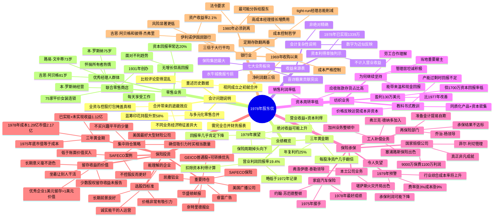

# 1978年巴菲特致股东信 · 思维导图

## 二、文本大纲（点击展开）

1978年股东信

会计问题说明

与多元化零售合并

蓝筹印花持股升至58%

需完全合并财务报表

合并带来的遮蔽效应

不同业务经济特征差异大

全资与控股打包掩盖真相

重述历史数据

视同成立之初就合并

比较评论变得混乱

业绩概览

营业利润回报率19.4%

略低于1972年记录

扣除资本利得计算

三年黄金期

每股净资产几乎翻倍

年复利约25%

营业收益+资本利得

1979年展望

保险周期掉头向下

回报率几乎肯定下降

绝对收益可能上升

收益来源表

七大业务板块

保险集团最大

喜诗糖果贡献突出

水牛城晚报亏损

资本利得单独列示

1978年已实现1339万

不计入营业收益

会计复杂性说明

数字为近似反映

非绝对精确

纺织业务

盈利130万美元

比1977年改善

但1700万资本回报率低

资本周转率低

应收账款存货占比高

销售利润率低

教科书式教训

同质化产品+资本密集

产能过剩时回报不足

价格反映运营成本非资本

为何继续坚持

当地重要雇主

管理层坦诚积极

劳工合作理解

能带来温和现金回报

保险承保

国家赔偿公司

菲尔·利切管理

9000万保费1100万利润

真正非凡成就

家庭汽车保险

约翰·苏厄德整顿

1975年接手

1978年最好成绩

工人补偿业务

塞浦路斯保险出色

加州业务整顿中

弗兰克·德纳多加入

再保险部门

乔治·杨领导

承保结果不达标

准备金计提易自欺

本土公司业务

令人失望

堪萨斯火灾开局出色

弗洛伊德·泰勒领导

1979年预警

行业综合成本率将上升

费率涨3%成本涨9%

承保利润可能下降

保险投资

选股四标准

能理解的企业

长期前景良好

诚实能干的人运营

价格非常有吸引力

三年黄金期

1975年底市值等于成本

1978年成本1.29亿市值2.17亿

已实现+未实现收益1.12亿

集中持仓策略

不买兴趣平平的少量

确信吸引力时买相当数量

重要持仓

GEICO普通股+可转换优先

SAFECO保险

华盛顿邮报

美国广播公司

凯撒铝业

奈特里德报业

睿富广告

留存收益的价值

少数股权留存收益未报告

长期意义毫不逊色

优秀企业1美元留存>1美元价值

SAFECO案例

美国最好大型财险公司

低于账面价值买入

不控股反而更好

坐着让别人干活

银行业

伊利诺伊国民银行

吉恩·阿贝格和彼得·杰弗里

资产收益率2.1%

三倍于大行平均

风险显著更低

1969年收购以来

定期存款翻两番

净利润翻三倍

成本严格控制

成本控制哲学

高成本经理擅长增费用

tight-run经理总能削减

1980年必须剥离

法令要求

最可能分拆给股东

零售业务

联合零售商店

75家平价女装连锁

本·罗斯纳经营

1931年创办

无增长但高回报

面对不利趋势

资本回报率常达20%

优秀经理人群体

本·罗斯纳75岁

吉恩·阿贝格81岁

路易·文辛蒂73岁

怀揣所有者热情

每天享受工作

## 结构概要

| 章节 | 核心主题 | 关键词 |
|-----|---------|--------|
| 会计问题说明 | 合并带来的披露复杂性 | 完全合并、重述数据 |
| 业绩概览 | 三年黄金期的总结与展望 | 19.4%回报率、不可持续 |
| 收益来源表 | 各业务板块贡献一览 | 保险领先、喜诗突出 |
| 纺织业务 | 逆风行业的坚持与教训 | 同质化、产能过剩 |
| 保险承保 | 各板块表现与行业拐点 | 菲尔·利切、1979预警 |
| 保险投资 | 选股标准与重要持仓 | 四标准、SAFECO案例 |
| 银行业 | 优秀银行的典范与剥离 | 阿贝格、1980分拆 |
| 零售业务 | 老将的价值 | 罗斯纳、所有者热情 |

## 关键人物

- [[沃伦·巴菲特]] - 董事长，作者
- [[菲尔·利切]] - 国家赔偿公司CEO，1978年最大贡献者
- [[杰克·林格沃特]] - 国家赔偿创始人，经营哲学延续至今
- [[约翰·苏厄德]] - 家庭汽车保险，1975年接手整顿
- [[米尔特·桑顿]] - 塞浦路斯保险，工人补偿出色
- [[弗兰克·德纳多]] - 加州工人补偿整顿
- [[乔治·杨]] - 再保险部门
- [[弗洛伊德·泰勒]] - 堪萨斯火灾，开局出色
- [[吉恩·阿贝格]] - 伊利诺伊国民银行创始人，81岁
- [[彼得·杰弗里]] - 伊利诺伊国民银行联合领导
- [[本·罗斯纳]] - 联合零售，75岁
- [[路易·文辛蒂]] - 韦斯考金融，73岁

## 关键公司

- [[国家赔偿公司]] - 保险业务最大贡献者
- [[GEICO]] - 核心持仓，政府雇员保险公司
- [[SAFECO]] - 美国最好的大型财险公司
- [[华盛顿邮报]] - 重要持仓
- [[美国广播公司]] - 重要持仓
- [[喜诗糖果]] - 蓝筹印花旗下，利润贡献突出
- [[水牛城晚报]] - 1978年亏损
- [[伊利诺伊国民银行]] - 优秀银行典范，1980年剥离
- [[联合零售商店]] - 75家平价女装连锁
- [[蓝筹印花]] - 伯克希尔持股58%
- [[韦斯考金融]] - 蓝筹印花持股80%

## 时代背景

- 1978年与多元化零售合并，蓝筹印花持股升至58%
- 保险行业处于顺风周期尾声，1979年拐点将至
- 通胀高企：费率涨3%，成本涨9%
- 养老基金行为极端：1971年122%投股市，1978年仅9%
- 银行控股公司法要求1980年前剥离银行

---

> 链接：[[1978年巴菲特致股东的信-翻译]] | [[1978年巴菲特致股东的信-核心总结]]
