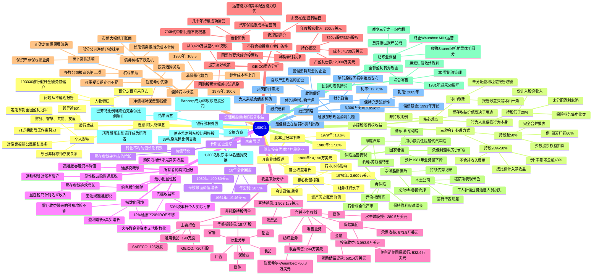

# 1980年巴菲特致股东信思维导图

## 二、文本大纲（点击展开）

1980年

开篇业绩概述

营业收益增长

1979年: 3,600万美元

1980年: 4,190万美元

股本回报率下降

1979年: 18.6%

1980年: 17.8%

核心衡量标准

会计政策理解

资产历史账面价值

财务杠杆水平

行业环境影响

非控股所有权收益

三种会计处理方式

持股超50%

完全合并报表

少数股东权益扣除

例: 蓝筹印花60%

持股20%-50%

按比例计入净收益

不合并收入费用

例: 韦斯考金融48%

持股低于20%

仅计入股息收入

未分配盈利忽略

保险业务集中此类

核心观点

留存收益价值取决于用途

非持股比例

行为人重要性行为本身

冰山现象

报告收益只是冰山一角

未分配盈利超过报告总额

长期企业业绩

16年复合回报

每股账面价值增长

1964年: 19.46美元

1980年: 400.80美元

年复利: 20.5%

价值转化

留存收益转为市值增长

转化不均匀但长期有效

未来展望

继续投资优质非控股企业

长期回报继续超报告收益

所有者的真实回报

通胀税概念

购买力增长才是真实收益

高通胀吞噬资本价值

门槛收益率

12%通胀下20%ROE不够

50%税率档个人实际亏损

显性税vs隐性通胀税

显性税只针对名义收入

通胀税针对所有资产

指数化困境

大多数企业资本无法指数化

盈利增长≠真实增长

留存收益带来的股息增长不算

伯克希尔策略

留存收益追求增长

最小化显性税

无法规避通胀税

收益来源分析

合并业务收益

保险集团

承保收益: 673.8万美元

投资收益: 3,093.9万美元

纺织业务

伯克希尔-Waumbec: -50.8万美元

零售业务

联合零售: 244万美元

消费品

喜诗糖果: 1,503.1万美元

媒体

水牛城晚报: -280.5万美元

金融

伊利诺伊国民银行: 532.4万美元

互助储蓄贷款: 581.4万美元

非控股持股清单

主要持仓

GEICO: 720万股

SAFECO: 125万股

通用食品: 198万股

华盛顿邮报: 187万股

行业分布

保险业

铝业

食品

媒体

广告

零售

GEICO重点分析

持仓概况

720万股约33%股权

成本: 4,700万美元

年度股息收入: 300万美元

占盈利份额: 2,000万美元

特殊会计处理

因监管要求放弃投票权

不符合被投资方会计条件

商业优势

汽车保险低成本运营商

几十年持续成功运营

70年代中期问题不伤根基

股东友好政策

回购股票大幅减少流通股

从3,420万减至2,160万股

管理层评价

杰克·伯恩扭转局面

运营能力和资本配置能力双优

保险行业状况

承保恶化趋势

综合成本率上升

1979年: 100.6

1980年: 103.5

债券价格下跌危机

长期债券按摊余成本计价

市值大幅低于账面

部分公司净值已被抹平

行业困境

两个恶性选项

正确定价保保费流失

保资产承保亏损业务

多数公司被迫选第二项

伯克希尔优势

净值相对保费最强健

投资选择灵活

可承受长期定价不足

保险运营表现

国家赔偿

菲尔·利切领导

承保利润率历史新高

预计1981年业务量下降

家庭汽车

约翰·苏厄德转型

用小额责任险替代汽车险

再保险

乔治·杨管理

行业业余化严重

保持盈利但难增长

本土公司

堪萨斯表现出色

爱荷华表现差

工人补偿业务遭遇人员损失

塞浦路斯保险

米尔特·桑顿管理

持续优秀记录

纺织和零售运营

纺织业调整

终止Waumbec Mills运营

减少三分之一织布机

放弃低回报产品线

收购Saurer织机扩展优势细分

联合零售

本·罗斯纳管理

糟糕年份依然盈利

全部盈利转为现金

1981年迎来50周年

银行股权处置

交换方案

伯克希尔股东按比例换股

1,300名股东中24名选择交换

39名股东超比例交换

结果满意

Bancorp成为65股东控股公司

所有股东主动选择成为所有者

巴菲特比例略降伯克希尔比例略升

融资策略

6,000万美元票据发行

利率: 12.75%

到期: 2005年

偿债基金: 1991年开始

融资逻辑

非因即时需求

为未来机会储备弹药

最佳机会在信贷昂贵时出现

收购偏好

喜欢产生现金的企业

警惕消耗现金的企业

通胀加剧现金消耗问题

财务政策

保持充足流动性

债务适中结构合理

略低股权回报率换取安心

吉恩·阿贝格悼念

人物特质

1933年银行假日全额兑付储户

百分之百直来直去

问题从不延迟报告

银行成就

领导近50年

定期拿到全国盈利冠军

71岁卖出后工作更努力

个人影响

对洛克福德公民帮助良多

财务、智慧、共情、友谊

与巴菲特亦师亦友关系

---

## 📊 结构概要表

| 章节 | 核心主题 | 关键要点 |
|------|---------|---------|
| 开篇 | 1980年业绩概述 | 收益增长但回报率下降 |
| 非控股所有权收益 | 会计处理三种方式 | 留存收益价值取决于用途，非持股比例 |
| 长期企业业绩 | 16年复合回报 | 年复利20.5%，远超年度报告收益 |
| 所有者的真实回报 | 通胀税概念 | 高通胀吞噬资本，12%通胀下20%ROE不够 |
| 收益来源 | 财务分析 | 详细业务收益表+非控股持股清单 |
| GEICO | 重点持仓分析 | 33%股权，核心竞争优势完整保留 |
| 保险行业状况 | 行业危机 | 债券市值下跌+承保恶化双重困境 |
| 保险运营 | 各业务线表现 | 国家赔偿优秀，再保险谨慎 |
| 纺织和零售 | 业务调整 | 纺织收缩，联合零售表现稳健 |
| 银行股权处置 | 换股方案 | 顺利完成，股东主动选择 |
| 融资 | 债券发行 | 6000万美元储备资金，等待机会 |
| 悼念 | 吉恩·阿贝格 | 银行家典范，受托责任典范 |

---

## 👤 关键人物链接

| 人物 | 角色 | 相关公司 |
|------|------|---------|
| **沃伦·巴菲特** | 董事长 | 伯克希尔·哈撒韦 |
| **查理·芒格** | 副董事长 | 蓝筹印花、韦斯考金融 |
| **杰克·伯恩** | CEO | GEICO |
| **菲尔·利切** | 管理层 | 国家赔偿公司 |
| **约翰·苏厄德** | 管理层 | 家庭汽车保险公司 |
| **乔治·杨** | 管理层 | 再保险业务 |
| **弗洛伊德·泰勒** | 管理层 | 堪萨斯本土公司 |
| **米尔特·桑顿** | 管理层 | 塞浦路斯保险公司 |
| **本·罗斯纳** | 管理层 | 联合零售公司 |
| **路易·文辛蒂** | 管理层 | 互助储蓄贷款 |
| **吉恩·阿贝格** | 创始人（已故） | 伊利诺伊国民银行 |

---

## 🏢 关键公司链接

| 公司 | 业务类型 | 巴菲特评价 |
|------|---------|-----------|
| **GEICO** | 汽车保险 | 最好的投资：无法复制的商业优势+非凡管理层 |
| **伯克希尔·哈撒韦** | 综合集团 | 母公司，保险+纺织+零售+金融 |
| **蓝筹印花** | 多元控股 | 伯克希尔持股60%，完全合并报表 |
| **韦斯考金融** | 金融服务 | 伯克希尔持股48%，按比例计入收益 |
| **喜诗糖果** | 消费品 | 优质消费品牌，持续稳定盈利 |
| **华盛顿邮报** | 媒体 | 重要非控股持股，优质媒体资产 |
| **国家赔偿** | 保险 | 承保纪律典范，历史新高利润率 |
| **联合零售** | 零售 | 现金流典范，50年稳定运营 |
| **伊利诺伊国民银行** | 银行 | 盈利冠军，受托责任典范（已分拆） |

---

## 🕰️ 时代背景

### 1980年美国经济环境

**通胀高企**
- 年通胀率约12%，处于历史高位
- 通胀被视为"隐性资本税"，侵蚀投资回报
- 巴菲特首次系统阐述"通胀税"概念

**利率环境**
- 联邦基金利率一度升至20%以上
- 长期债券收益率高企（伯克希尔发行12.75%票据）
- 债券价格暴跌，保险公司账面受损

**保险业困境**
- 承保综合成本率恶化至103.5%
- 债券未实现损失威胁公司净值
- "保资产承保"现象普遍

**纺织业衰退**
- 传统制造业在通胀和竞争压力下艰难
- 巴菲特承认错误：应更早退出
- 典型的"烂行业好管理"案例

**投资哲学发展**
- 明确区分"报告收益"与"经济价值"
- 强调留存收益用途决定价值
- 提出"行为重要，行为人不重要"理念

---

## 💡 核心金句

> "留存收益对伯克希尔的价值，不取决于我们拥有企业100%、50%、20%还是1%，而是取决于留存收益怎么用，以及使用之后产生的盈利水平。"

> "当声名显赫的管理层接手基本面糟糕的企业，保持完好的是企业的名声。"

> "只有购买力增长才是投资真实收益。如果放弃十个汉堡买一个投资，拿到税后股息只能买两个汉堡，这个投资没有真实收入。"

> "通胀是对资本征收的税，让很多企业投资都不划算。"

> "他（吉恩·阿贝格）从来不会延迟一分钟报告问题，吉恩的问题本来就很少。"

---

*生成时间：2026-04-09*
