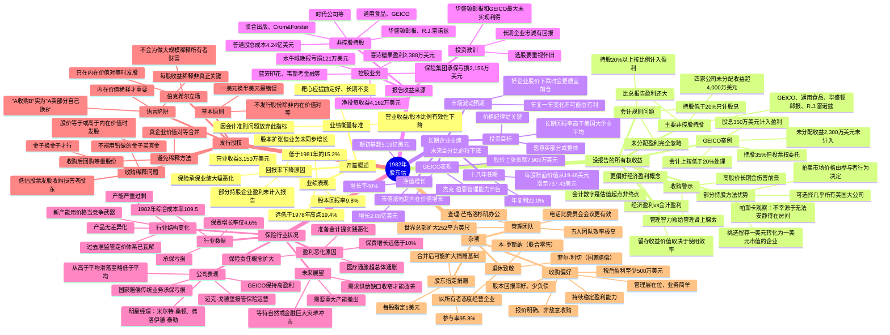

# 1982年巴菲特致股东信思维导图

## 二、文本大纲（点击展开）

1982年 股东信

开篇概述

业绩表现

营业收益3,150万美元

股本回报率9.8%

低于1981年的15.2%

远低于1978年高点19.4%

回报率下降原因

保险承保业绩大幅恶化

股本扩张但业务未同步增长

部分持股企业盈利未计入报告

业绩衡量标准

营业收益/股本比例有效性下降

靶心应提前定好、长期不变

因会计准则问题放弃此指标

没报告的所有权收益

会计规则问题

持股20%以上按比例计入盈利

持股低于20%只计股息

未分配盈利完全忽略

GEICO案例

持股35%但投票权委托

会计上按低于20%处理

股息350万美元计入盈利

未分配收益2,300万美元未计入

经济盈利vs会计盈利

更偏好经济盈利概念

留存收益价值取决于使用效率

会计数字是估值起点非终点

主要非控股持股

四家公司未分配收益超4,000万美元

比总报告盈利还大

GEICO、通用食品、华盛顿邮报、R.J.雷诺兹

部分持股方法优势

可选择几乎所有美国大公司

拍卖市场价格由参与者行为决定

挑选留存一美元转化为一美元市值的企业

收购警示

管理智力败给管理肾上腺素

帕斯卡观察：不幸源于无法安静待在房间

高股价长期会伤害前景

长期企业业绩

净值增长

增长2.08亿美元

期初基数5.19亿美元

增长率40%

十八年任期

每股账面价值从19.46美元涨至737.43美元

年复利22.0%

未来百分比必将下降

投资目标

长期回报率高于美国大企业平均

愿意买部分或整体

价格纪律是关键

GEICO表现

股价上涨贡献7,900万美元

市值涨幅超内在价值增长

杰克·伯恩管理能力出色

市场波动预期

年复一年变化不可能总有利

好企业股价下跌时会更便宜加仓

报告收益来源

控股业务

保险集团承保亏损2,156万美元

净投资收益4,162万美元

喜诗糖果盈利2,388万美元

水牛城晚报亏损121万美元

蓝筹印花、韦斯考金融等

非控股持股

联合出版、Crum&Forster

通用食品、GEICO

华盛顿邮报、R.J.雷诺兹

时代公司等

普通股总成本4.24亿美元

投资教训

选股要重视怀旧

华盛顿邮报和GEICO最大未实现利得

长期企业忠诚有回报

保险行业状况

行业数据

1982年综合成本率109.5

承保亏损

保费增长率仅4.6%

盈利恶化原因

保费增长远低于10%

医疗通胀超总体通胀

保险责任概念扩大

准备金计提实践恶化

行业结构变化

过去准监管定价体系已瓦解

新产能用价格当竞争武器

产品无差异化

产能严重过剩

未来展望

需求供给缺口收窄才能改善

需要重大产能撤出

等待自然或金融巨大灾难冲击

公司表现

从高于平均滑落至略低于平均

国家赔偿传统业务承保亏损

明星经理：米尔特·桑顿、弗洛伊德·泰勒

迈克·戈德堡接管保险运营

GEICO保持高盈利

发行股权

基本原则

不发行股份除非内在价值对等

一美元换半美元是错误

收购稀释问题

低估股票发股收购损害老股东

金子换金子才行

不能用铅做的金子买真金

避免稀释方法

真企业价值对等合并

股价等于或高于内在价值时发股

收购后回购等量股份

语言陷阱

每股收益稀释非真正关键

内在价值稀释才重要

"A收购B"实为"A卖部分自己换B"

伯克希尔立场

不会为做大规模稀释所有者财富

只在内在价值对等时发股

杂项

收购偏好

税后盈利至少500万美元

持续稳定盈利能力

股本回报率好、少负债

管理层在位、业务简单

报价明确、非敌意收购

股东指定捐赠

参与率95.8%

每股指定1美元

合并后可能扩大捐赠基础

管理团队

世界总部扩大252平方英尺

五人团队效率极高

查理·芒格洛杉矶办公

电话比委员会会议更有效

退休致敬

菲尔·利切（国家赔偿）

本·罗斯纳（联合零售）

以所有者态度经营企业

---

## 结构概要表

| 章节 | 核心主题 | 关键观点 |
|------|----------|----------|
| 开篇概述 | 业绩下滑与衡量标准 | 股本回报率从15.2%降至9.8%，会计准则导致指标失真 |
| 没报告的所有权收益 | 会计vs经济盈利 | 持股低于20%企业未分配收益未计入，实际经济盈利被低估 |
| 长期企业业绩 | 净值增长与目标 | 18年每股账面价值年复利22%，长期目标跑赢大企业平均 |
| 报告收益来源 | 业务板块分析 | 控股业务详细披露，非控股持股清单及投资教训 |
| 保险行业状况 | 行业结构性变化 | 准监管定价体系瓦解，产能过剩导致盈利困难 |
| 发行股权 | 股份发行原则 | 只在内在价值对等时发股，反对稀释性收购 |
| 杂项 | 收购标准与团队 | 收购偏好、股东捐赠、团队介绍、退休致敬 |

---

## 关键人物链接

| 人物 | 身份 | 相关公司 | 本信提及要点 |
|------|------|----------|--------------|
| [沃伦·巴菲特](https://en.wikipedia.org/wiki/Warren_Buffett) | 董事长 | 伯克希尔·哈撒韦 | 署名作者，阐述经营理念 |
| [查理·芒格](https://en.wikipedia.org/wiki/Charlie_Munger) | 合伙人 | 伯克希尔·哈撒韦 | 洛杉矶办公，决策可互换 |
| [杰克·伯恩](https://en.wikipedia.org/wiki/John_J._Byrne_(executive)) | CEO | GEICO | 管理能力出色，"让杰克干"是完美信条 |
| 杰克·林格沃特 | 前任管理者 | 国家赔偿 | 与菲尔·利切共同推动成功 |
| 菲尔·利切 | 退休经理 | 国家赔偿 | 65岁退休，以所有者态度经营 |
| 本·罗斯纳 | 退休经理 | 联合零售 | 79岁退休，15年全垒打表现 |
| 米尔特·桑顿 | 经理 | 塞浦路斯保险 | 持续承保盈利明星 |
| 弗洛伊德·泰勒 | 经理 | 堪萨斯火灾意外伤害 | 持续承保盈利明星 |
| 迈克·戈德堡 | 保险运营主管 | 伯克希尔 | 1982年接管保险运营 |
| 卢·辛普森 | 投资经理 | GEICO | 财产意外险行业最佳 |
| 比尔·斯奈德 | 高管 | GEICO | 坚持简单，记住要做什么 |
| 亚瑟·奥肯 | 经济学家 | - | "抵消"圣徒理论 |

---

## 关键公司链接

| 公司 | 行业 | 伯克希尔持股 | 本信提及要点 |
|------|------|--------------|--------------|
| [伯克希尔·哈撒韦](https://en.wikipedia.org/wiki/Berkshire_Hathaway) | 综合企业 | 100% | 本信主体 |
| [GEICO](https://en.wikipedia.org/wiki/GEICO) | 汽车保险 | 35% | 最大未分配收益来源，成本优势突出 |
| [华盛顿邮报](https://en.wikipedia.org/wiki/The_Washington_Post) | 媒体 | 主要股东 | 最大未实现利得之一，巴菲特13岁首次商业接触 |
| [蓝筹印花](https://en.wikipedia.org/wiki/Blue_Chip_Stamps) | 商业印花 | 60% | 计划与伯克希尔合并 |
| [喜诗糖果](https://en.wikipedia.org/wiki/See%27s_Candies) | 糖果零售 | 控股 | 盈利2,388万美元 |
| [水牛城晚报](https://en.wikipedia.org/wiki/The_Buffalo_News) | 报纸 | 控股 | 周日版发行量增长35%至36.7万 |
| [韦斯考金融](https://en.wikipedia.org/wiki/Wesco_Financial) | 金融服务 | 通过蓝筹印花控股 | 储蓄贷款业务 |
| [通用食品](https://en.wikipedia.org/wiki/General_Foods) | 食品 | 主要股东 | 四大非控股持股之一 |
| [R.J.雷诺兹](https://en.wikipedia.org/wiki/R._J._Reynolds_Tobacco_Company) | 烟草 | 主要股东 | 1982年大幅增持 |
| 国家赔偿 | 财产意外险 | 100% | 传统业务承保亏损 |
| 联合零售 | 零售 | 控股 | 本·罗斯纳管理15年 |
| Crum & Forster | 保险 | 主要股东 | 非控股持股之一 |
| 时代公司 | 媒体 | 主要股东 | 非控股持股之一 |

---

## 时代背景

### 经济环境（1982年）

- **通胀与利率**：美国处于高通胀尾声，美联储主席保罗·沃尔克激进加息政策奏效，通胀从1980年14.8%降至1982年约6%
- **经济衰退**：1981-1982年美国经历严重衰退，失业率最高达10.8%
- **股市表现**：1982年8月美股开启大牛市，道琼斯指数从约770点起步

### 行业背景

- **保险业危机**：综合成本率109.5，行业承保严重亏损，准监管定价体系瓦解，价格战激烈
- **并购热潮**：80年代并购活跃，很多收购溢价过高，巴菲特警示"管理智力败给管理肾上腺素"

### 伯克希尔发展

- **规模扩张**：保险子公司股权投资占投资组合从1972年15%升至1982年80%
- **管理理念成熟**：形成"内在价值对等"发股原则，明确收购标准
- **股权结构变化**：计划与蓝筹印花合并，简化架构

### 核心思想演变

- 从"营业收益/股本"衡量转向关注"经济盈利"
- 部分持股方法与整体收购并重的投资策略
- 对大宗商品行业的深刻认识：产能过剩+无差异化=低盈利

---

*生成日期：2026年4月9日*
*基于1983年3月3日发布的1982年巴菲特致股东信原文翻译*
