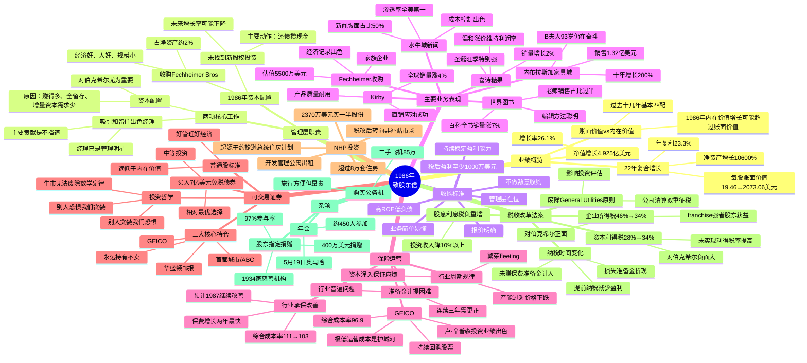

# 1986年巴菲特致股东信思维导图

## 二、文本大纲（点击展开）

1986年 致股东信

业绩概览

净值增长4.925亿美元

增长率26.1%

22年复合增长

每股账面价值19.46→2073.06美元

年复利23.3%

净资产增长10600%

账面价值vs内在价值

过去十几年基本匹配

1986年内在价值增长可能超过账面价值

管理层职责

两项核心工作

吸引和留住出色经理

经理已是管理明星

主要贡献是不挡道

资本配置

对伯克希尔尤为重要

三原因：赚得多、全留存、增量资本需求少

1986年资本配置

收购Fechheimer Bros

占净资产约2%

经济好、人好、规模小

未找到新股权投资

主要动作：还债攒现金

未来增长率可能下降

收购标准

税后盈利至少1000万美元

持续稳定盈利能力

高ROE低负债

管理层在位

业务简单易懂

报价明确

不做敌意收购

主要业务表现

水牛城新闻

渗透率全美第一

新闻版面占比50%

成本控制出色

内布拉斯加家具城

销售1.32亿美元

十年增长200%

B夫人93岁仍在奋斗

喜诗糖果

销量增长2%

圣诞旺季特别强

温和涨价维持利润率

世界图书

百科全书销量涨7%

编辑方法聪明

老师销售占比过半

Kirby

全球销量涨4%

产品质量耐用

直销应对成功

Fechheimer收购

家族企业

经济记录出色

估值5500万美元

保险运营

行业承保改善

综合成本率111→103

保费增长两年最快

预计1987继续改善

行业周期规律

繁荣fleeting

产能过剩价格下跌

资本涌入保证麻烦

准备金计提困难

连续三年需更正

行业普遍问题

GEICO

综合成本率96.9

极低运营成本是护城河

持续回购股票

卢·辛普森投资业绩出色

可交易证券

买入7亿美元免税债券

中等投资

相对最优选择

普通股标准

好管理好经济

远低于内在价值

三大核心持仓

首都城市/ABC

GEICO

华盛顿邮报

永远持有不卖

投资哲学

别人贪婪我们恐惧

别人恐惧我们贪婪

牛市无法废除数学定律

NHP投资

2370万美元买一半股份

开发管理公寓出租

起源于约翰逊总统住房计划

超过8万套住房

税改后转向非补贴市场

税收改革法案

企业所得税46%→34%

对伯克希尔正面

franchise强者股东获益

资本利得税28%→34%

对伯克希尔负面大

未实现利得税率提高

股息利息税负重增

投资收入降10%以上

纳税时间变化

损失准备金折现

未赚保费准备金计入

提前纳税减少盈利

废除General Utilities原则

公司清算双重征税

影响投资评估

杂项

购买公务机

二手飞机85万

旅行方便但昂贵

股东指定捐赠

97%参与率

400万美元捐赠

1934家慈善机构

年会

约450人参加

5月19日奥马哈

---

## 结构概要表

| 章节 | 主要内容 | 关键数据/要点 |
|------|----------|---------------|
| 业绩概览 | 年度业绩与管理层职责 | 净值增长26.1%，22年复利23.3% |
| 报告收益来源 | 各业务板块收益明细 | 营业收益1.96亿美元，总收益4.12亿美元 |
| 主要业务表现 | 水牛城、NFM、喜诗、世界图书、Kirby详情 | 渗透率第一、销售增长、利润率维持 |
| Fechheimer收购 | 收购案例与标准更新 | 5500万估值，收购标准提至1000万 |
| 保险运营 | 行业分析与GEICO表现 | 综合成本率改善，GEICO成本率96.9 |
| 可交易证券 | 投资策略与核心持仓 | 7亿债券，三大持仓永远持有 |
| NHP投资 | 公寓住房投资 | 2370万美元，8万套住房 |
| 税收改革法案 | 税改对各业务影响 | 企业税降、资本利得税升、股息税负重 |
| 杂项 | 公务机、捐赠、年会 | 400万捐赠，450人参会 |

---

## 关键人物链接

| 人物 | 身份 | 相关企业 | 本章提及要点 |
|------|------|----------|--------------|
| 沃伦·巴菲特 | 董事长 | 伯克希尔·哈撒韦 | 资本配置困难，承认配不上经理们表现 |
| 查理·芒格 | 副董事长 | 伯克希尔·哈撒韦 | 两项工作：留住经理、配置资本 |
| B夫人（Rose Blumkin） | 创始人 | 内布拉斯加家具城 | 93岁仍是最强销售，NFM十年增长200% |
| 斯坦·利普西 | 出版人 | 水牛城新闻 | 管理superb，渗透率全美第一 |
| 查克·哈金斯 | CEO | 喜诗糖果 | 保持客户导向企业文化 |
| 拉尔夫·谢伊 | CEO | Scott Fetzer/世界图书 | 超级棒商人，精力全能 |
| Bob Heldman | 董事长 | Fechheimer Bros | 家族企业，主动写信寻求收购 |
| 迈克·戈德堡 | 保险经理 | 伯克希尔保险集团 | 保险运营出色表现 |
| 比尔·斯奈德 | 董事长 | GEICO | 极低运营成本，持续压降费用 |
| 卢·辛普森 | 投资副总裁 | GEICO | 投资业绩远超标普500 |
| 穆雷·莱特 | 主编 | 水牛城新闻 | 困难时期坚持，繁荣后不变 |

---

## 关键公司链接

| 公司 | 业务性质 | 本章要点 |
|------|----------|----------|
| 伯克希尔·哈撒韦 | 投资控股公司 | 净值2073美元/股，22年复利23.3% |
| 水牛城新闻 | 报纸出版 | 工作日+周日渗透率双第一，新闻版面50% |
| 内布拉斯加家具城 | 家具零售 | 销售1.32亿，十年增长200%，B夫人传奇 |
| 喜诗糖果 | 糖果零售 | 销量增2%，温和涨价维持利润率 |
| 世界图书 | 百科全书出版 | 销量增7%，美国直销第一 |
| Kirby | 吸尘器制造 | 全球销量增4%，产品耐用三十四年 |
| Fechheimer Bros | 制服生产分销 | 1842年创立，5500万估值收购 |
| GEICO | 汽车保险 | 成本率96.9，极低成本护城河 |
| 首都城市/ABC | 媒体集团 | 三大核心持仓之一，永远持有 |
| 华盛顿邮报 | 报业集团 | 三大核心持仓之一，永远持有 |
| NHP | 公寓开发管理 | 8万套住房，税改后转向非补贴市场 |
| Scott Fetzer | 多元化制造 | 世界图书+Kirby母公司，收购后表现出色 |

---

## 时代背景

### 1986年美国经济与市场环境

| 维度 | 背景 | 对巴菲特的影响 |
|------|------|----------------|
| **股市环境** | 牛市欣快症，华尔街缺乏恐惧 | 找不到低估普通股，买入债券替代 |
| **保险行业** | 保费增长22.6%，综合成本率改善 | 承保亏损大幅下降，但预计繁荣短暂 |
| **税收改革** | 1986年税改法案通过 | 企业税降但资本利得税升，整体负面影响 |
| **并购市场** | 企业重组活跃 | 收购Fechheimer，提高收购标准至1000万 |
| **利率环境** | 中期利率相对较高 | 8-12年免税债券成为相对优选择 |

### 关键历史节点

- **税改里程碑**：1986年税收改革法案是美国二战后最重要税制改革，简化税制、降低税率、扩大税基
- **保险周期**：保费增长从27.1%降至18.7%，行业产能扩张预示未来价格下跌
- **企业重组浪潮**：LBO（杠杆收购）盛行，Fechheimer前身为风投LBO标的
- **媒体行业变革**：首都城市收购ABC，形成媒体巨头

### 巴菲特投资哲学的体现

1. **长期主义**：三大核心持仓"永远持有"，不受市场估值波动影响
2. **逆向思维**："别人贪婪我恐惧，别人恐惧我贪婪"
3. **质量优先**：只与喜欢欣赏的人合作，宁缺毋滥
4. **能力圈**：业务简单易懂，太多技术不碰
5. **护城河意识**：GEICO极低成本、水牛城新闻高渗透率
