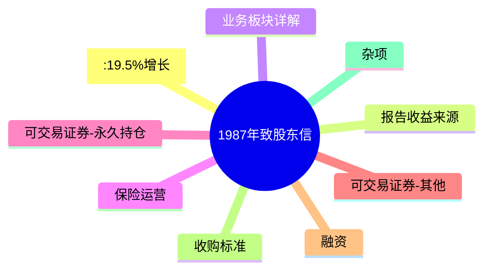
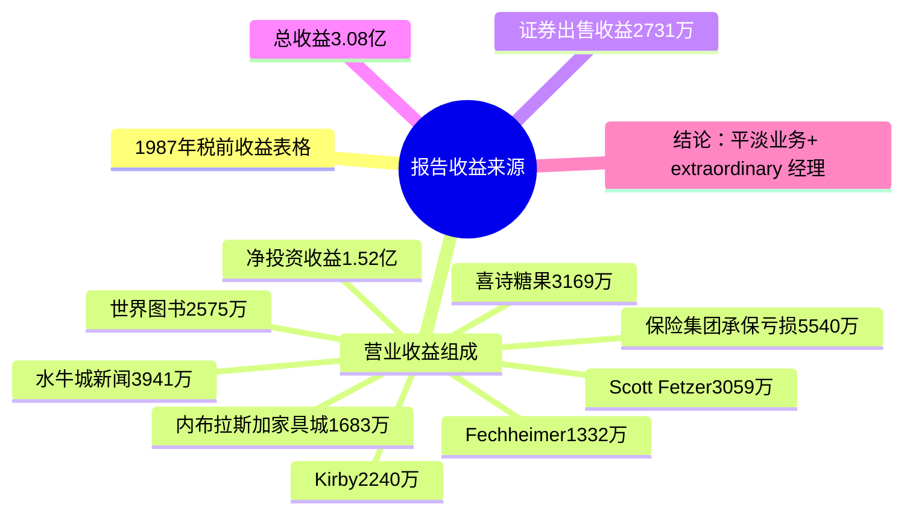
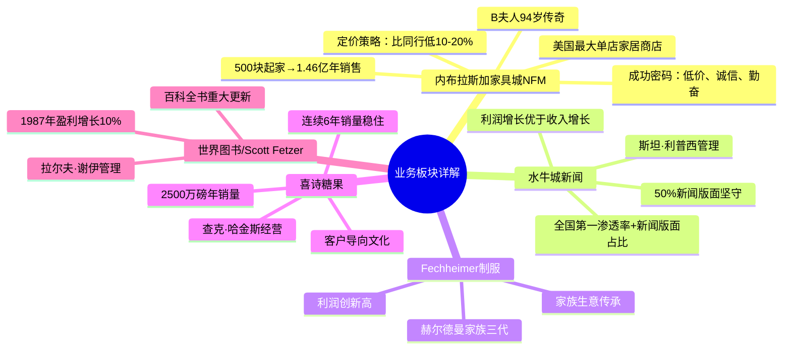
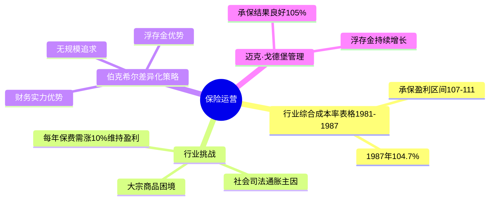
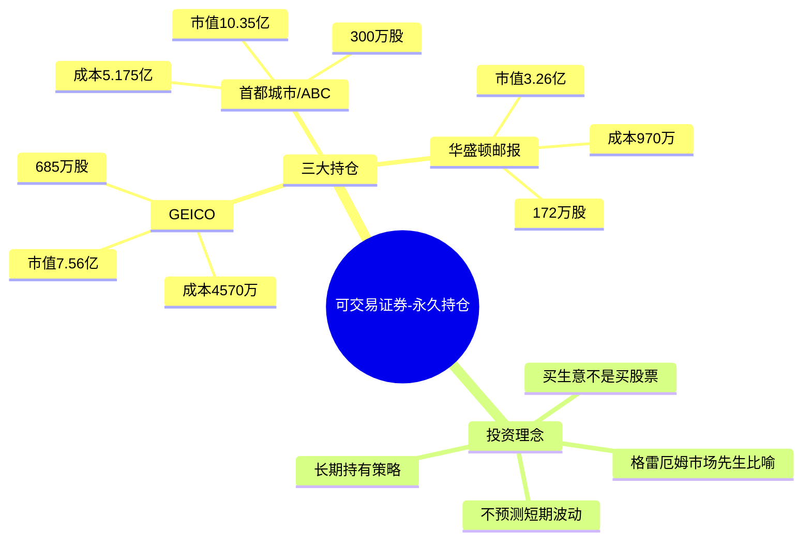
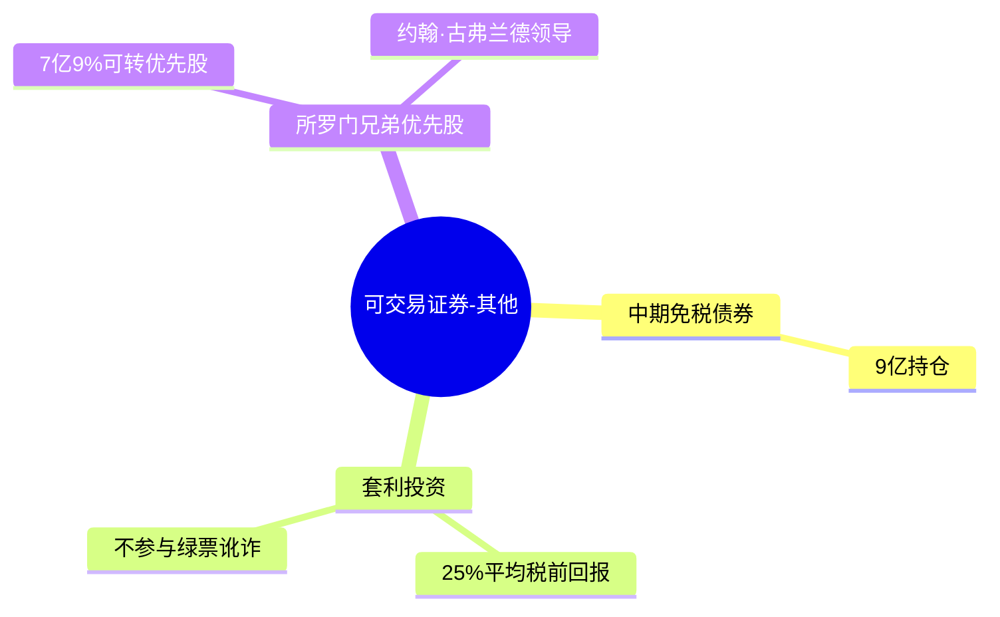
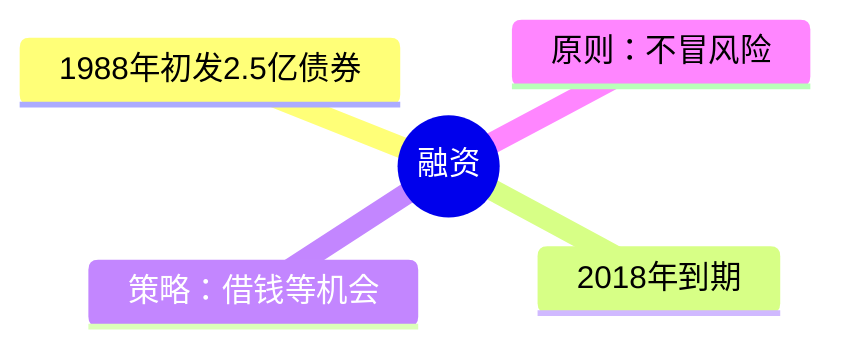
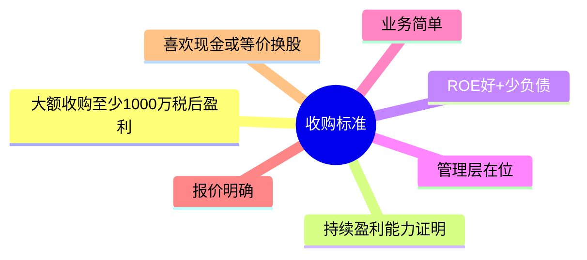
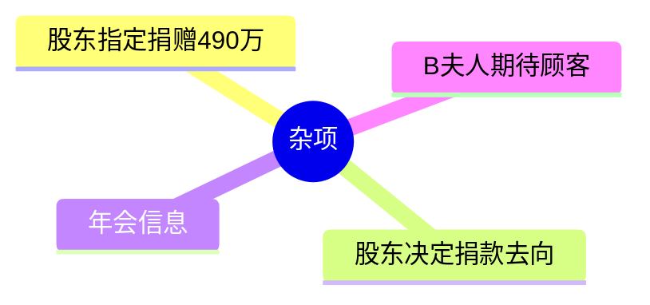

# 巴菲特致股东信 1987 - 思维导图


<style>
.mm-sub {
  margin: 8px 0;
  border: 1px solid var(--vp-c-divider, #e2e2e2);
  border-radius: 8px;
  overflow: hidden;
}
.mm-sub summary {
  padding: 10px 14px;
  background: var(--vp-c-bg-soft, #f8f9fa);
  font-weight: 600;
  font-size: 0.95em;
  cursor: pointer;
  color: var(--vp-c-text-1, #213547);
  list-style: none;
  display: flex;
  align-items: center;
  gap: 8px;
  transition: background 0.15s;
}
.mm-sub summary::-webkit-details-marker { display: none; }
.mm-sub summary::before {
  content: "▶";
  font-size: 0.65em;
  color: var(--vp-c-brand-1, #3eaf7c);
  transition: transform 0.15s;
  flex-shrink: 0;
}
.mm-sub[open] > summary::before { transform: rotate(90deg); }
.mm-sub summary:hover { background: var(--vp-c-brand-soft, rgba(62,175,124,0.08)); }
.mm-sub[open] > summary {
  border-bottom: 1px solid var(--vp-c-divider, #e2e2e2);
}
.mm-sub > div {
  padding: 16px;
  background: var(--vp-c-bg, #fff);
}
</style>

<div class="mm-sub-list">
<details class="mm-sub">
<summary>[:19.5%增长]</summary>
<div>

```mermaid
mindmap
  root(([:19.5%增长]))
    净值增长4.64亿美元
    每股账面19.46→2477.47美元
    年复利23.1%
    内在价值与账面价值关系
      内在价值更重要
      伯克希尔两者一直跟踪不错
      拥有卓越business+更卓越经理
```

</div>
</details>

<details class="mm-sub">
<summary>报告收益来源</summary>
<div>



</div>
</details>

<details class="mm-sub">
<summary>业务板块详解</summary>
<div>



</div>
</details>

<details class="mm-sub">
<summary>保险运营</summary>
<div>



</div>
</details>

<details class="mm-sub">
<summary>可交易证券-永久持仓</summary>
<div>



</div>
</details>

<details class="mm-sub">
<summary>可交易证券-其他</summary>
<div>



</div>
</details>

<details class="mm-sub">
<summary>融资</summary>
<div>



</div>
</details>

<details class="mm-sub">
<summary>收购标准</summary>
<div>



</div>
</details>

<details class="mm-sub">
<summary>杂项</summary>
<div>



</div>
</details>

</div>
---

## 结构概要表

| 章节 | 主要内容 | 关键数据/要点 |
|------|----------|----------------|
| 业绩总览 | 1987年增长19.5% | 净值增4.64亿，23年复利23.1% |
| 收益来源 | 各业务板块盈利 | 保险投资收益1.52亿，各业务稳定 |
| 业务板块 | 七大非金融业务 | ROE 57%，1.75亿资本赚1.78亿 |
| 保险运营 | 行业分析与策略 | 综合成本率104.7%，浮存金优势 |
| 永久持仓 | 三大股票投资 | 20亿市值，股息vs账面差异 |
| 投资理念 | 市场先生理论 | 长期持有，不做短线 |
| 收购标准 | 六大收购条件 | 1000万盈利起，ROE好少负债 |

---

## 关键人物链接

| 人物 | 职位/角色 | 关联业务 |
|------|-----------|----------|
| 沃伦·巴菲特 | 董事长 | 整封信 |
| 查理·芒格 | 副董事长 | 共同管理 |
| B夫人(94岁) | 内布拉斯加家具城董事长 | 零售传奇 |
| 斯坦·利普西 | 水牛城新闻 | 报纸管理 |
| 赫尔德曼家族 | Fechheimer | 三代传承 |
| 查克·哈金斯 | 喜诗糖果 | 糖果业务 |
| 拉尔夫·谢伊 | Scott Fetzer集团 | 19个业务 |
| 迈克·戈德堡 | 保险业务 | 承保投资 |
| 约翰·古弗兰德 | 所罗门兄弟董事长 | 优先股投资 |

---

## 关键公司链接

| 公司 | 类型 | 1987年要点 |
|------|------|------------|
| 伯克希尔·哈撒韦 | 投资控股 | 净值增长19.5% |
| 内布拉斯加家具城NFM | 零售 | 1.46亿美元销售 |
