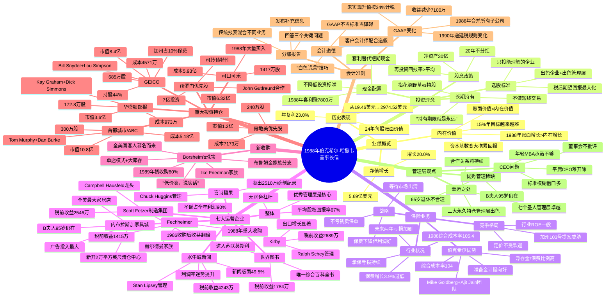

# 1988年巴菲特股东信思维导图

## Mermaid Mindmap

---

## 结构概要表格

| 章节 | 核心主题 | 关键词 |
|------|----------|--------|
| 开篇 | 业绩概览与增长挑战 | 净值增长20%、23年复利、资本基数、15%目标 |
| 会计准则变化 | GAAP变化与信息披露 | 合并报表、递延税、分部报告、三个关键问题 |
| 报告收益来源 | 各业务单元业绩 | 七大圣人、税前收益、运营利润 |
| 运营企业更新 | 核心业务表现 | B夫人、水牛城新闻、喜诗糖果、Stan Lipsey |
| Borsheim's | 新收购珠宝业务 | Ike Friedman、布鲁姆金家族、单店模式 |
| 保险运营 | 行业分析与战略 | 综合成本率、浮存金、加州103号提案 |
| 可交易证券 | 投资组合与持仓 | 首都城市、GEICO、可口可乐、房地美 |
| 套利 | 现金管理策略 | 7800万收益、替代国债、克制诱惑 |
| 股息政策 | 资本配置原则 | 20年不分红、再投资、股份不拆分 |
| 收购标准 | 并购准则 | 1000万盈利、持续盈利、管理层在位 |
| 杂项 | 股东捐赠与年会 | 500万捐赠、5月1日年会 |

---

## 关键人物列表

- [[沃伦·巴菲特]] - 伯克希尔董事长，信作者
- [[查理·芒格]] - 巴菲特合伙人
- [[B夫人/罗斯·布鲁姆金]] - 内布拉斯加家具城创始人，95岁仍在经营
- [[Louie]] - B夫人儿子
- [[Ron Irv]] - B夫人孙子
- [[Stan Lipsey]] - 水牛城新闻管理者，报业管理记录最佳
- [[Murray Light]] - 水牛城新闻主编
- [[Chuck Huggins]] - 喜诗糖果管理者
- [[Bob Hieldeman]] - Fechheimer家族成员
- [[George Hieldeman]] - Fechheimer家族成员
- [[Gary Hieldeman]] - Fechheimer家族成员
- [[Roger Hieldeman]] - Fechheimer家族成员
- [[Fred Hieldeman]] - Fechheimer家族成员
- [[Ralph Schey]] - 管理世界图书、Kirby、Scott Fetzer制造集团
- [[Ike Friedman]] - Borsheim's经营者
- [[Alan Friedman]] - Ike儿子，Borsheim's家族成员
- [[Marvin Cohn]] - Borsheim's家族成员
- [[Donald Yale]] - Borsheim's家族成员
- [[Mike Goldberg]] - 保险业务管理者
- [[Ajit Jain]] - 保险团队核心成员
- [[Dinos Iordanou]] - 国家赔偿管理团队
- [[Tom Murphy]] - 首都城市/ABC管理层
- [[Dan Burke]] - 首都城市/ABC管理层
- [[Bill Snyder]] - GEICO管理层
- [[Lou Simpson]] - GEICO管理层
- [[Kay Graham]] - 华盛顿邮报管理层
- [[Dick Simmons]] - 华盛顿邮报管理层
- [[John Gutfreund]] - 所罗门兄弟合作
- [[William Dillard]] - Dillard百货老板，宣布不与B夫人竞争
- [[Peter Lynch]] - 引用其"掐花浇野草"比喻
- [[Mae West]] - 引用其"好东西太多也可以很好"
- [[Sam Goldwyn]] - 引用其关于甜酸都要接受

---

## 关键公司列表

- [[伯克希尔·哈撒韦]] - 母公司
- [[水牛城新闻]] - 报纸业务，税前收益4243万
- [[内布拉斯加家具城/NFM]] - 家具零售，全美最大
- [[喜诗糖果]] - 糖果业务，2510万磅销量创纪录
- [[Fechheimer]] - 制服制造，赫尔德曼家族经营
- [[Kirby]] - 清洁设备，Ralph Schey管理
- [[世界图书]] - 百科全书，进入苏联市场
- [[Scott Fetzer制造集团]] - 制造业，含Campbell Hausfeld
- [[Borsheim's]] - 奥马哈珠宝店，1989年新收购
- [[首都城市/ABC]] - 三大永久持仓之一
- [[GEICO]] - 三大永久持仓之一，持股44%
- [[华盛顿邮报]] - 三大永久持仓之一
- [[可口可乐]] - 1988年大量买入
- [[房地美]] - 优先股投资
- [[所罗门兄弟]] - 可转债投资
- [[Fireman's Fund]] - 再保合同到期
- [[Dillard]] - 百货公司，宣布不与NFM竞争
- [[奥马哈世界先驱报]] - NFM最大广告客户

---

## 时代背景

1988年正值美国股市持续牛市后期，通胀相对温和但保险行业承保亏损持续加剧；加州通过103号提案试图强制压低车险价格，反映了公众对保险业定价的不满情绪。伯克希尔的资本基数已增长至难以维持早期高回报率的规模，巴菲特开始将目光投向可口可乐等消费巨头，并完成了对Borsheim's珠宝店的收购，继续贯彻"以合理价格买入出色企业"的长期投资理念。
