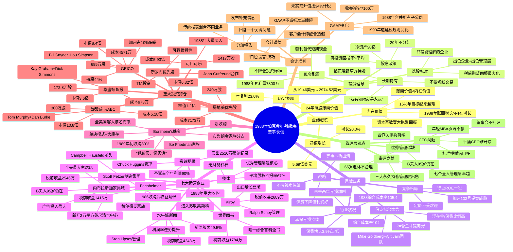

# 1988年巴菲特股东信思维导图

## Mermaid Mindmap

```mermaid
mindmap
  root((1988年伯克希尔·哈撒韦<br/>董事长信))
    业绩概览
      净值增长
        5.69亿美元
        增长20.0%
      历史表现
        24年每股账面价值
        从19.46美元→2974.52美元
        年复利23.0%
      内在价值
        账面价值<内在价值
        1988年账面增长>内在增长
        15%年目标越来越难
        资本基数变大拖累回报
    投资理念
      长期持有
        "持有期限就是永远"
        不做短线交易
        掐花浇野草vs持股
      选股标准
        税后期望回报最大化
        出色企业+出色管理层
        只投能理解的企业
      现金配置
        套利替代短期现金
        1988年套利赚7800万
        不降低投资标准
      股息政策
        20年不分红
        净资产30亿
        再投资回报率>平均
    保险业务
      行业状况
        1988综合成本率105.4
        承保亏损持续
        保费增长3.9%过低
        未来两年亏损加剧
      竞争格局
        行业ROE一般
        定价不受欢迎
        加州103号提案威胁
      伯克希尔优势
        综合成本率104
        浮存金/保费比例高
        准备金计提向好
        Mike Goldberg+Ajit Jain团队
      战略
        不亏钱卖保单
        保费下降但利润好
        等待市场出清
    七大运营企业
      水牛城新闻
        税前收益4243万
        Stan Lipsey管理
        利润率逆势提升
        新闻版面49.5%
      内布拉斯加家具城
        B夫人95岁仍在
        全美最大家居店
        广告投入最大
        新开2万平方英尺清仓中心
      喜诗糖果
        卖出2510万磅创纪录
        圣诞占全年利润90%
        Chuck Huggins管理
      Fechheimer
        税前收益1415万
        赫尔德曼家族
        1988年重大收购
      Kirby
        税前收益2689万
        出口增长显著
        Ralph Schey管理
      世界图书
        税前收益1784万
        进入苏联莫斯科
        唯一综合百科全书
      Scott Fetzer制造集团
        税前收益2546万
        Campbell Hausfeld龙头
        1986收购后收益翻倍
      整体
        平均股权回报率67%
        无财务杠杆
        优秀管理层是核心
    新收购
      Borsheim's珠宝
        1989年初收购80%
        Ike Friedman家族
        布鲁姆金家族分支
        "低价卖，说实话"
        单店模式+大库存
        全美国客人慕名而来
    重大投资持仓
      首都城市/ABC
        300万股
        成本5.18亿
        市值10.8亿
        Tom Murphy+Dan Burke
      GEICO
        685万股
        成本4571万
        市值8.4亿
        Bill Snyder+Lou Simpson
        持股44%
        加州占10%保费
      华盛顿邮报
        172.8万股
        成本973万
        市值3.6亿
        Kay Graham+Dick Simmons
      可口可乐
        1417万股
        成本5.93亿
        市值6.32亿
        1988年大量买入
      房地美优先股
        240万股
        成本7173万
        市值1.2亿
      所罗门优先股
        7亿投资
        John Gutfreund合作
        可转债特性
    会计准则
      GAAP变化
        1988年合并所有子公司
        1990年递延税规则变化
        未实现升值按34%计税
        收益减少7100万
      分部报告
        传统报表混合不同业务
        发布补充信息
        回答三个关键问题
      会计道德
        GAAP不当标准当障碍
        客户会计师配合造假
        "白色谎言"技巧
    管理层观点
      优秀管理稀缺
        65岁退休不合理
        B夫人95岁仍在
        年轻MBA承诺不够
      CEO问题
        平庸CEO难开除
        标准模糊借口多
        董事会不批评
      幸运之处
        三大永久持仓管理层出色
        七个圣人管理层卓越
        合作关系将持续
```

## 二、文本大纲（点击展开）

1988年伯克希尔·哈撒韦 董事长信

业绩概览

净值增长

5.69亿美元

增长20.0%

历史表现

24年每股账面价值

从19.46美元→2974.52美元

年复利23.0%

内在价值

账面价值<内在价值

1988年账面增长>内在增长

15%年目标越来越难

资本基数变大拖累回报

投资理念

长期持有

"持有期限就是永远"

不做短线交易

掐花浇野草vs持股

选股标准

税后期望回报最大化

出色企业+出色管理层

只投能理解的企业

现金配置

套利替代短期现金

1988年套利赚7800万

不降低投资标准

股息政策

20年不分红

净资产30亿

再投资回报率>平均

保险业务

行业状况

1988综合成本率105.4

承保亏损持续

保费增长3.9%过低

未来两年亏损加剧

竞争格局

行业ROE一般

定价不受欢迎

加州103号提案威胁

伯克希尔优势

综合成本率104

浮存金/保费比例高

准备金计提向好

Mike Goldberg+Ajit Jain团队

战略

不亏钱卖保单

保费下降但利润好

等待市场出清

七大运营企业

水牛城新闻

税前收益4243万

Stan Lipsey管理

利润率逆势提升

新闻版面49.5%

内布拉斯加家具城

B夫人95岁仍在

全美最大家居店

广告投入最大

新开2万平方英尺清仓中心

喜诗糖果

卖出2510万磅创纪录

圣诞占全年利润90%

Chuck Huggins管理

Fechheimer

税前收益1415万

赫尔德曼家族

1988年重大收购

Kirby

税前收益2689万

出口增长显著

Ralph Schey管理

世界图书

税前收益1784万

进入苏联莫斯科

唯一综合百科全书

Scott Fetzer制造集团

税前收益2546万

Campbell Hausfeld龙头

1986收购后收益翻倍

整体

平均股权回报率67%

无财务杠杆

优秀管理层是核心

新收购

Borsheim's珠宝

1989年初收购80%

Ike Friedman家族

布鲁姆金家族分支

"低价卖，说实话"

单店模式+大库存

全美国客人慕名而来

重大投资持仓

首都城市/ABC

300万股

成本5.18亿

市值10.8亿

Tom Murphy+Dan Burke

GEICO

685万股

成本4571万

市值8.4亿

Bill Snyder+Lou Simpson

持股44%

加州占10%保费

华盛顿邮报

172.8万股

成本973万

市值3.6亿

Kay Graham+Dick Simmons

可口可乐

1417万股

成本5.93亿

市值6.32亿

1988年大量买入

房地美优先股

240万股

成本7173万

市值1.2亿

所罗门优先股

7亿投资

John Gutfreund合作

可转债特性

会计准则

GAAP变化

1988年合并所有子公司

1990年递延税规则变化

未实现升值按34%计税

收益减少7100万

分部报告

传统报表混合不同业务

发布补充信息

回答三个关键问题

会计道德

GAAP不当标准当障碍

客户会计师配合造假

"白色谎言"技巧

管理层观点

优秀管理稀缺

65岁退休不合理

B夫人95岁仍在

年轻MBA承诺不够

CEO问题

平庸CEO难开除

标准模糊借口多

董事会不批评

幸运之处

三大永久持仓管理层出色

七个圣人管理层卓越

合作关系将持续

---

## 结构概要表格

| 章节 | 核心主题 | 关键词 |
|------|----------|--------|
| 开篇 | 业绩概览与增长挑战 | 净值增长20%、23年复利、资本基数、15%目标 |
| 会计准则变化 | GAAP变化与信息披露 | 合并报表、递延税、分部报告、三个关键问题 |
| 报告收益来源 | 各业务单元业绩 | 七大圣人、税前收益、运营利润 |
| 运营企业更新 | 核心业务表现 | B夫人、水牛城新闻、喜诗糖果、Stan Lipsey |
| Borsheim's | 新收购珠宝业务 | Ike Friedman、布鲁姆金家族、单店模式 |
| 保险运营 | 行业分析与战略 | 综合成本率、浮存金、加州103号提案 |
| 可交易证券 | 投资组合与持仓 | 首都城市、GEICO、可口可乐、房地美 |
| 套利 | 现金管理策略 | 7800万收益、替代国债、克制诱惑 |
| 股息政策 | 资本配置原则 | 20年不分红、再投资、股份不拆分 |
| 收购标准 | 并购准则 | 1000万盈利、持续盈利、管理层在位 |
| 杂项 | 股东捐赠与年会 | 500万捐赠、5月1日年会 |

---

## 关键人物列表

- [[沃伦·巴菲特]] - 伯克希尔董事长，信作者
- [[查理·芒格]] - 巴菲特合伙人
- [[B夫人/罗斯·布鲁姆金]] - 内布拉斯加家具城创始人，95岁仍在经营
- [[Louie]] - B夫人儿子
- [[Ron Irv]] - B夫人孙子
- [[Stan Lipsey]] - 水牛城新闻管理者，报业管理记录最佳
- [[Murray Light]] - 水牛城新闻主编
- [[Chuck Huggins]] - 喜诗糖果管理者
- [[Bob Hieldeman]] - Fechheimer家族成员
- [[George Hieldeman]] - Fechheimer家族成员
- [[Gary Hieldeman]] - Fechheimer家族成员
- [[Roger Hieldeman]] - Fechheimer家族成员
- [[Fred Hieldeman]] - Fechheimer家族成员
- [[Ralph Schey]] - 管理世界图书、Kirby、Scott Fetzer制造集团
- [[Ike Friedman]] - Borsheim's经营者
- [[Alan Friedman]] - Ike儿子，Borsheim's家族成员
- [[Marvin Cohn]] - Borsheim's家族成员
- [[Donald Yale]] - Borsheim's家族成员
- [[Mike Goldberg]] - 保险业务管理者
- [[Ajit Jain]] - 保险团队核心成员
- [[Dinos Iordanou]] - 国家赔偿管理团队
- [[Tom Murphy]] - 首都城市/ABC管理层
- [[Dan Burke]] - 首都城市/ABC管理层
- [[Bill Snyder]] - GEICO管理层
- [[Lou Simpson]] - GEICO管理层
- [[Kay Graham]] - 华盛顿邮报管理层
- [[Dick Simmons]] - 华盛顿邮报管理层
- [[John Gutfreund]] - 所罗门兄弟合作
- [[William Dillard]] - Dillard百货老板，宣布不与B夫人竞争
- [[Peter Lynch]] - 引用其"掐花浇野草"比喻
- [[Mae West]] - 引用其"好东西太多也可以很好"
- [[Sam Goldwyn]] - 引用其关于甜酸都要接受

---

## 关键公司列表

- [[伯克希尔·哈撒韦]] - 母公司
- [[水牛城新闻]] - 报纸业务，税前收益4243万
- [[内布拉斯加家具城/NFM]] - 家具零售，全美最大
- [[喜诗糖果]] - 糖果业务，2510万磅销量创纪录
- [[Fechheimer]] - 制服制造，赫尔德曼家族经营
- [[Kirby]] - 清洁设备，Ralph Schey管理
- [[世界图书]] - 百科全书，进入苏联市场
- [[Scott Fetzer制造集团]] - 制造业，含Campbell Hausfeld
- [[Borsheim's]] - 奥马哈珠宝店，1989年新收购
- [[首都城市/ABC]] - 三大永久持仓之一
- [[GEICO]] - 三大永久持仓之一，持股44%
- [[华盛顿邮报]] - 三大永久持仓之一
- [[可口可乐]] - 1988年大量买入
- [[房地美]] - 优先股投资
- [[所罗门兄弟]] - 可转债投资
- [[Fireman's Fund]] - 再保合同到期
- [[Dillard]] - 百货公司，宣布不与NFM竞争
- [[奥马哈世界先驱报]] - NFM最大广告客户

---

## 时代背景

1988年正值美国股市持续牛市后期，通胀相对温和但保险行业承保亏损持续加剧；加州通过103号提案试图强制压低车险价格，反映了公众对保险业定价的不满情绪。伯克希尔的资本基数已增长至难以维持早期高回报率的规模，巴菲特开始将目光投向可口可乐等消费巨头，并完成了对Borsheim's珠宝店的收购，继续贯彻"以合理价格买入出色企业"的长期投资理念。
