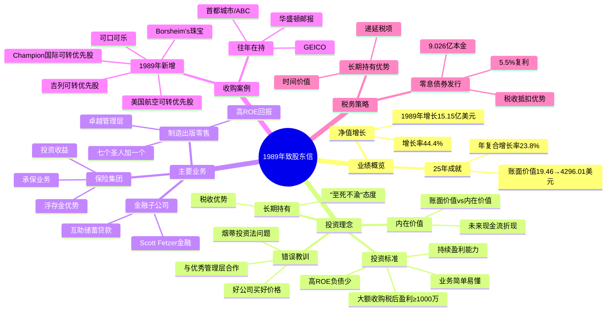

# 1989年巴菲特致股东信 - 思维导图

## Mermaid Mindmap

---

## 结构概要表格

| 类别 | 核心内容 |
|------|----------|
| **业绩表现** | 1989年净值增长15.15亿美元(+44.4%)，25年复合增长率23.8% |
| **投资理念** | 内在价值优先、长期持有、与优秀管理层合作、"至死不渝" |
| **核心业务** | 保险运营(浮存金投资)、制造出版零售(7+1圣人)、金融子公司 |
| **主要持仓** | 可口可乐、GEICO、首都城市/ABC、吉列、美国航空、华盛顿邮报 |
| **收购标准** | 税后盈利≥1000万、持续盈利、高ROE、简单业务、合理价格 |
| **税务优势** | 长期持有递延税项、零息债券税收抵扣 |
| **错误反思** | 烟蒂投资法教训、好价格买好公司vs好公司买好价格 |

---

## 关键人物

- [[沃伦·巴菲特]] - 董事长，致信作者
- [[查理·芒格]] - 副董事长
- [[B夫人]]（罗斯·布鲁姆金） - 内布拉斯加家具城创始人，96岁退休创业
- [[Ike Friedman]] - Borsheim's珠宝CEO，管理天才
- [[查克·哈金斯]] - 喜诗糖果CEO
- [[Ralph Schey]] - 世界图书、Kirby、Scott Fetzer制造集团CEO
- [[Roberto Goizueta]] - 可口可乐CEO，重塑公司聚焦
- [[Murray Light]] - 水牛城新闻主编
- [[Stan Lipsey]] - 水牛城新闻发行人
- [[赫尔德曼家族]] - Fechheimer Bros.管理者

---

## 关键公司

- [[伯克希尔·哈撒韦]] - 投资主体
- [[可口可乐]] - 1988-1989年大举建仓
- [[GEICO]] - 汽车保险巨头
- [[首都城市/ABC]] - 传媒公司
- [[吉列]] - 剃须刀品牌，优先股投资
- [[美国航空]] - 优先股投资
- [[Champion国际]] - 造纸行业，优先股投资
- [[水牛城新闻]] - 报纸，连续7年利润纪录
- [[喜诗糖果]] - 糖果制造商
- [[内布拉斯加家具城]]（NFM）- 家具零售龙头
- [[Borsheim's]] - 珠宝零售
- [[Fechheimer]] - 制服制造商
- [[Kirby]] - 清洁设备
- [[世界图书]] - 百科全书出版
- [[Scott Fetzer]] - 制造集团

---

## 时代背景

### 宏观经济
- **1989年股市**：整体表现强劲，主要持仓估值相对于内在价值比过去更高
- **通胀水平**：GNP平减指数约4.1%，历史低位

### 保险行业
- **承保周期恶化**：综合成本率上升，保费增长跟不上损失增长(10%)
- **行业产能过剩**：监管宽松，有净资产就能承保，价格战持续
- **灾难频发**：1989年雨果飓风、加州地震影响行业

### 企业并购浪潮
- **80年代杠杆收购盛**行：垃圾债券融资活跃
- **恶意收购常见**：巴菲特强调不进行敌意收购
- **管理层激励**：股东导向文化被市场认可

### 税务环境
- **资本利得税**：1987年后上调至34%
- **递延税项**：长期持有的税收优势明显

### 巴菲特策略演进
- 从"烟蒂投资"(买便宜货)转向"合理价格买好公司"
- 强调与优秀管理层建立长期信任关系
- 远离高杠杆，保守财务政策
- 大额非控股投资成为主要方式
