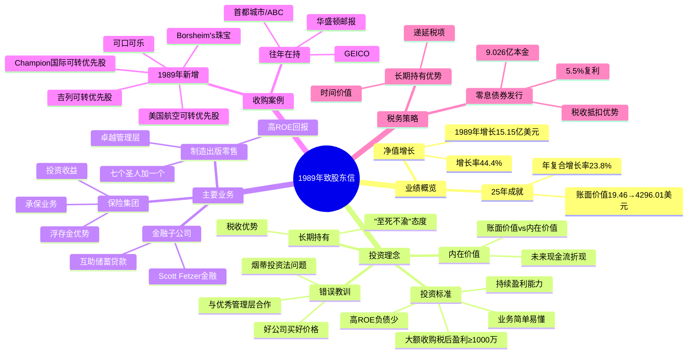

# 1989年巴菲特致股东信 - 思维导图

## Mermaid Mindmap

```mermaid
mindmap
  root((1989年致股东信))
    业绩概览
      净值增长
        1989年增长15.15亿美元
        增长率44.4%
      25年成就
        账面价值19.46→4296.01美元
        年复合增长率23.8%
    投资理念
      内在价值
        未来现金流折现
        账面价值vs内在价值
      长期持有
        税收优势
        "至死不渝"态度
      投资标准
        大额收购税后盈利≥1000万
        持续盈利能力
        高ROE负债少
        业务简单易懂
      错误教训
        烟蒂投资法问题
        好公司买好价格
        与优秀管理层合作
    主要业务
      保险集团
        承保业务
        投资收益
        浮存金优势
      制造出版零售
        七个圣人加一个
        高ROE回报
        卓越管理层
      金融子公司
        Scott Fetzer金融
        互助储蓄贷款
    收购案例
      1989年新增
        Borsheim's珠宝
        可口可乐
        吉列可转优先股
        美国航空可转优先股
        Champion国际可转优先股
      往年在持
        GEICO
        首都城市/ABC
        华盛顿邮报
    税务策略
      长期持有优势
        递延税项
        时间价值
      零息债券发行
        9.026亿本金
        5.5%复利
        税收抵扣优势
```

## 二、文本大纲（点击展开）

1989年致股东信

业绩概览

净值增长

1989年增长15.15亿美元

增长率44.4%

25年成就

账面价值19.46→4296.01美元

年复合增长率23.8%

投资理念

内在价值

未来现金流折现

账面价值vs内在价值

长期持有

税收优势

"至死不渝"态度

投资标准

大额收购税后盈利≥1000万

持续盈利能力

高ROE负债少

业务简单易懂

错误教训

烟蒂投资法问题

好公司买好价格

与优秀管理层合作

主要业务

保险集团

承保业务

投资收益

浮存金优势

制造出版零售

七个圣人加一个

高ROE回报

卓越管理层

金融子公司

Scott Fetzer金融

互助储蓄贷款

收购案例

1989年新增

Borsheim's珠宝

可口可乐

吉列可转优先股

美国航空可转优先股

Champion国际可转优先股

往年在持

GEICO

首都城市/ABC

华盛顿邮报

税务策略

长期持有优势

递延税项

时间价值

零息债券发行

9.026亿本金

5.5%复利

税收抵扣优势

---

## 结构概要表格

| 类别 | 核心内容 |
|------|----------|
| **业绩表现** | 1989年净值增长15.15亿美元(+44.4%)，25年复合增长率23.8% |
| **投资理念** | 内在价值优先、长期持有、与优秀管理层合作、"至死不渝" |
| **核心业务** | 保险运营(浮存金投资)、制造出版零售(7+1圣人)、金融子公司 |
| **主要持仓** | 可口可乐、GEICO、首都城市/ABC、吉列、美国航空、华盛顿邮报 |
| **收购标准** | 税后盈利≥1000万、持续盈利、高ROE、简单业务、合理价格 |
| **税务优势** | 长期持有递延税项、零息债券税收抵扣 |
| **错误反思** | 烟蒂投资法教训、好价格买好公司vs好公司买好价格 |

---

## 关键人物

- [[沃伦·巴菲特]] - 董事长，致信作者
- [[查理·芒格]] - 副董事长
- [[B夫人]]（罗斯·布鲁姆金） - 内布拉斯加家具城创始人，96岁退休创业
- [[Ike Friedman]] - Borsheim's珠宝CEO，管理天才
- [[查克·哈金斯]] - 喜诗糖果CEO
- [[Ralph Schey]] - 世界图书、Kirby、Scott Fetzer制造集团CEO
- [[Roberto Goizueta]] - 可口可乐CEO，重塑公司聚焦
- [[Murray Light]] - 水牛城新闻主编
- [[Stan Lipsey]] - 水牛城新闻发行人
- [[赫尔德曼家族]] - Fechheimer Bros.管理者

---

## 关键公司

- [[伯克希尔·哈撒韦]] - 投资主体
- [[可口可乐]] - 1988-1989年大举建仓
- [[GEICO]] - 汽车保险巨头
- [[首都城市/ABC]] - 传媒公司
- [[吉列]] - 剃须刀品牌，优先股投资
- [[美国航空]] - 优先股投资
- [[Champion国际]] - 造纸行业，优先股投资
- [[水牛城新闻]] - 报纸，连续7年利润纪录
- [[喜诗糖果]] - 糖果制造商
- [[内布拉斯加家具城]]（NFM）- 家具零售龙头
- [[Borsheim's]] - 珠宝零售
- [[Fechheimer]] - 制服制造商
- [[Kirby]] - 清洁设备
- [[世界图书]] - 百科全书出版
- [[Scott Fetzer]] - 制造集团

---

## 时代背景

### 宏观经济
- **1989年股市**：整体表现强劲，主要持仓估值相对于内在价值比过去更高
- **通胀水平**：GNP平减指数约4.1%，历史低位

### 保险行业
- **承保周期恶化**：综合成本率上升，保费增长跟不上损失增长(10%)
- **行业产能过剩**：监管宽松，有净资产就能承保，价格战持续
- **灾难频发**：1989年雨果飓风、加州地震影响行业

### 企业并购浪潮
- **80年代杠杆收购盛**行：垃圾债券融资活跃
- **恶意收购常见**：巴菲特强调不进行敌意收购
- **管理层激励**：股东导向文化被市场认可

### 税务环境
- **资本利得税**：1987年后上调至34%
- **递延税项**：长期持有的税收优势明显

### 巴菲特策略演进
- 从"烟蒂投资"(买便宜货)转向"合理价格买好公司"
- 强调与优秀管理层建立长期信任关系
- 远离高杠杆，保守财务政策
- 大额非控股投资成为主要方式
