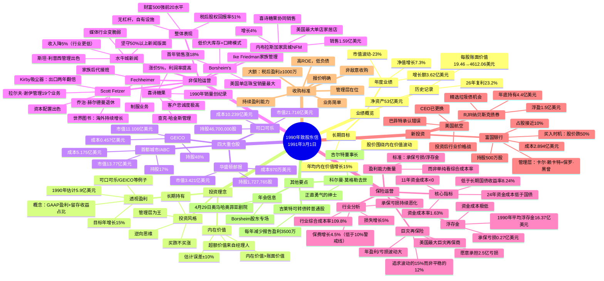

# 1990年巴菲特致股东信 - 思维导图

## 一、Mermaid 思维导图

---

## 二、结构概要表格

| 模块 | 核心内容 | 关键数据 |
|------|----------|----------|
| **业绩概览** | 1990年净值增长7.3%，26年复利23.2%，目标年均内在价值增长15% | 净值+3.62亿；每股账面价值4612.06美元；净资产53亿 |
| **投资理念** | 透视盈利概念（GAAP盈利+留存收益占比）；内在价值估计；逆向投资 | 1990年透视盈利5.9亿美元；目标年增长15% |
| **四大重仓** | 首都城市/ABC、可口可乐、GEICO、华盛顿邮报为核心持股 | 合计市值超50亿美元 |
| **非保险运营** | Borsheim、NFM、喜诗糖果、水牛城新闻等；税后股权回报率51% | Borsheim首年+18%；NFM销售1.59亿；喜诗涨价5%利润率提高 |
| **保险运营** | 行业承保恶化；伯克希尔资金成本1.63%；巨灾再保险业务 | 浮存金16.37亿；24年资金成本低于国债；美国最大巨灾再保商 |
| **新投资** | 富国银行、RJR纳贝斯克债券；反思美国航空投资失误 | 富国银行2.894亿美元买入；RJR浮盈1.5亿 |
| **收购标准** | 6条明确标准：大额、持续盈利、高ROE、管理层在位、业务简单、报价明确 | 税后盈利≥1000万；非敌意收购 |

---

## 三、关键人物

| 人物 | 身份 | 关联公司/领域 | 信中评价 |
|------|------|---------------|----------|
| [[沃伦·E·巴菲特]] | 伯克希尔董事长 | 整体决策 | 写信人，承认美国航空投资错误 |
| [[查理·芒格]] | 伯克希尔副董事长 | 整体决策 | 与巴菲特一起估计内在价值 |
| [[汤姆·墨菲]] | 首都城市/ABC CEO | 首都城市/ABC | 与丹伯克搭档出色 |
| [[丹·伯克]] | 首都城市/ABC高管 | 首都城市/ABC | 与汤姆墨菲搭档出色 |
| [[Ike Friedman]] | Borsheim's 家族 | Borsheim's珠宝 | "真厉害"，诚信经营典范 |
| [[查克·哈金斯]] | CEO | 喜诗糖果 | "做得非常出色"，顾客忠诚度 |
| [[斯坦·利普西]] | CEO | 水牛城新闻 | "管理真出色"，逆境坚守 |
| [[乔治·赫尔德曼]] | 创始人 | Fechheimer制服 | 69岁退休，家族接班 |
| [[拉尔夫·谢伊]] | CEO | Scott Fetzer | "和买到这些business一样值钱" |
| [[卡尔·赖卡特]] | CEO | 富国银行 | 管理层出色，控制成本 |
| [[保罗·黑曾]] | 高管 | 富国银行 | 与赖卡特搭档 |
| [[迈克·戈德堡]] | 保险业务负责人 | 伯克希尔保险 | 来之前巴菲特犯过很多错 |
| [[科尔曼·莫格勒]] | 董事长 | 吉尔特 | "真正绅士，正直勇气"，1月去世 |

---

## 四、关键公司

### 核心投资

| 公司 | 类型 | 持股/关系 | 关键数据 |
|------|------|-----------|----------|
| [[首都城市/ABC]] | 媒体 | 17%持股 | 市值13.77亿；透视盈利8300万 |
| [[可口可乐]] | 消费品 | 46,700,000股 | 市值21.72亿；成本10.24亿 |
| [[GEICO]] | 保险 | 48%持股 | 市值11.11亿；成本4570万；承保盈利 |
| [[华盛顿邮报]] | 媒体 | 1,727,765股 | 市值3.42亿；成本970万 |
| [[富国银行]] | 银行 | 500万股/10% | 成本2.894亿；股价跌50%时买入 |
| [[房地美]] | 金融 | 240万股优先股 | 市值1.17亿；成本7170万 |

### 全资子公司

| 公司 | 业务 | 1990年表现 | 管理层 |
|------|------|------------|--------|
| [[Borsheim's]] | 珠宝零售 | 销售涨18%，单店销量最大 | Ike Friedman家族 |
| [[内布拉斯加家具城NFM]] | 家居零售 | 销售1.59亿，涨4% | 布鲁姆金家族 |
| [[喜诗糖果]] | 糖果 | 销量创纪录，涨价5% | 查克·哈金斯 |
| [[水牛城新闻]] | 报纸 | 收入降5%（优于行业） | 斯坦·利普西 |
| [[Fechheimer]] | 制服 | 家族整合完成 | 赫尔德曼家族 |
| [[Scott Fetzer]] | 多元化 | Kirby出口两年翻倍 | 拉尔夫·谢伊 |
| [[Kirby]] | 吸尘器 | 出口两年翻一番，1990年涨20% | Scott Fetzer旗下 |
| [[世界图书百科全书]] | 出版 | 海外持续增长 | Scott Fetzer旗下 |

### 其他提及

| 公司 | 类型 | 说明 |
|------|------|------|
| [[RJR纳贝斯克]] | 债券投资 | 持有4.4亿，浮盈1.5亿 |
| [[美国航空]] | 股票投资 | 投资后遇价格战，巴菲特承认错误 |
| [[吉尔特]] | 消费品 | 可转债转普通股；董事长科尔曼·莫格勒去世 |

---

## 五、时代背景

### 宏观经济环境（1990-1991年）

| 领域 | 背景描述 |
|------|----------|
| **经济周期** | 1990年美国经济进入衰退期；通胀率约4.1%（GNP平减指数） |
| **利率环境** | 长期国债收益率8.24%，处于相对高位 |
| **股市表现** | 伯克希尔1989年股价涨85%，1990年跌23%；波动剧烈 |
| **保险行业** | 行业承保持续恶化；综合成本率109.8%；保费增长低于损失增长 |

### 行业变化

| 行业 | 变化 |
|------|------|
| **媒体行业** | 广告分散化，定价权下降；巴菲特承认之前高估媒体价值；报纸面临结构性挑战 |
| **银行业** | 加州房地产过度建设；地震风险；银行业一般杠杆20倍，风险较高 |
| **垃圾债券** | 1980年代泡沫破裂；许多债券"天生违约"；满地是坑 |
| **航空业** | 价格战激烈；巴菲特承认投资美国航空是错误 |
| **零售业** | 协同效应显现（NFM卖喜诗糖果超过加州门店） |

### 伯克希尔战略定位

| 维度 | 定位 |
|------|------|
| **保险** | 美国最大巨灾再保险公司；资金成本1.63%远低于行业；浮存金16.37亿美元 |
| **投资** | 逆向投资者；市场恐慌时买入富国银行；长期持有六大重仓股 |
| **收购** | 明确6条标准；非敌意收购；偏好管理层留任 |
| **竞争壁垒** | 资本实力强，能承受巨灾2.5亿亏损；别人不敢接的业务我们敢接 |

### 经典引用

> "大多数人宁愿死也不愿意思考，就是这样，很多人就是跟着群体走。" —— 伯特兰·罗素

> "我们宁愿要波动的15%，不要平稳的12%。"

> "我们就是找到这些天才经理人，我们给他们环境，让他们干活，他们就创造价值，我们就分钱。"

---

*生成时间：2025年*  
*来源：1990年巴菲特致股东信中译本*
