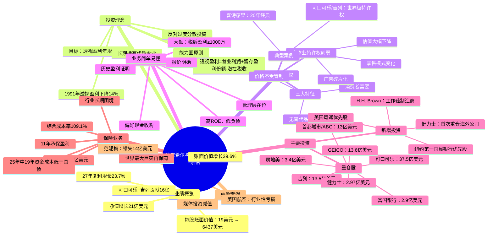

# 1991年伯克希尔·哈撒韦股东信 - 思维导图

## 一、Mermaid Mindmap

```mermaid
mindmap
  root((伯克希尔·哈撒韦\n1991年股东信))
    业绩概览
      净值增长21亿美元
      账面价值增长39.6%
      27年复利增长23.7%
      每股账面价值：19美元 → 6437美元
      可口可乐+吉列贡献16亿
    投资理念
      目标：透视盈利年增长15%
      透视盈利=营业利润+留存盈利份额-潜在税收
      1991年透视盈利下降14%
      长期持有优质企业
      反对过度分散投资
      能力圈原则
    经济特许经营权
      三大特征
        消费者需要
        无替代品
        价格不受管制
      媒体业特许权削弱
        零售模式变化
        广告碎片化
        估值大幅下降
      典型案例
        喜诗糖果：20年经典
        可口可乐/吉列：世界级特许权
    收购标准
      大额：税后盈利≥1000万
      历史盈利证明
      高ROE，低负债
      管理层在位
      业务简单易懂
      报价明确
      偏好现金收购
    主要投资
      重仓股
        可口可乐：37.5亿美元
        GEICO：13.6亿美元
        吉列：13.5亿美元
        首都城市/ABC：13亿美元
        富国银行：2.9亿美元
        房地美：3.4亿美元
        健力士：2.97亿美元
      新增投资
        健力士：首次重仓海外公司
        H.H. Brown：工作鞋制造商
        美国运通优先股
        纽约第一国民银行优先股
    保险业务
      浮存金近19亿美元
      25年中19年资金成本低于国债
      11年承保盈利
      世界最大巨灾再保商
      综合成本率109.1%
      行业长期困境
    失败案例
      美国航空：行业性亏损
      范妮梅：错失14亿美元
      媒体投资减值
```

## 二、文本大纲（点击展开）

伯克希尔·哈撒韦\n1991年股东信

业绩概览

净值增长21亿美元

账面价值增长39.6%

27年复利增长23.7%

每股账面价值：19美元 → 6437美元

可口可乐+吉列贡献16亿

投资理念

目标：透视盈利年增长15%

透视盈利=营业利润+留存盈利份额-潜在税收

1991年透视盈利下降14%

长期持有优质企业

反对过度分散投资

能力圈原则

经济特许经营权

三大特征

消费者需要

无替代品

价格不受管制

媒体业特许权削弱

零售模式变化

广告碎片化

估值大幅下降

典型案例

喜诗糖果：20年经典

可口可乐/吉列：世界级特许权

收购标准

大额：税后盈利≥1000万

历史盈利证明

高ROE，低负债

管理层在位

业务简单易懂

报价明确

偏好现金收购

主要投资

重仓股

可口可乐：37.5亿美元

GEICO：13.6亿美元

吉列：13.5亿美元

首都城市/ABC：13亿美元

富国银行：2.9亿美元

房地美：3.4亿美元

健力士：2.97亿美元

新增投资

健力士：首次重仓海外公司

H.H. Brown：工作鞋制造商

美国运通优先股

纽约第一国民银行优先股

保险业务

浮存金近19亿美元

25年中19年资金成本低于国债

11年承保盈利

世界最大巨灾再保商

综合成本率109.1%

行业长期困境

失败案例

美国航空：行业性亏损

范妮梅：错失14亿美元

媒体投资减值

---

## 二、结构概要表格

| 板块 | 核心内容 | 关键数据 |
|------|----------|----------|
| **业绩概览** | 1991年净值大幅增长，主要靠可口可乐和吉列估值提升 | 净值+21亿(+39.6%)，27年复利23.7% |
| **透视盈利** | 真实盈利计算方式及1991年下降原因分析 | 透视盈利下降14% |
| **特许经营权** | 定义三大特征，分析媒体业特许权削弱趋势 | 媒体估值下降超50% |
| **喜诗糖果** | 20年投资复盘，经典特许经营案例 | ROI超20倍，利润率21.6% |
| **H.H. Brown** | 1991年新收购，工作鞋制造商 | 税后盈利达标，管理层激励到位 |
| **收购六原则** | 明确的收购标准和偏好 | 大额、高ROE、简单业务 |
| **保险运营** | 浮存金成本理念及巨灾再保业务 | 浮存金19亿，19年成本低于国债 |
| **可交易证券** | 六大重仓股及新增健力士投资 | 6大重仓，新增健力士 |
| **认错反思** | 范妮梅投资不足错失巨额收益 | 少赚14亿美元 |
| **固定收益** | 持仓调整及美国航空减值 | 吉列优先股转股，美国航空减值 |

---

## 三、关键人物

[[沃伦·巴菲特]] - 伯克希尔·哈撒韦董事长，信中主要阐述者

[[查理·芒格]] - 巴菲特长期合作伙伴，共同制定投资目标

[[斯坦·利普西]] - 水牛城新闻管理者，管理出色

[[弗兰克·鲁尼]] - H.H. Brown CEO，原创始人女婿，管理层持股激励典范

[[戴维·马克斯韦尔]] - 范妮梅前CEO，巴菲特高度认可其管理能力

[[塞斯]] - 美国航空CEO，努力调整应对行业危机

[[凯恩斯]] - 投资理念引用，强调集中投资

---

## 四、关键公司

[[伯克希尔·哈撒韦]] - 母公司，净资产74亿美元

[[可口可乐]] - 第一重仓股，市值37.5亿美元，世界最佳公司之一

[[吉列]] - 第二重仓股，市值13.5亿美元，优先股转普通股

[[GEICO]] - 保险核心资产，持股48%，资金成本极低

[[首都城市/ABC]] - 媒体投资，市值13亿美元

[[华盛顿邮报]] - 媒体投资，管理出色

[[水牛城新闻]] - 媒体投资，斯坦·利普西管理

[[富国银行]] - 银行投资，1991年留存盈利为负

[[房地美]] - 房地美投资，市值3.4亿美元

[[健力士]] - 新增海外投资，首次重仓外国公司

[[喜诗糖果]] - 经典投资案例，20年辉煌

[[H.H. Brown]] - 1991年新收购，工作鞋制造商

[[范妮梅]] - 错失的投资机会，少赚14亿

[[美国航空]] - 失败投资，行业性亏损导致减值

[[所罗门兄弟]] - 持仓不变，巴菲特任临时董事长

[[美国运通]] - 新增优先股投资

[[纽约第一国民银行]] - 新增优先股投资

---

## 五、时代背景

**宏观经济（1991年）**
- 美国经济处于衰退期，加州经济尤其低迷
- GNP平减通胀率3.7%
- 保费增长率仅3.1%，持续低于预期

**行业变革**
- 媒体行业：零售模式剧变，广告市场碎片化，传统报纸电视台特许经营权价值大幅下降
- 保险业：综合成本率109.1%，行业长期承保亏损
- 航空业：全行业亏损，破产公司低价竞争
- 制鞋业：美国85%鞋子进口，国内厂商生存困难

**投资趋势**
- 全球化开始：巴菲特首次重仓海外公司（健力士）
- 优质消费品牌估值大幅提升
- 机构投资者开始重视经济特许经营权概念

**监管环境**
- GAAP会计准则对巨灾再保准备金计提限制
- 保险业监管趋严

---

## 六、核心金句

> "两千万资本赚一百万就能贡献五个百分点，现在我们赚三亿七千万才能做到。"

> "坏管理只能削弱，不会杀死特许经营权。"

> "我们不可能找到很多好企业，为什么要买一堆我们不懂的？"

> "机会放在你面前你没重仓，就是错。"

> "我们就是喜欢拿着好公司，我们不折腾。"
