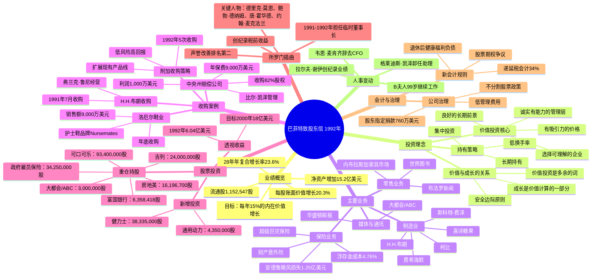

# 巴菲特致股东信 — 1992年 思维导图

---

## 1. Mermaid 思维导图

---

## 2. 结构概要表格

| 模块 | 核心内容 | 关键数据 |
|------|----------|----------|
| **业绩表现** | 每股账面价值增长、净资产增加、长期目标 | 增长20.3%，28年复合增长23.6%，净资产+15.2亿 |
| **投资理念** | 价值投资原则、安全边际、价值与成长关系 | 15%年增长率目标 |
| **保险业务** | 财产意外险、超级巨灾保险、浮存金 | 浮存金成本4.76%，飓风损失1.25亿 |
| **股票投资** | 重仓持股、透视收益、新增投资 | 9只重仓股，透视收益6.04亿 |
| **收购策略** | 收购标准、附加收购、典型案例 | 中央州赔偿公司、H.H.布朗、洛厄尔鞋业 |
| **主要业务** | 制造业、零售业、媒体业运营状况 | 斯科特-费泽1.1亿税前收益 |
| **所罗门事件** | 临时董事长经历、公司恢复 | 声誉改善排名第二 |
| **会计与治理** | 新会计准则、公司治理、股东政策 | 递延税34%，捐款760万美元 |
| **人事动态** | 关键人员变动与贡献 | B夫人99岁、拉尔夫·谢伊业绩 |

---

## 3. 关键人物

| 人物 | 身份 | 贡献/角色 |
|------|------|-----------|
| [[沃伦·巴菲特]] | 伯克希尔董事会主席 | 信函作者，核心投资决策者 |
| [[查理·芒格]] | 伯克希尔副董事长 | 巴菲特合伙人，共同决策 |
| [[比尔·凯泽]] | 中央州赔偿公司管理者 | 35年朋友，新收购公司管理者 |
| [[杰克·林格沃尔特]] | 国民赔偿公司创始人 | 26年前首次收购的合作者 |
| [[弗兰克·鲁尼]] | H.H.布朗CEO | 8个孩子的父亲，优秀管理者 |
| [[德里克·莫恩]] | 所罗门高管 | 挽救所罗门的关键人物 |
| [[鲍勃·德纳姆]] | 所罗门高管 | 挽救所罗门的关键人物 |
| [[唐·霍华德]] | 所罗门高管 | 挽救所罗门的关键人物 |
| [[约翰·麦克法兰]] | 所罗门高管 | 挽救所罗门的关键人物 |
| [[罗恩·奥尔森]] | 芒格-托尔斯-奥尔森律所 | 所罗门政府事务首席律师 |
| [[比尔·安德斯]] | 通用动力前CEO | 通用动力投资契机 |
| [[B夫人/罗斯·布鲁姆金]] | 内布拉斯加家具市场创始人 | 99岁继续工作 |
| [[拉尔夫·谢伊]] | 斯科特-费泽CEO | 创纪录业绩1.1亿税前收益 |
| [[格莱迪斯·凯泽]] | 巴菲特助理25年 | 1993年将卸任 |
| [[韦恩·麦肯齐]] | 前首席财务官 | 30年合作后辞职 |

---

## 4. 关键公司

| 公司 | 类型 | 持股/关系 | 关键数据 |
|------|------|-----------|----------|
| [[伯克希尔·哈撒韦]] | 母公司 | 100% | 1,152,547股流通股，账面价值7,745美元/股 |
| [[中央州赔偿公司]] | 保险（新收购） | 82% | 年保费9,000万，利润1,000万 |
| [[国民赔偿公司]] | 保险 | 子公司 | 26年前首次收购 |
| [[H.H.布朗]] | 鞋业 | 子公司（1991年收购） | 税前收益2,788万 |
| [[洛厄尔鞋业公司]] | 鞋业（附加收购） | 子公司 | 销售额9,000万，Nursemates品牌 |
| [[斯科特-费泽]] | 制造业集团 | 子公司 | 创纪录1.1亿税前收益 |
| [[喜诗糖果]] | 糖果制造 | 子公司 | 税前收益4,236万 |
| [[柯比]] | 吸尘器制造 | 子公司 | 税前收益3,565万 |
| [[内布拉斯加家具市场]] | 家具零售 | 子公司 | B夫人99岁继续工作 |
| [[布法罗新闻]] | 报业 | 子公司 | 税前收益4,786万 |
| [[世界图书]] | 出版 | 子公司 | 税前收益2,904万 |
| [[可口可乐]] | 股票投资 | 7.1%（93,400,000股） | 市值39.11亿，成本10.24亿 |
| [[政府雇员保险公司(GEICO)]] | 股票投资 | 48.1%（34,250,000股） | 市值22.26亿，成本4,571万 |
| [[大都会/ABC]] | 股票投资 | 18.2%（3,000,000股） | 市值15.24亿，成本5.18亿 |
| [[房地美]] | 股票投资 | 8.2%（16,196,700股） | 市值7.84亿，成本4.14亿 |
| [[吉列]] | 股票投资 | 10.9%（24,000,000股） | 市值13.65亿，成本6亿 |
| [[华盛顿邮报]] | 股票投资 | 14.6%（1,727,765股） | 市值3.97亿，成本973万 |
| [[富国银行]] | 股票投资 | 11.5%（6,358,418股） | 市值4.86亿，成本3.81亿 |
| [[通用动力]] | 股票投资（新增） | 14.1%（4,350,000股） | 市值4.51亿，成本3.12亿 |
| [[健力士]] | 股票投资（新增） | 2.0%（38,335,000股） | 市值3亿，成本3.33亿 |
| [[所罗门公司]] | 固定收益/曾任董事长 | 优先股 | 临时董事长经历 |

---

## 5. 时代背景

### 5.1 宏观经济环境

- **1992年美国经济**：经济从1990-91年衰退中复苏，股市表现强劲
- **利率环境**：美国政府长期债券收益率约7.39%
- **税制改革**：公司税率34%，递延税会计规则即将生效（1993年）

### 5.2 行业背景

- **保险业**：1992年综合比率114.8（承保亏损），安德鲁飓风造成历史最大保险损失
- **股市环境**：标普500表现，但巴菲特预测未来十年回报将低于过去十年
- **航空业**：行业经济恶化，全美航空投资面临挑战

### 5.3 伯克希尔发展节点

- **28年里程碑**：自1964年管理层接手，账面价值从19美元增至7,745美元
- **规模挑战**：扩大的资本基础对相对业绩产生拖累
- **股东结构**：坚持不分割股票，聚集高质量股东群体

### 5.4 重大事件

- **所罗门丑闻后续**：巴菲特担任临时董事长10个月，成功挽救公司声誉
- **安德鲁飓风**：美国历史上最严重的自然灾害之一，伯克希尔损失1.25亿美元
- **会计规则变化**：FASB新准则要求更透明的递延税和退休福利会计处理

### 5.5 企业文化特点

- **精简管理**：无法律、人事、公关、投资者关系、战略规划部门
- **股东友好**：97%股份参与股东指定捐款计划，760万美元捐赠
- **长期主义**：低换手率、集中投资、对短期波动的容忍

---

*生成时间：2026年4月10日*
*来源：1992年巴菲特致股东信翻译稿*
