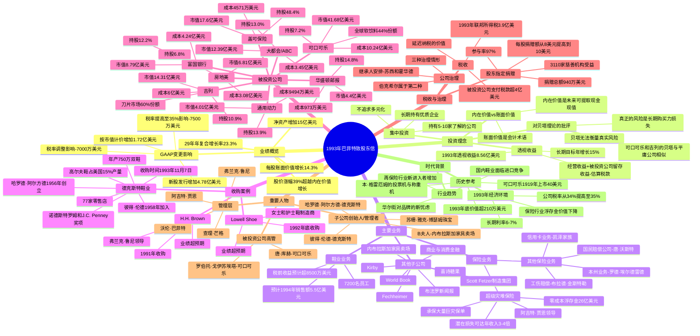

# 巴菲特致股东的信 · 1993年 思维导图

## 一、Mermaid Mindmap

---

## 二、结构概要表格

| 一级分支 | 二级分支 | 核心内容 | 关键数据/要点 |
|---------|---------|---------|--------------|
| **业绩概览** | 账面价值增长 | 每股账面价值增长14.3% | 29年年复合增长率23.3%，从19美元增至8,854美元 |
| | 净资产变化 | 增加15亿美元 | 受GAAP变更和新股发行影响 |
| | 股价表现 | 涨幅39%超越内在价值 | 可口可乐和吉列股价表现落后于业绩 |
| **投资理念** | 内在价值 | 未来可提取现金的现值 | 账面价值是追踪工具但低于内在价值 |
| | 透视收益 | 更准确的收益衡量方式 | 1993年达8.56亿美元，目标年增长15% |
| | 风险观 | 批评贝塔理论 | 真正的风险是长期购买力损失而非价格波动 |
| | 投资策略 | 集中投资 | 持有5-10家了解的公司，不追求多元化 |
| **主要业务** | 保险业务 | 超级灾难保险是核心 | 零成本浮存金26亿美元，阿吉特·贾恩领导 |
| | 鞋业业务 | 三大品牌整合 | 预计1994年销售额5.5亿美元，收益超8500万美元 |
| | 其他子公司 | 多元化制造业和媒体 | 喜诗糖果、布法罗新闻报、Kirby等 |
| **收购案例** | 德克斯特鞋业 | 1993年最重要收购 | 11月7日完成，年产750万双鞋，管理卓越 |
| | H.H. Brown | 1991年收购 | 弗兰克·鲁尼领导，业绩持续超预期 |
| | Lowell Shoe | 1992年底收购 | 女士和护士鞋制造商，需整顿但超预期 |
| **被投资公司** | 核心持仓 | 可口可乐、吉列 | 可口可乐持股7.2%市值41.7亿；吉列持股10.9%市值14.3亿 |
| | 保险/金融 | 盖可保险、富国银行 | 盖可持股48.4%，富国银行持股12.2% |
| | 媒体/其他 | 大都会/ABC、华盛顿邮报 | 大都会持股13%，华盛顿邮报持股14.8% |
| **税收与治理** | 税收观点 | 延迟纳税的价值 | 1993年联邦所得税3.9亿美元，支持买入持有策略 |
| | 公司治理 | 三种治理情形分析 | 伯克希尔属于控股股东即管理者类型 |
| | 股东捐赠 | 独特捐赠计划 | 每股10美元，97%参与率，3110家机构受益 |

---

## 三、关键人物

| 人物名 | 身份/角色 | 相关内容 |
|-------|----------|---------|
| [[沃伦·巴菲特]] | 伯克希尔·哈撒韦董事长 | 信件作者，阐述投资理念和业绩 |
| [[查理·芒格]] | 伯克希尔副董事长 | 巴菲特的长期合作伙伴，共同决策 |
| [[阿吉特·贾恩]] | 保险业务负责人 | 超级灾难保险业务最优秀的经理 |
| [[弗兰克·鲁尼]] | H.H. Brown领导者 | 领导H.H. Brown创纪录利润，协助收购德克斯特 |
| [[哈罗德·阿尔方德]] | 德克斯特鞋业创始人 | 20岁从鞋厂工人起步，1956年用1万美元创立德克斯特 |
| [[彼得·伦德]] | 德克斯特鞋业管理者 | 1958年加入，与哈罗德共同建立年产750万双鞋的企业 |
| [[唐·库赫]] | 可口可乐前高管 | 巴菲特邻居，非凡商业才能，增加周围人幸福感 |
| [[罗伯托·戈伊苏埃塔]] | 可口可乐CEO | 1981年上任，13年将市值从44亿提升至580亿美元 |
| [[B夫人]] (罗斯·布鲁姆金) | 内布拉斯加家具卖场创始人 | 100岁生日，1937年用500美元创立，销售额2亿美元 |
| [[苏珊·雅克]] | 博瑟姆珠宝总裁兼CEO | 11年前从时薪4美元做起，1994年被任命总裁 |
| [[本·格雷厄姆]] | 价值投资之父 | "市场短期是投票机，长期是称重机" |
| [[苏西·巴菲特]] | 巴菲特妻子 | 董事会成员，巴菲特股份的继承人 |
| [[霍华德·巴菲特]] | 巴菲特儿子 | 1993年加入董事会，代表控股权益 |
| [[罗德·埃尔德雷德]] | 本州保险业务负责人 | 领导本州保险业务取得优异业绩 |
| [[布拉德·金斯特勒]] | 工伤赔偿业务负责人 | 领导工伤赔偿业务取得优异业绩 |
| [[彼得·林奇]] | 著名投资经理 | 引用其"销售大宗商品类产品的公司股票应附警告标签" |
| [[唐·沃斯特]] | 国民赔偿公司负责人 | 领导传统汽车和一般责任业务 |

---

## 四、关键公司

| 公司名 | 类型 | 相关内容 |
|-------|------|---------|
| [[伯克希尔·哈撒韦]] | 母公司 | 投资控股公司，管理多元化业务组合 |
| [[德克斯特鞋业]] | 子公司（1993年收购） | 缅因州鞋企，年产750万双，管理卓越 |
| [[H.H. Brown]] | 子公司（1991年收购） | 工作鞋、靴子制造商，弗兰克·鲁尼领导 |
| [[Lowell Shoe]] | 子公司（1992年收购） | 女士和护士鞋制造商 |
| [[可口可乐公司]] | 被投资公司 | 持股7.2%，市值41.7亿美元，全球软饮料44%份额 |
| [[吉列公司]] | 被投资公司 | 持股10.9%，市值14.3亿美元，刀片市场60%份额 |
| [[盖可保险公司]] | 被投资公司 | 持股48.4%，市值17.6亿美元 |
| [[大都会/ABC公司]] | 被投资公司 | 持股13%，市值12.4亿美元，媒体集团 |
| [[富国银行]] | 被投资公司 | 持股12.2%，市值8.8亿美元 |
| [[联邦住房贷款抵押公司]] (房地美) | 被投资公司 | 持股6.8%，市值6.8亿美元 |
| [[华盛顿邮报公司]] | 被投资公司 | 持股14.8%，市值4.4亿美元 |
| [[通用动力公司]] | 被投资公司 | 持股13.9%，市值4亿美元 |
| [[喜诗糖果]] | 全资子公司 | 优质糖果制造商 |
| [[内布拉斯加家具卖场]] | 全资子公司 | B夫人创立，销售额2亿美元 |
| [[布法罗新闻报]] | 全资子公司 | 报纸出版业务 |
| [[Kirby]] | 全资子公司 | 家用清洁设备制造商 |
| [[World Book]] | 全资子公司 | 百科全书出版商 |
| [[Scott Fetzer制造集团]] | 全资子公司 | 多元化制造业务 |
| [[Fechheimer]] | 全资子公司 | 制服制造商 |
| [[博瑟姆珠宝]] | 全资子公司 | 珠宝零售商，苏珊·雅克领导 |
| [[诺德斯特罗姆]] | 外部公司 | 授予德克斯特供应商表现奖项 |
| [[J.C. Penney]] | 外部公司 | 授予德克斯特供应商表现奖项 |
| [[健力士公司]] | 被投资公司 | 持股1.9%，市值2.7亿美元 |

---

## 五、时代背景

### 5.1 宏观经济环境（1993年）

| 因素 | 描述 | 对伯克希尔的影响 |
|-----|------|----------------|
| **利率环境** | 长期利率6-7% | 影响保险浮存金价值评估和股票估值 |
| **税率变化** | 公司税率从34%提高至35% | GAAP要求对未实现增值额外计提1%，减少净资产7500万美元 |
| **GAAP变更** | 证券按市值计价规则变更 | 影响投资组合账面价值和税款计提方式 |
| **通胀水平** | 相对稳定 | 影响长期投资回报的实际购买力 |

### 5.2 行业特定背景

| 行业 | 背景情况 | 伯克希尔的应对 |
|-----|---------|--------------|
| **保险业** | 利率下降导致浮存金价值大幅下降；综合成本率高于100%的行业普遍亏损 | 坚持承保纪律，超级灾难保险以"零成本"获得26亿美元浮存金 |
| **鞋业** | 国内鞋业面临来自低工资国家的进口竞争压力 | 收购德克斯特、H.H. Brown等，依靠卓越管理和熟练劳动力保持竞争力 |
| **再保险业** | 新进入者增加，筹集近50亿美元资本 | 坚持价格纪律，宁可减少业务量也不做勉强交易 |
| **股市** | 华尔街对品牌公司出现新忧虑；可口可乐和吉列股价跑输业绩 | 坚持长期持有，强调企业盈利表现的重要性 |

### 5.3 历史参照与引用

| 引用/参照 | 内容 | 意义 |
|----------|------|------|
| **可口可乐1919-1993** | 1919年40美元投资，1993年底价值超210万美元 | 说明长期持有优质企业的巨大回报 |
| **本·格雷厄姆名言** | "短期来看，市场是一台投票机...但长期来看，市场是一台称重机" | 阐述短期波动与长期价值的关系 |
| **1938年《财富》文章** | 称可口可乐"饱和和竞争的幽灵"已出现 | 证明即使专家也难以预测优质企业的长期增长 |
| **《Li'l Abner》连环画** | 倍增20次的故事，说明延迟纳税的价值 | 强调买入持有策略的税收优势 |

### 5.4 社会与文化背景

- **公司治理改革**：1993年是公司治理热门话题，董事们开始更加挺直腰杆，股东受到更像真正所有者的对待
- **慈善捐赠文化**：伯克希尔独特的股东指定捐赠计划与大多数上市公司不同，体现"公司的钱就是所有者的钱"理念
- **奥马哈社区**：巴菲特强调家乡纽带——查理·芒格、妻子苏西都在附近长大，唐·库赫是街对面邻居

---

*本思维导图基于1993年巴菲特致伯克希尔·哈撒韦股东信的中文翻译整理制作。*
