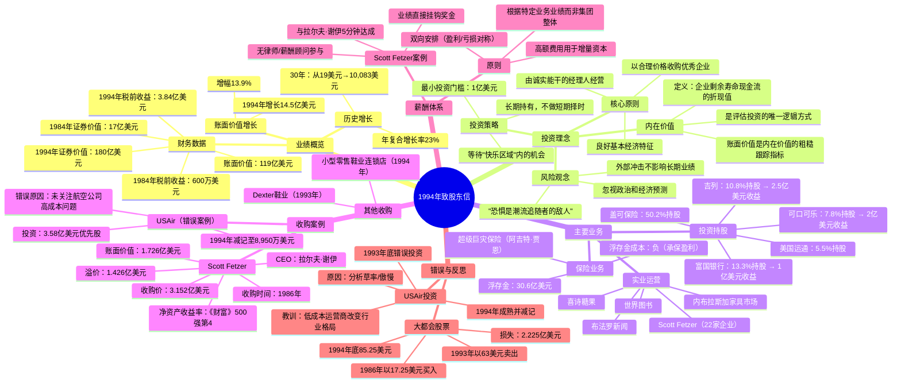

# 巴菲特致股东的信 · 1994年 - 思维导图

## 1. Mermaid 思维导图

---

## 2. 结构概要表格

| 维度 | 内容 |
|------|------|
| **业绩表现** | 账面价值增长13.9%（14.5亿美元），30年年复合增长率23% |
| **核心投资理念** | 以合理价格收购优质企业，等待"快乐区域"机会，重视内在价值 |
| **主要收入来源** | 保险浮存金+投资持股（可口可乐、吉列、富国银行）+实业运营 |
| **重大收购** | Scott Fetzer（1986）、Dexter鞋业（1993） |
| **标志性错误** | USAir优先股投资（3.58亿→0.895亿）、大都会股票卖出 |
| **关键人物贡献** | 查理·芒格、拉尔夫·谢伊、阿吉特·贾恩 |
| **保险业务优势** | 浮存金成本为负，超级巨灾保险承保能力行业第一 |

---

## 3. 关键人物

- [[查理·芒格]] - 伯克希尔副董事长，与巴菲特共同管理
- [[拉尔夫·谢伊]] - Scott Fetzer CEO，净资产收益率行业第一
- [[阿吉特·贾恩]] - 超级巨灾保险业务负责人
- [[本·格雷厄姆]] - 巴菲特的投资导师，价值投资理论创始人
- [[丹·伯克]] - 大都会/ABC CEO，1994年退休
- [[卡尔·赖查特]] - 富国银行CEO，1994年退休
- [[塞思·斯科菲尔德]] - USAir CEO，试图扭转公司困境
- [[B夫人]] - 内布拉斯加家具市场创始人，101岁仍在工作
- [[泰德·威廉姆斯]] - 棒球击球手，"等待好球"理念的来源

---

## 4. 关键公司

- [[伯克希尔·哈撒韦]] - 巴菲特执掌的综合性企业
- [[可口可乐]] - 7.8%持股，软饮料收益约2亿美元
- [[吉列]] - 10.8%持股，剃须刀市场7%份额
- [[富国银行]] - 13.3%持股，"伯克希尔银行"盈利约1亿美元
- [[盖可保险]] - 50.2%控股，伯克希尔保险核心
- [[Scott Fetzer]] - 1986年收购的22家企业集合
- [[美国运通]] - 5.5%持股，从1964年持有至今
- [[大都会/ABC]] - 13%持股，1994年卖给迪士尼
- [[喜诗糖果]] - 1972年收购的糖果企业
- [[布法罗新闻]] - 1977年收购的报纸
- [[内布拉斯加家具市场]] - 1983年收购的家具零售
- [[USAir]] - 投资失败案例，减记至25%
- [[华盛顿邮报]] - 15.2%持股
- [[房地美]] - 联邦住房贷款抵押公司

---

## 5. 时代背景

### 全球宏观环境
- **冷战结束**：苏联1991年解体，冷战格局结束
- **海湾战争**：1991年伊拉克战争影响
- **日本泡沫破裂**：1990年代日本经济持续低迷
- **美国经济复苏**：1990年代克林顿执政期经济繁荣

### 行业特定背景
- **航空业放松管制**：1978年后放松管制，低成本航空崛起，传统航空承压
- **媒体整合浪潮**：1990年代传媒业大规模并购
- **金融业变革**：利率市场化、金融创新加速

### 市场环境
- **债券收益率波动**：国库券收益率在2.8%至17.4%之间波动
- **股市重大事件**：道琼斯指数单日下跌508点（1987年股灾）
- **投资者情绪**：恐惧与贪婪交替，宏观预测主导市场

### 巴菲特面临的挑战
- **资金规模问题**：119亿美元账面价值，"鼓鼓的钱包是卓越投资成果的敌人"
- **投资门槛提高**：最低1亿美元才能产生实质影响
- **能力圈收窄**：寻找大型收购标的难度增加

---

*本思维导图基于1994年巴菲特致股东信原文整理*
