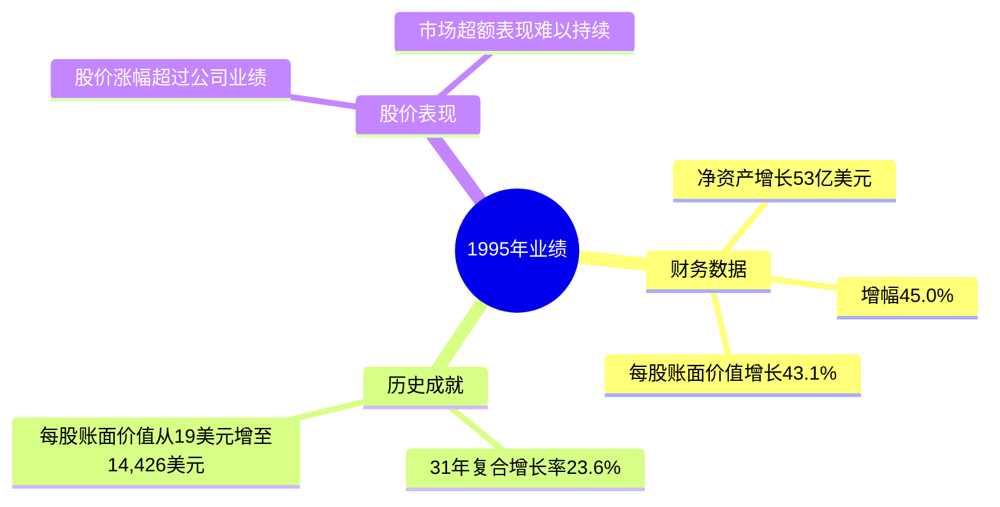
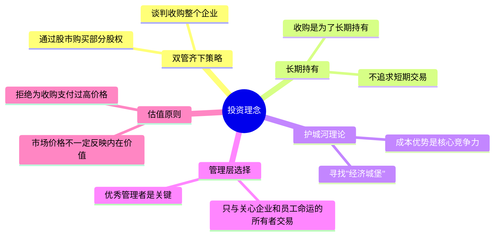
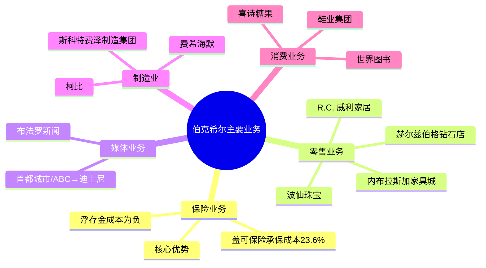

# 1995年巴菲特致股东信 - 思维导图

## 一、业绩概览

## 二、投资理念

## 三、主要业务

## 四、收购案例

### 1. 赫尔兹伯格钻石店 (Helzberg's Diamond Shops)

- **收购时间**: 1995年
- **交易方式**: 免税换股
- **历史**: 1915年创立，1994年销售额2.82亿美元
- **特点**: 134家门店，平均单店年销售额200万美元
- **管理层**: 杰夫·科门特 (Jeff Comment)
- **意义**: 证明了"走动式收购"策略

### 2. R.C. 威利家居 (R.C. Willey Home Furnishings)

- **收购时间**: 1995年年中
- **创始人**: 比尔·蔡尔德 (Bill Child)
- **历史**: 1954年销售额25万美元 → 1995年2.57亿美元
- **特点**: 犹他州家具市场50%份额
- **意义**: 创始人遗产税规划驱动出售

### 3. 盖可保险 (GEICO) - 最大收购

- **收购时间**: 1996年初（1995年终后完成）
- **收购价格**: 23亿美元
- **持股历史**:
  - 1951年：巴菲特初次接触，个人买入350股
  - 1976年：大量购入
  - 1980年末：持有33.3%股权
  - 1995年：收购剩余50%股权
- **管理层**: 
  - 托尼·尼斯利 (Tony Nicely) - 保险业务
  - 卢·辛普森 (Lou Simpson) - 投资业务
- **特点**: 直接营销模式，成本优势显著

## 五、股票投资组合

| 公司 | 持股数量 | 成本（百万美元） | 市值（百万美元） |
|------|---------|---------------|---------------|
| 可口可乐 | 100,000,000 | 1,298.9 | 7,425.0 |
| 吉列 | 48,000,000 | 600.0 | 2,502.0 |
| 首都城市/ABC | 20,000,000 | 345.0 | 2,467.5 |
| 盖可保险 | 34,250,000 | 45.7 | 2,393.2 |
| 美国运通 | 49,456,900 | 1,392.7 | 2,046.3 |
| 富国银行 | 6,791,218 | 423.7 | 1,466.9 |
| 联邦住宅贷款抵押公司 | 12,502,500 | 260.1 | 1,044.0 |

## 六、关键人物

- [[沃伦·巴菲特]] - 董事长
- [[查理·芒格]] - 副董事长
- [[本·格雷厄姆]] - 巴菲特的老师，价值投资奠基人
- [[洛里默·戴维森]] (Lorimer Davidson) - 盖可保险前总裁，1951年指导巴菲特
- [[杰克·伯恩]] (Jack Byrne) - 盖可保险1976年CEO，拯救公司
- [[托尼·尼斯利]] (Tony Nicely) - 盖可保险CEO，管理34年
- [[卢·辛普森]] (Lou Simpson) - 盖可保险投资经理，年化回报22.8%
- [[小巴内特·赫尔兹伯格]] (Barnett Helzberg Jr.) - 赫尔兹伯格钻石店所有者
- [[杰夫·科门特]] (Jeff Comment) - 赫尔兹伯格CEO
- [[比尔·蔡尔德]] (Bill Child) - R.C. 威利CEO
- [[欧文·布鲁姆金]] (Irv Blumkin) - 内布拉斯加家具城
- [[汤姆·墨菲]] (Tom Murphy) - 首都城市/ABC CEO
- [[迈克尔·艾斯纳]] (Michael Eisner) - 迪士尼CEO
- [[苏珊·雅克]] (Susan Jacques) - 波仙珠宝CEO
- [[阿吉特·杰恩]] (Ajit Jain) - 伯克希尔保险业务

## 七、关键公司

- [[伯克希尔·哈撒韦]] - 巴菲特的核心投资集团
- [[盖可保险]] - 美国第七大汽车保险公司
- [[赫尔兹伯格钻石店]] - 134家珠宝连锁店
- [[R.C. 威利家居]] - 犹他州家具零售龙头
- [[波仙珠宝]] - 奥马哈珠宝店
- [[内布拉斯加家具城]] - 美国最大家具店之一
- [[布法罗新闻]] - 纽约州报纸
- [[喜诗糖果]] - 加州糖果品牌
- [[迪士尼]] - 娱乐巨头
- [[可口可乐]] - 全球饮料巨头
- [[吉列]] - 剃须刀品牌
- [[美国运通]] - 金融服务公司
- [[富国银行]] - 美国第三大银行
- [[联邦住宅贷款抵押公司]] (Freddie Mac) - 房贷巨头

## 八、时代背景

- **宏观经济**: 1995年股市大涨，"任何傻瓜都能在股市中大赚一笔"
- **利率环境**: 年末长期政府债券收益率5.95%
- **行业趋势**:
  - 零售业竞争激烈，需要"每天聪明"
  - 保险业再保险业务风险累积
  - 报纸行业竞争优势逐渐削弱
  - 电子百科全书冲击传统出版
- **并购热潮**: 企业多元化收购流行，但多数损害股东利益
- **巴菲特动态**:
  - 完成三笔重大收购
  - 股价达到36,000美元
  - 考虑发行B股解决"拆股"需求

## 九、精华摘录

> "我们最喜欢的收购方式是通过谈判以公允价格购买100%的此类企业。但当股市为我们提供机会，以远低于收购100%所需代价的比例价格购买一小部分卓越企业时，我们几乎同样高兴。"

> "在商业中，我寻找由不可逾越的'护城河'保护的经济城堡。"

> "我们宁愿要参差不齐的15%，也不要平滑的12%。"

> "做交易胜过干活。做交易令人兴奋、有趣，而工作则琐碎乏味。"
