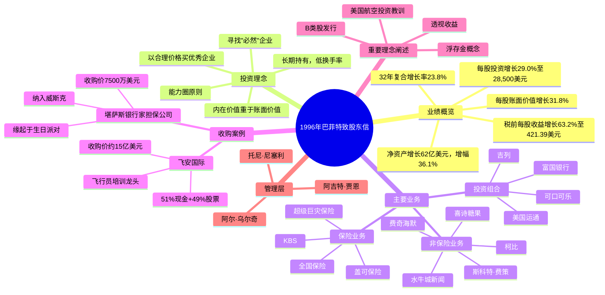

# 巴菲特致股东的信 · 1996年 - 思维导图

---

## Mermaid Mindmap

---

## 结构概要表格

| 章节 | 核心内容 | 关键词 |
|------|---------|--------|
| **业绩概览** | 净资产增长36.1%，每股账面价值增长31.8%，32年复合增长率23.8% | 净资产、账面价值、复合增长率 |
| **内在价值** | 强调内在价值重于账面价值，股价与价值的关系 | 内在价值、市场价格、长期视角 |
| **1996年收购** | 收购KBS（7500万美元）和飞安国际（15亿美元） | KBS、飞安国际、收购策略 |
| **保险业务** | 盖可保险全资控股，浮存金成本为负，超级巨灾保险 | 浮存金、盖可保险、巨灾保险 |
| **税收** | 缴纳8.6亿美元所得税 | 税收贡献 |
| **报告收益** | 各业务单元收益明细，经营收益合计12.21亿美元 | 经营收益、分部业绩 |
| **透视收益** | 提出透视收益概念，估算约15.22亿美元 | 未分配收益、透视收益 |
| **普通股投资** | 投资组合约277.5亿美元，核心持仓8只股票 | 可口可乐、吉列、美国运通 |
| **美国航空** | 反思优先股投资失误，最终获得偿还 | 投资教训、优先股 |
| **融资** | 发行B类股和可转债，与所罗门合作 | B类股、可转债 |

---

## 关键人物

| 人物 | 身份/角色 | 信中相关内容 |
|------|----------|-------------|
| [[沃伦·巴菲特]] | 伯克希尔董事长、作者 | 全文 narrator，分享投资理念与业绩 |
| [[查理·芒格]] | 伯克希尔副董事长 | 多次共同署名，价值理念合伙人 |
| [[托尼·尼塞利]] | 盖可保险首席运营官 | "卓越的业务管理者"，推动自愿汽车保单增长10% |
| [[阿吉特·贾恩]] | 超级巨灾保险负责人 | "对伯克希尔的价值简直不可估量" |
| [[阿尔·乌尔奇]] | 飞安国际CEO（79岁） | 创始人，热爱航空事业，伯克希尔式管理者 |
| [[唐·托尔]] | KBS管理者 | "非凡的管理者"，与数百位银行家建立关系 |
| [[卢·辛普森]] | 盖可保险资金管理人 | 投资组合跑赢标普500指数6.2个百分点 |
| [[罗伊·丁斯代尔]] | 简的父亲 | 生日派对上促成KBS收购的关键人脉 |
| [[理查德·瑟瑟]] | 图森航空顾问 | 飞安国际股东，促成收购的中间人 |
| [[罗伯托·戈伊苏埃塔]] | 可口可乐CEO | "为股东创造价值方面绝对令人难以置信" |
| [[埃德·科洛德尼]] | 美国航空前CEO | 巴菲特"喜欢并钦佩"的管理者 |
| [[斯蒂芬·沃尔夫]] | 美国航空现任CEO | 恢复盈利，支付欠款4790万美元 |
| [[罗斯·布鲁姆金]] | B太太 | 内布拉斯加家具城103岁创始人 |

---

## 关键公司

### 伯克希尔旗下公司

| 公司 | 业务领域 | 1996年表现/特点 |
|------|---------|----------------|
| [[伯克希尔·哈撒韦]] | 母公司 | 净资产增长36.1%，市值大幅增长 |
| [[盖可保险]] | 汽车保险 | 全资控股，自愿保单增长10%，承保利润优秀 |
| [[飞安国际]] | 飞行员培训 | 新收购，全球龙头，15亿美元 |
| [[堪萨斯银行家担保公司]] | 银行家保险 | 新收购，7500万美元，纳入威斯克 |
| [[喜诗糖果]] | 糖果零售 | 稳定业务，与1972年购买时基本面未变 |
| [[水牛城新闻]] | 报纸出版 | 收益增长，扭转1995年下滑 |
| [[柯比]] | 吸尘器制造 | 税前收益5850万美元，增长显著 |
| [[斯科特·费策]] | 制造集团 | 税前收益5060万美元 |
| [[内布拉斯加家具城]] | 家具零售 | 单店销售额2.65亿美元创纪录 |
| [[世界百科]] | 百科全书 | 面临挑战，重组分销方式 |

### 重要投资标的

| 公司 | 持股比例 | 市值 | 特点 |
|------|---------|------|------|
| [[可口可乐]] | 8.1% | 105.25亿美元 | "必然"企业，百年品牌 |
| [[美国运通]] | 10.5% | 27.94亿美元 | 金融服务龙头 |
| [[吉列]] | 8.6% | 37.32亿美元 | "必然"企业，剃须刀霸主 |
| [[富国银行]] | 8.0% | 19.67亿美元 | 银行业优质标的 |
| [[迪士尼]] | 3.6% | 17.17亿美元 | 娱乐传媒 |
| [[房地美]] | 8.4% | 17.73亿美元 | 住房贷款抵押 |
| [[华盛顿邮报]] | 15.8% | 5.79亿美元 | 媒体投资，低持股成本 |
| [[麦当劳]] | 4.3% | 13.68亿美元 | 快餐连锁 |

### 其他提及公司

| 公司 | 关系/角色 |
|------|----------|
| [[所罗门兄弟]] | 投资银行合作伙伴，协助B类股发行和飞安收购 |
| [[美国航空]] | 优先股投资，经历困难后恢复 |
| [[好事达]] | 超级巨灾保险客户，佛罗里达飓风合同 |
| [[加州地震局]] | 超级巨灾保险客户，承担约10亿美元层级风险 |
| [[泛美航空]] | 阿尔·乌尔奇曾任职，飞安国际创立背景 |
| [[不列颠百科全书]] | 竞争对手，1996年退出直销市场 |

---

## 时代背景

### 宏观经济环境

- **1996年美国经济**：持续扩张期，股市表现强劲
- **利率环境**：长期政府债券收益率约6.64%，相对稳定
- **税收背景**：伯克希尔缴纳8.6亿美元所得税，体现企业盈利规模

### 行业背景

| 行业 | 背景特征 |
|------|---------|
| **保险业** | 监管环境变化，巨灾保险需求增长，计算机模型开始应用于风险评估 |
| **航空业** | 美国航空经历1990-1994年巨额亏损（24亿美元），1995-1996年恢复盈利；行业成本结构受监管放松影响 |
| **出版业** | 传统百科全书市场萎缩，数字化转型开始，不列颠百科全书退出直销 |
| **零售业** | 家具、珠宝等零售业务稳定增长，B2C模式成熟 |
| **饮料业** | 可口可乐全球扩张，持续增长，市场份额扩大 |

### 技术与互联网发展

- **互联网萌芽**：伯克希尔决定进入"20世纪"，开设官网www.berkshirehathaway.com
- **计算机模型争议**：巴菲特质疑保险领域计算机模型的"精确性幻觉"
- **数字产品**：世界百科开发CD-ROM产品，与IBM合作

### 重要历史事件参照

- **1987年股灾**：提及"投资组合保险"造成的破坏性影响
- **1994年北岭地震**：加州重大地震，保险公司损失超预期，促成加州地震局成立
- **监管变化**：加州保险专员查克·夸肯布什设计新的住宅地震保险方案

### 伯克希尔发展阶段

- **股本规模**：已成为全美资本规模前十大企业之一
- **股东结构**：1996年发行B类股，股东人数翻倍至约4万人
- **年度股东大会**：从Holiday Convention Centre迁至Aksarben体育馆，容纳万人
- **投资规模**：普通股投资组合市值达277.5亿美元

---

## 核心金句摘录

> "在过去32年里，每股账面价值从19美元增长到19,011美元，年复合增长率为23.8%。"

> "在伯克希尔真正重要的是内在价值，而不是账面价值。"

> "成功投资上市公司的艺术与成功收购子公司的艺术没有太大区别。"

> "查理和我宁愿随着时间的推移获得参差不齐的15%的回报，也不愿获得平稳的12%。"

> "如果你不愿意持有一只股票十年，那你连十分钟都不应该持有。"

> "我只想知道我会在哪里死去，这样我就永远不会去那里。"

> "因为'可怕'的消息而卖出优秀企业通常是一个糟糕的决定。"

---

*本思维导图基于1996年巴菲特致伯克希尔·哈撒韦股东信整理*
