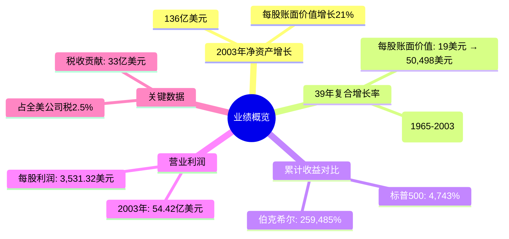
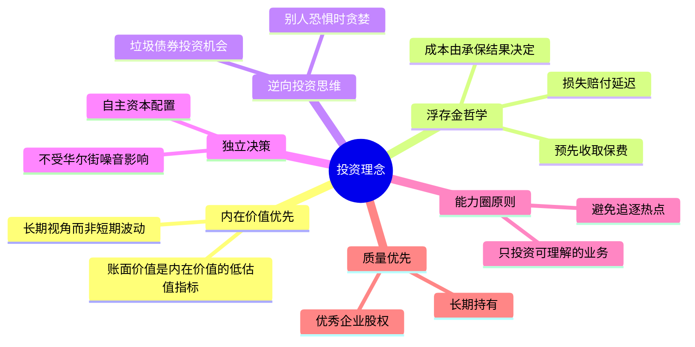
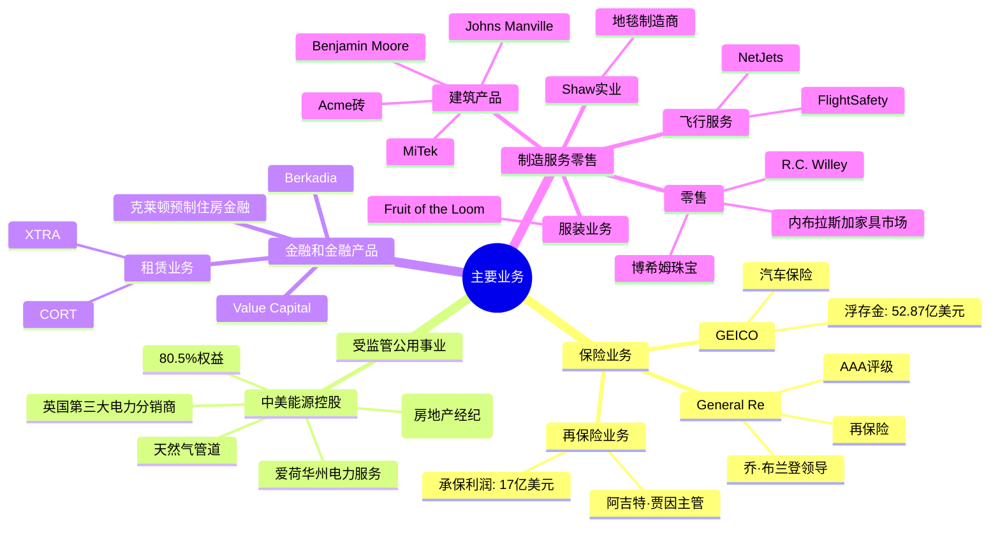
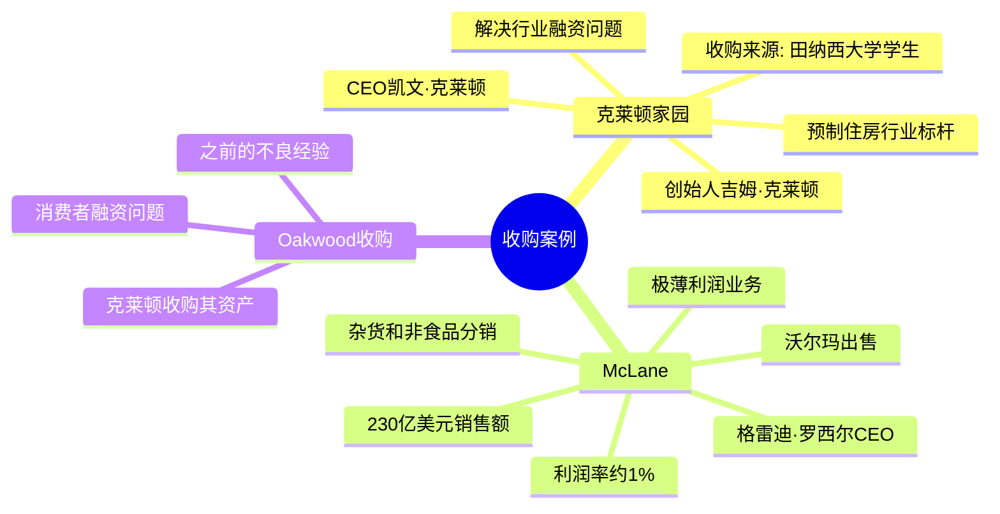
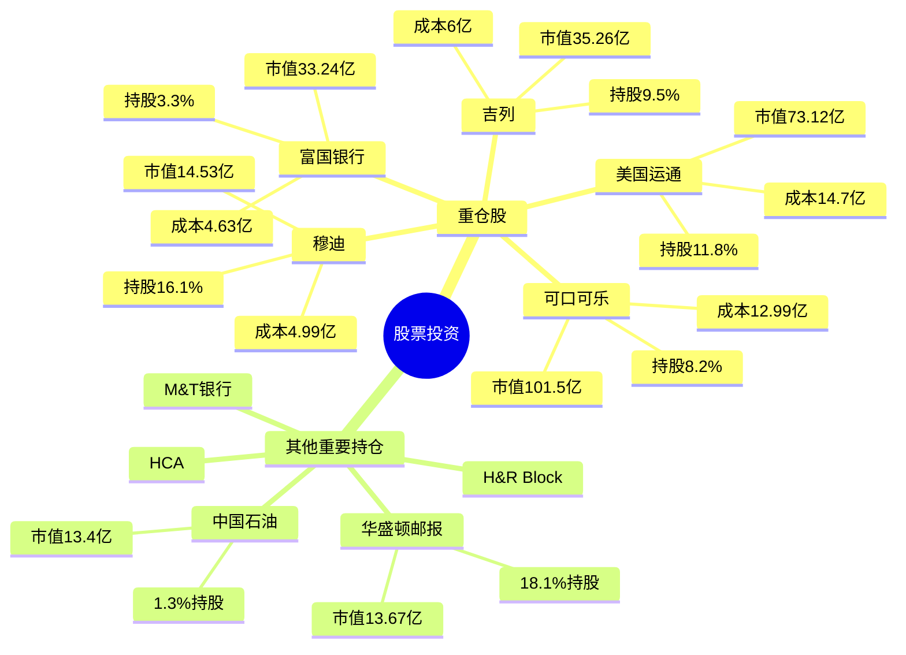
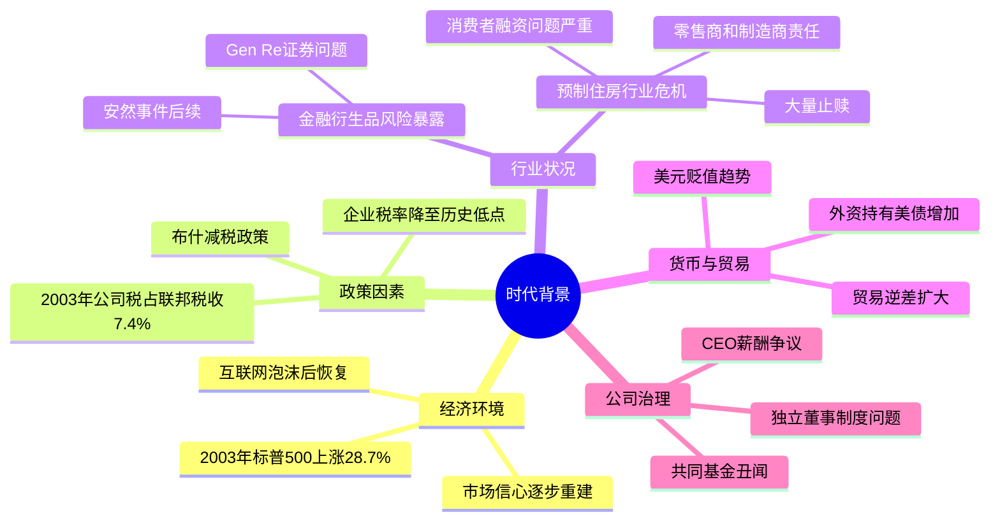

# 2003年巴菲特致股东信思维导图

## 一、业绩概览



## 二、投资理念



## 三、主要业务板块



## 四、收购案例



## 五、股票投资组合



## 六、关键人物

```mermaid
mindmap
  root((关键人物))
    伯克希尔核心
      [[沃伦·巴菲特]]
        董事会主席
      [[查理·芒格]]
        副董事长
        合伙人
    保险业务
      乔·布兰登
        Gen Re CEO
      塔德·蒙特罗斯
        Gen Re合伙人
      阿吉特·贾因
        再保险业务
    收购企业
      吉姆·克莱顿
        克莱顿家园创始人
      凯文·克莱顿
        克莱顿家园CEO
      格雷迪·罗西尔
        McLane CEO
    中美能源
      戴夫·索科尔
      格雷格·阿贝尔
      沃尔特·斯科特
    董事会成员
      大卫·戈特斯曼
      夏洛特·盖曼
      唐·基奥
      汤姆·墨菲
```

## 七、关键公司

```mermaid
mindmap
  root((关键公司))
    保险板块
      [[伯克希尔·哈撒韦]]
        主体公司
      [[GEICO]]
        汽车保险
      [[General Re]]
        再保险
    公用事业
      [[中美能源控股]]
        公用事业控股
      [[北方电力]]
      [[约克郡电力]]
    零售制造
      [[克莱顿家园]]
        预制住房
      [[McLane]]
        分销业务
      [[Shaw实业]]
        地毯制造
      [[Fruit of the Loom]]
        服装
      [[内布拉斯加家具市场]]
        家具零售
      [[博希姆珠宝]]
        珠宝零售
    金融
      [[NetJets]]
        飞机部分所有权
      [[Value Capital]]
        对冲基金
```

## 八、时代背景



---

## 结构概要表格

| 一级分支 | 二级分支 | 核心内容 | 关键数据 |
|---------|---------|---------|---------|
| **业绩概览** | 净资产增长 | 2003年表现 | 136亿美元，21%增长 |
| | 长期表现 | 39年复合增长率 | 22.2%，259,485%累计 |
| **投资理念** | 内在价值 | 账面价值vs内在价值 | 长期投资导向 |
| | 浮存金 | 保险资金管理 | 442亿美元浮存金 |
| **主要业务** | 保险 | GEICO、Gen Re、再保险 | 17亿美元承保利润 |
| | 公用事业 | 中美能源控股 | 80.5%权益 |
| | 制造零售 | 建筑、地毯、服装、珠宝 | 321亿收入 |
| **收购案例** | 克莱顿家园 | 预制住房行业整合 | 解决融资问题 |
| | McLane | 沃尔玛分销业务 | 230亿销售额 |
| **股票投资** | 重仓股 | 可口可乐、美国运通、吉列 | 352亿市值 |
| **关键人物** | 核心团队 | 巴菲特、芒格 | 99%净资产在公司 |
| | 业务领袖 | 各板块CEO | 阿吉特、乔·布兰登等 |
| **时代背景** | 经济 | 泡沫后恢复 | 标普500涨28.7% |
| | 行业 | 预制住房危机 | 大量止赎 |

---

## 核心要点总结

1. **业绩辉煌**: 2003年增长21%，39年复合增长率22.2%
2. **保险为基**: 442亿美元浮存金支撑投资
3. **收购扩张**: 克莱顿家园、McLane强化业务版图
4. **投资智慧**: 坚守能力圈，长期持有优质企业
5. **问题反思**: Gen Re衍生品损失、共同基金丑闻
6. **税收贡献**: 33亿美元，占全美公司税2.5%
7. **治理理念**: 真正的独立性，所有者资本主义
