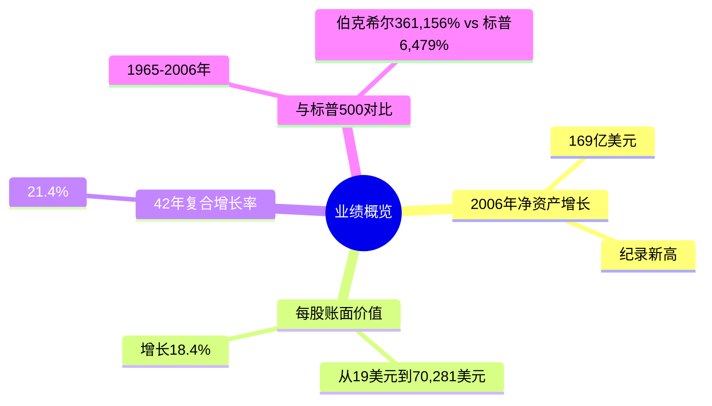
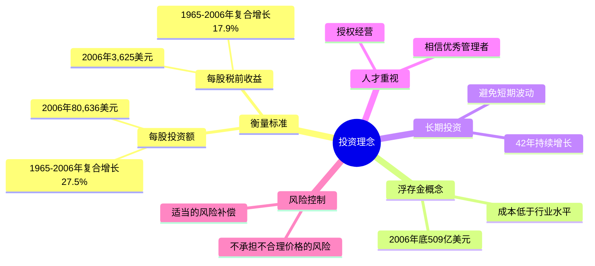
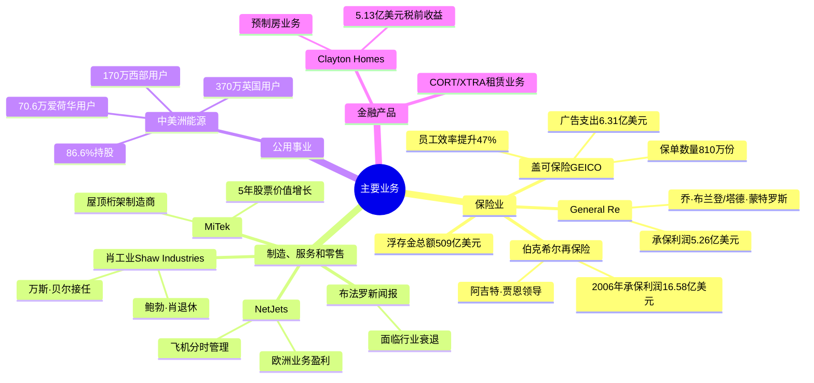
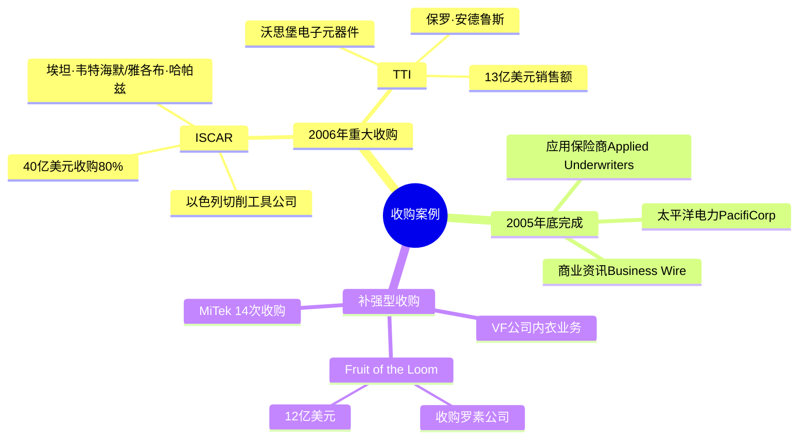
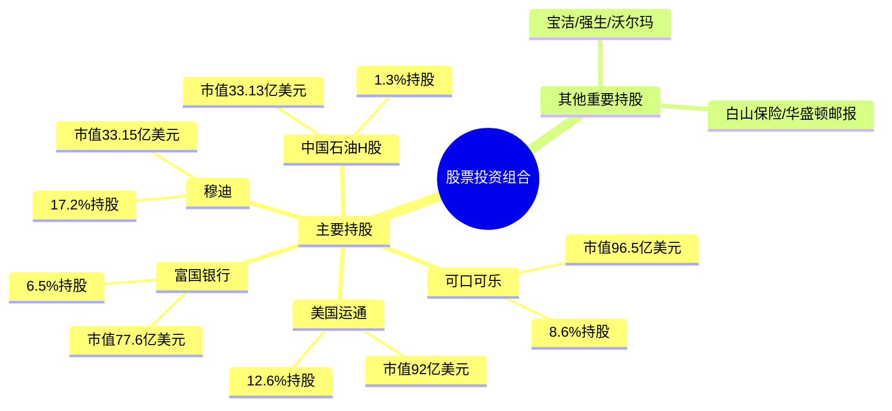
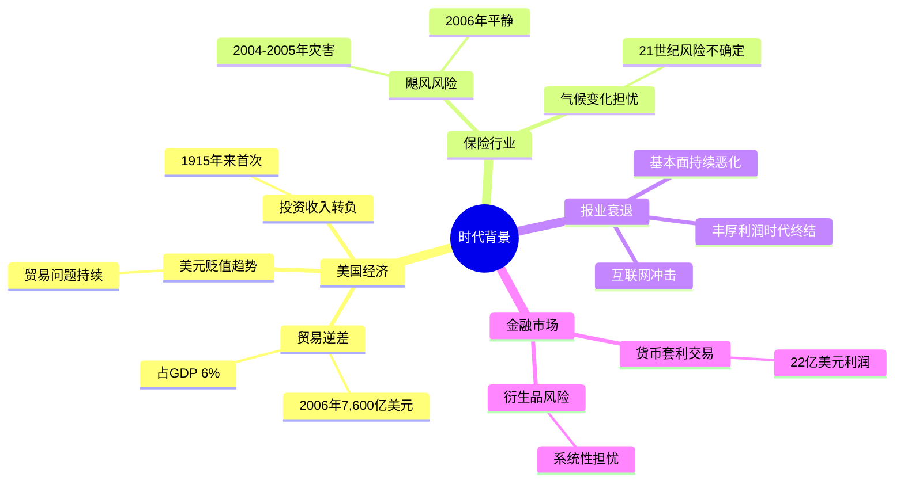

# 2006年巴菲特致股东信思维导图

## 一、业绩概览



## 二、投资理念



## 三、主要业务板块



## 四、收购案例



## 五、股票投资组合



## 六、关键人物

```mermaid
mindmap
  root((关键人物))
    巴菲特核心团队
      [[查理·芒格]]
        副董事长
        合伙人/律师背景
      [[托尼·奈斯利]]
        盖可保险CEO
        45年工龄
      [[阿吉特·贾恩]]
        再保险业务
        卓越贡献
    收购企业管理者
      [[埃坦·韦特海默]]
        ISCAR董事长
      [[雅各布·哈帕兹]]
        ISCAR CEO
      [[保罗·安德rews]]
        TTI创始人
      [[约翰·罗奇]]
        贾斯汀工业
    公用事业团队
      [[沃尔特·斯科特]]
        中美洲能源合伙人
      [[戴夫·索科尔]]
        中美洲能源CEO
      [[格雷格·阿贝尔]]
        中美洲能源
    投资界
      [[卢·辛普森]]
        投资经理
        盖可保险组合管理
      [[沃尔特·施洛斯]]
        47年投资记录
```

## 七、关键公司

```mermaid
mindmap
  root((关键公司))
    保险板块
      [[伯克希尔·哈撒韦]]
        母公司
      [[盖可保险]]GEICO
        汽车保险
      [[伯克希尔再保险]]
        再保险业务
      [[General Re]]
        全球再保险
    制造零售
      [[ISCAR]]
        以色列切削工具
      [[TTI]]
        电子元器件分销
      [[Fruit of the Loom]]
        服装制造商
      [[MiTek]]
        建筑材料
      [[Shaw Industries]]
        地毯生产
      [[Clayton Homes]]
        预制房
    公用事业
      [[中美洲能源]]
        能源控股
      [[太平洋电力]]
        西部公用事业
    航空服务
      [[NetJets]]
        飞机分时管理
```

## 八、时代背景



---

## 结构概要表格

| 一级分支 | 二级分支 | 核心内容 | 关键数据 |
|---------|---------|---------|---------|
| **业绩概览** | 净资产增长 | 2006年创纪录增长 | 169亿美元 |
| | 账面价值 | 42年复合增长 | 21.4% |
| **投资理念** | 衡量标准 | 每股投资额/收益 | 80,636美元/3,625美元 |
| | 浮存金 | 保险业务优势 | 509亿美元 |
| **主要业务** | 保险 | 核心业务 | 承保利润38.38亿美元 |
| | 制造零售 | 多元业务 | 收入526.6亿美元 |
| | 公用事业 | 中美洲能源 | 净利润9.16亿美元 |
| **收购案例** | ISCAR | 首次海外收购 | 40亿美元 |
| | TTI | 家族企业传承 | 13亿美元销售额 |
| **股票组合** | 四大持股 | 美国运通/可口可乐/富国/穆迪 | 占比最高 |
| **关键人物** | 管理团队 | 芒格/奈斯利/贾恩等 | 21.7万员工 |
| **关键公司** | 核心企业 | 盖可/ISCAR/中美洲能源等 | 73家业务 |
| **时代背景** | 经济趋势 | 贸易逆差/美元贬值 | 7,600亿美元逆差 |

---

## 总结

本思维导图涵盖了2006年巴菲特致股东信的核心内容：

1. **业绩创纪录**：169亿美元净资产增长，18.4%账面价值增长
2. **投资理念成熟**：强调浮存金、长期投资、人才授权
3. **业务多元**：保险、制造零售、公用事业、金融四大板块
4. **收购扩张**：ISCAR开启海外收购序幕，TTI等补强型收购
5. **股票组合**：重仓美国运通、可口可乐、富国银行等
6. **团队卓越**：托尼·奈斯利、阿吉特·贾恩等关键管理者
7. **时代洞察**：警示贸易逆差、美元贬值、报业衰退等趋势
