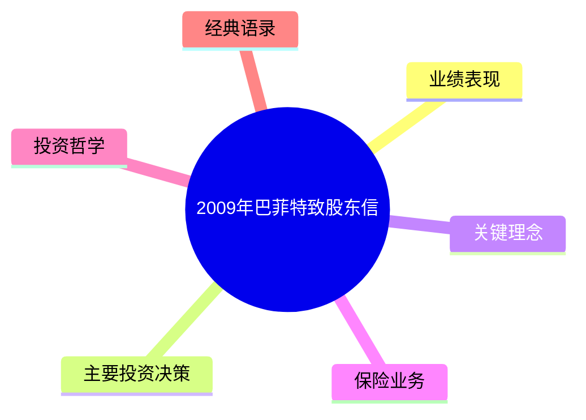
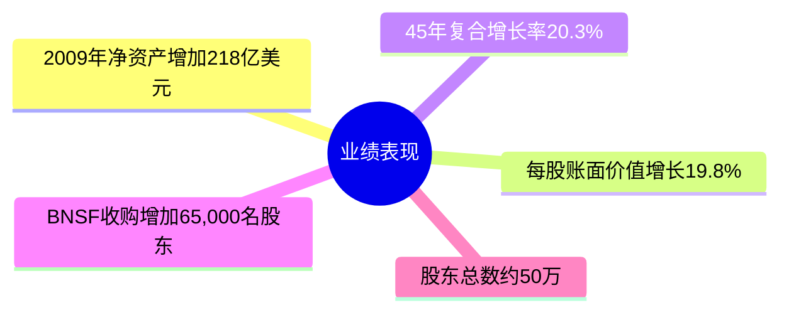
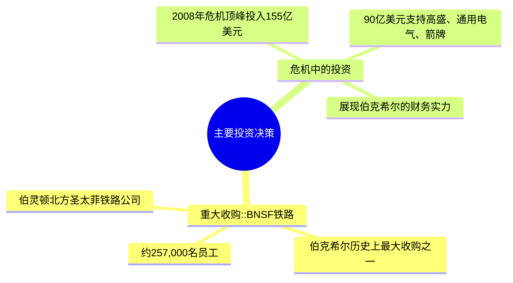
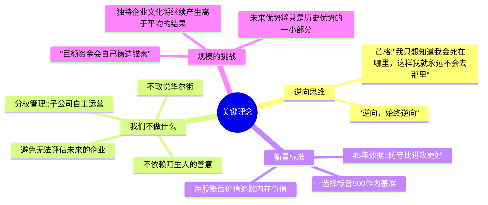
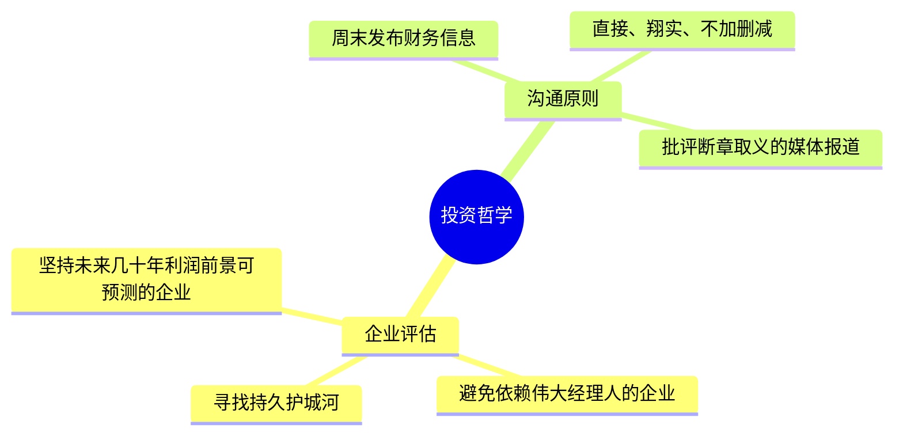
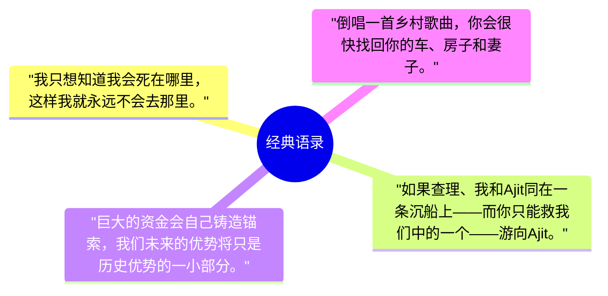

# 巴菲特2009年致股东信 - 思维导图

> 基于2009年巴菲特致股东信内容整理

---

## 时代背景分析

### 宏观经济环境
- **金融危机余波**：2008年金融危机顶峰时期，伯克希尔逆势投入155亿美元
- **市场恐慌**：90亿美元支持高盛、通用电气、箭牌，展现财务实力
- **行业冲击**：保险业受重创，但伯克希尔保险业务连续七年承保盈利

### 投资环境特征
- **现金为王**：持有200多亿美元现金，不依赖陌生人的善意
- **逆向投资**：危机中果断出手，"别人恐惧时贪婪"
- **规模挑战**："巨额资金会自己铸造锚索"，未来优势将只是历史优势的一小部分

### 巴菲特的投资信心
> "倒唱一首乡村歌曲，你会很快找回你的车、房子和妻子。"

> "如果查理、我和Ajit同在一条沉船上——而你只能救我们中的一个——游向Ajit。"

---

## Mermaid 思维导图


<style>
.mm-sub {
  margin: 8px 0;
  border: 1px solid var(--vp-c-divider, #e2e2e2);
  border-radius: 8px;
  overflow: hidden;
}
.mm-sub summary {
  padding: 10px 14px;
  background: var(--vp-c-bg-soft, #f8f9fa);
  font-weight: 600;
  font-size: 0.95em;
  cursor: pointer;
  color: var(--vp-c-text-1, #213547);
  list-style: none;
  display: flex;
  align-items: center;
  gap: 8px;
  transition: background 0.15s;
}
.mm-sub summary::-webkit-details-marker { display: none; }
.mm-sub summary::before {
  content: "▶";
  font-size: 0.65em;
  color: var(--vp-c-brand-1, #3eaf7c);
  transition: transform 0.15s;
  flex-shrink: 0;
}
.mm-sub[open] > summary::before { transform: rotate(90deg); }
.mm-sub summary:hover { background: var(--vp-c-brand-soft, rgba(62,175,124,0.08)); }
.mm-sub[open] > summary {
  border-bottom: 1px solid var(--vp-c-divider, #e2e2e2);
}
.mm-sub > div {
  padding: 16px;
  background: var(--vp-c-bg, #fff);
}
</style>

<div class="mm-sub-list">
<details class="mm-sub">
<summary>业绩表现</summary>
<div>



</div>
</details>

<details class="mm-sub">
<summary>主要投资决策</summary>
<div>



</div>
</details>

<details class="mm-sub">
<summary>关键理念</summary>
<div>



</div>
</details>

<details class="mm-sub">
<summary>保险业务</summary>
<div>

```mermaid
mindmap
  root((保险业务))
    浮存金奇迹
      从1967年1,600万美元增至620亿美元
      连续七年承保盈利
      "免费的浮存金"::持有别人资金还能获得报酬
    GEICO::Tony Nicely
      市场份额从2.5%(1995)增至8.1%
      14年中13年承保盈利
    再保险::Ajit Jain
      30人团队创造独特业务
      劳合社Equitas交易保费71亿美元
      人寿再保险合约可能50年带来500亿美元保费
    General Re::Tad Montross
      从困境到"保险皇冠上的明珠"
      取得Cologne Re 100%所有权
```

</div>
</details>

<details class="mm-sub">
<summary>投资哲学</summary>
<div>



</div>
</details>

<details class="mm-sub">
<summary>经典语录</summary>
<div>



</div>
</details>

</div>
---

## 结构概要表格

| 一级分支 | 二级分支 | 核心内容 | 关键数据 |
|---------|---------|---------|---------|
| **业绩表现** | 年度表现 | 净资产增加 | 218亿美元 |
| | 增长率 | 每股账面价值增长 | 19.8% |
| | 长期表现 | 45年复合增长率 | 20.3% |
| | 股东规模 | BNSF收购后股东总数 | 约50万 |
| **主要投资决策** | BNSF铁路 | 伯克希尔史上最大收购之一 | 257,000名员工 |
| | 危机投资 | 2008年危机顶峰投入 | 155亿美元 |
| | 重点支持 | 高盛/通用电气/箭牌 | 90亿美元 |
| **关键理念** | 逆向思维 | 芒格方法论 | "逆向，始终逆向" |
| | 不做什么 | 四条核心原则 | 现金200+亿美元 |
| | 衡量标准 | 标普500基准 | 指数下跌11年均战胜 |
| | 规模挑战 | 未来优势缩小 | "铸造锚索" |
| **保险业务** | 浮存金 | 42年增长 | 1,600万→620亿美元 |
| | GEICO | 市场份额增长 | 2.5%→8.1% |
| | 再保险 | Ajit Jain团队 | Equitas 71亿美元保费 |
| | General Re | 从困境到明珠 | 取得Cologne Re 100% |
| **投资哲学** | 企业评估 | 可预测利润前景 | 持久护城河 |
| | 沟通原则 | 周末发布信息 | 直接翔实 |
| **经典语录** | 四条经典 | 逆向/救命/规模/乡村 | — |

---

## 关键人物索引

- [[沃伦·巴菲特]] - 董事长
- [[查理·芒格]] - 副董事长
- [[阿吉特·贾因]] (Ajit Jain) - 伯克希尔再保险CEO
- [[托尼·奈斯利]] (Tony Nicely) - GEICO CEO
- [[泰德·蒙特罗斯]] (Tad Montross) - 通用再保险CEO

## 关键公司索引

### 伯克希尔旗下公司
- [[伯克希尔·哈撒韦]] - 母公司
- [[伯灵顿北方圣达菲铁路公司]] (BNSF) - 2009年最大收购
- [[GEICO]] - 美国汽车保险
- [[通用再保险]] - 再保险巨头
- [[伯克希尔再保险集团]] - 阿吉特·贾因管理
- [[Cologne Re]] - 通用再保险子公司

### 投资标的
- [[高盛]] - 危机中投资
- [[通用电气]] - 危机中投资
- [[箭牌]] - 危机中投资
